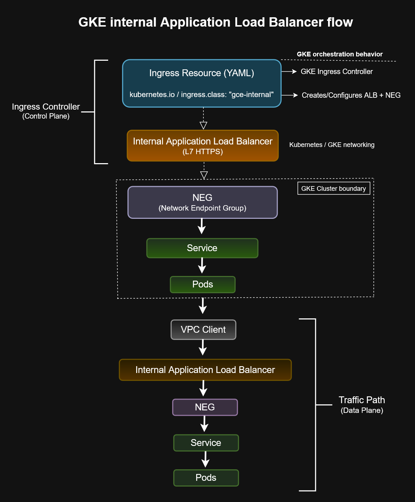
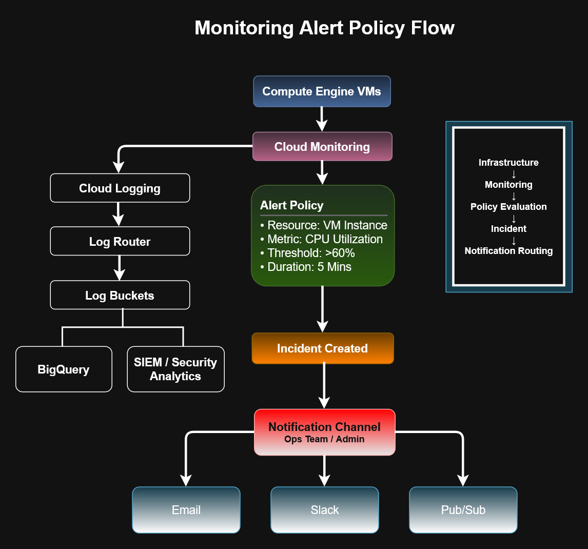
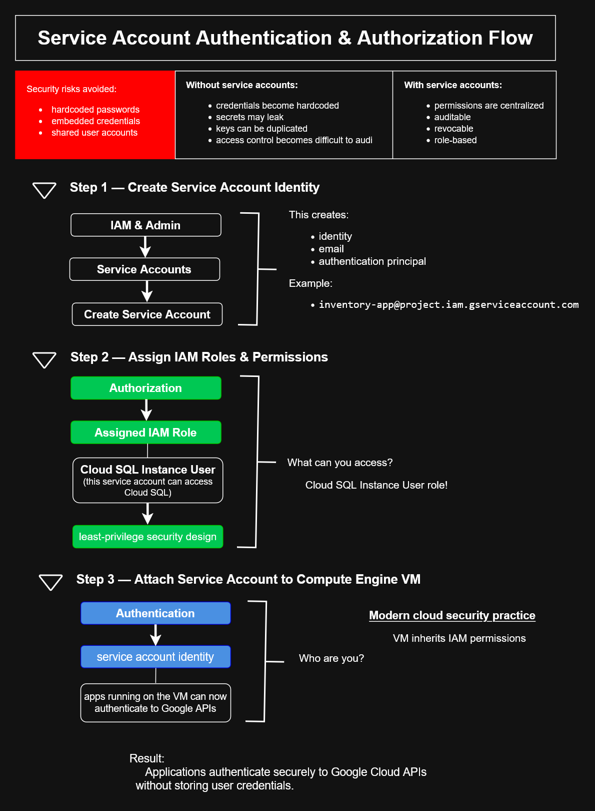
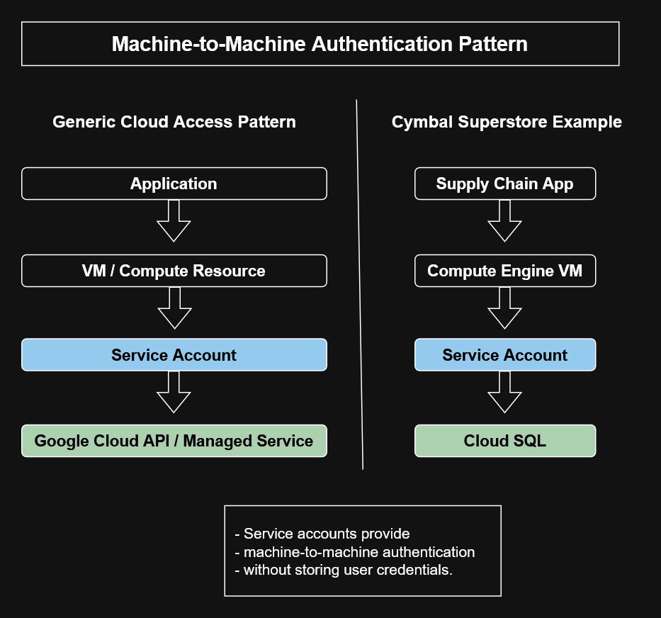

# Google Cloud Engineer Learning Path


Google Cloud • BigQuery • GKE • Terraform • Dataflow • Pub/Sub • Observability

## Certification Program
Google Cloud Engineer Certification (May – June 2026 Cohort)

Status: Active Learning Journey
Latest Milestone
✅ Essential Google Cloud Infrastructure: Foundation Completed
---
## Recent Achievements

- ✅ Completed Google Cloud Infrastructure: Foundation
- ✅ Created 20+ Compute Engine architecture diagrams
- ✅ Completed hands-on VM deployment labs
- ✅ Documented VM lifecycle and availability policies
- ✅ Completed Compute Engine troubleshooting exercises
- ✅ Built reusable draw.io cloud architecture diagrams
  
---
This repository documents my journey through the Google Cloud Engineer Certification program, focusing on building real-world cloud infrastructure skills.

Background:
- Software Development (DeVry University)
- IoT & Data Analytics Projects
- MySQL, Python, Automation

Goal:
Transition into Cloud / Systems Engineering roles by building production-ready cloud solutions.

---
## Portfolio Highlights

- Enterprise Google Cloud architecture diagrams
- VM Lifecycle reference models
- IAM inheritance documentation
- Compute Engine deployment labs
- Cloud Storage workflows
- Terraform learning repository
- Kubernetes reference diagrams
  
---

### Status Legend

- Pending = not started
- In Progress = actively studying/building
- Active = currently reviewing/testing
- Complete = documented and reviewed

## 📈 Live Progress Tracker

| Module | Topic | Status | Portfolio Evidence |
|---|---|---|---|
| 1 | Intro & ACE Foundations | 🟢 Complete | Core GCP notes and architecture fundamentals |
| 2 | Compute Engine & VM Operations | 🟢 Complete | 12+ documentation files, diagrams, lab walkthroughs |
| 3 | Cloud Storage & Data Services | 🟢 Complete | Cloud Storage API authentication diagrams |
| 4 | Networking & Load Balancing | 🟢 Complete | Monitoring and infrastructure routing diagrams |
| 5 | Cloud Run & Cloud Functions | 🟢 Complete | IAM custom role administration workflows |
| 6 | Kubernetes Engine (GKE) | 🟢 Complete | Planned GKE workload identity diagrams |
| 7 | Infrastructure as Code (Terraform) | 🟢 Complete | Terraform infrastructure deployment workflows |
| 8 | IAM & Governance | 🟢 Complete | IAM inheritance, folder IAM, custom roles, least privilege |
| 8 | Service Accounts | 🟢 Complete | OAuth, service accounts, ADC, workload identity, authentication patterns |
| 9 | Cloud Architecture & Security Diagrams | 🟢 Active Portfolio Development | Enterprise security and authentication flows |
| 10 | Diagnostic Reviews & Exam Prep | 🟢 Complete | ACE recognition-pattern documentation |

## Repository Structure

| Folder | Purpose |
|---|---|
| architecture-diagrams/ | draw.io, SVG, and PNG cloud architecture diagrams |
| definitions | Cloud terminology |
| study-plans | Certification planning |
| iam | IAM-focused documentation |
| labs/           | Hands-on implementation     |
| notes/          | Study + architecture        |
| Recognition/    | ACE trigger patterns        |
| Diagnostics/    | Scenario reasoning          |
| Compute-Engine/ | VM infrastructure           |
| GKE/            | Kubernetes concepts         |
| Cloud-Run/      | Serverless compute          |
| Databases/      | Cloud SQL / migration logic |
| architecture-diagrams/iam/ | IAM, OAuth, service account, and policy diagrams |
| architecture-diagrams/monitoring/ | Cloud Monitoring, alerting, logging, and observability diagrams |
| architecture-diagrams/storage/ | Storage lifecycle and data solution diagrams |
| architecture-diagrams/gke/ | GKE, Ingress, Kubernetes lifecycle, and load balancing diagrams |
| `notes/iam/`             | concepts & security        |
| `architecture-diagrams/` | visual workflows           |
| `glossary/`              | abbreviations              |
| `definitions/`           | cloud terminology          |
| `04-networking/`         | infrastructure networking  |
| `03-storage/`            | storage systems            |
| `04-operations/`         | observability & monitoring |

---

## Key Focus Areas

- Google Cloud Platform (GCP)
- Associate Cloud Engineer (ACE) Preparation
- IAM & Governance
- Kubernetes Engine (GKE)
- Terraform & Infrastructure as Code
- Cloud Monitoring & Logging
- Workload Identity
- OAuth & Service Accounts
- Enterprise Cloud Security Patterns
- Architecture Modeling & Documentation
- Cloud Operations & Automation

## Progress Snapshot

- ✅ IAM & Governance Review 5.1
- ✅ Service Accounts Review 5.2
- ✅ 10+ Cloud Security Diagrams Created
- ✅ IAM Architecture Library Established
- ✅ Terraform & GKE Documentation 

## Featured Architecture Diagrams

### GKE Internal Application Load Balancer


### Kubernetes Object Lifecycle


### Monitoring Alert Policy Flow


### IAM Service Account Security Flow


### Application Cloud Authentication Flow


---

## Skills Demonstrated

- Kubernetes networking
- GKE internal load balancing
- Cloud Run autoscaling
- Infrastructure-as-Code concepts
- YAML orchestration
- Terraform workflows
- Cloud architecture documentation
- Technical diagramming
- Operational troubleshooting
- IAM policy inheritance
- Service account authentication
- OAuth vs service account security patterns
- Cloud Monitoring and Cloud Logging 

## Repository Metrics

- 1147+ commits
- 20+ architecture diagrams
- 40+ technical documents
- Multiple completed Google Cloud labs
- Hands-on Compute Engine experience
- Multiple architecture diagrams
- GKE operational documentation
- Kubernetes lifecycle models
- ACE recognition patterns
- Infrastructure learning labs
  
---
## Skills Gained

- Compute Engine
- Virtual Machine Deployment
- Cloud Shell
- SSH Administration
- Persistent Disk Management
- Cloud Storage
- IAM Fundamentals
- Resource Hierarchy
- Machine Families
- Load Balancing
- Terraform Basics
- Cloud Monitoring
- Cloud Logging
- Infrastructure Documentation
  
---
## Module Overview

- ACE certification focuses on real-world cloud skills
- Course provides structure, not full preparation
- Key domains include compute, networking, security

## Introduction to ACE Role

- Engineers deploy, configure, and manage cloud systems
- Focus on scalability and operations

---

## Active ACE Domains

- IAM & Access Control
- Compute Engine
- Cloud Storage
- Networking & Load Balancing
- Billing Configuration
- Resource Hierarchy

---
## Hands-on Labs

| Lab | Status |
|------|---------|
| Create Virtual Machines | ✅ Complete |
| VM Lifecycle | ✅ Documented |
| VM Availability Policies | ✅ Documented |
| OS Patch Management | ✅ Documented |
| Working with Virtual Machines | ✅ Complete |
---

## Current Study Topics

- Completing ACE Diagnostic Reviews
- Reviewing IAM & Service Accounts
- Building cloud architecture diagrams
- Documenting ACE recognition patterns
- Preparing for Associate Cloud Engineer certification

### Compute
- Managed Instance Groups
- GKE Standard vs Autopilot
- Machine families
- Disk types
- Terraform basics

### Storage
- Cloud Storage classes
- Bucket configuration
- BigQuery transfers

### Networking
- Load balancing
- Internal vs external access
- Private clusters

---

## Key Notes & References

- `notes/02-compute/ACE-diagnostics.md`
- `notes/02-compute/managed-instance-groups.md`
- `notes/02-compute/gke-vs-cloud-run.md`
- `notes/03-storage/storage-classes.md`

---
## ACE Recognition Patterns

| Requirement | Usually Means |
|---|---|
| Lowest operational overhead | Autopilot |
| Full customization | Standard GKE |
| Event-driven | Cloud Functions |
| Containers | Cloud Run |
| Rolling updates | Managed Instance Groups |
---
```text
Compute Engine
    ↓
GKE Nodes
    ↓
Containers
    ↓
Cloud Run alternative
```
```text
Terraform
    ↓
Infrastructure as Code
    ↓
GKE provisioning
    ↓
Managed infrastructure
```
---

## Tools & Technologies

- Google Cloud Platform (GCP)
- Kubernetes
- GKE
- Cloud Run
- Terraform
- draw.io
- Visio
- GitHub
- Markdown
- YAML

---
## Repository Gallery

Screenshots from Google Cloud Skills and Google Cloud Console are included throughout this repository to demonstrate:

- VM deployment
- Cloud Console
- Cloud Shell
- SSH connectivity
- Architecture diagrams
- Compute Engine labs
  
---
## Certification Goal
Google Associate Cloud Engineer (ACE)

---
## Completed Courses

| Course | Status |
|----------|---------|
| Essential Google Cloud Infrastructure: Foundation | ✅ Completed |
