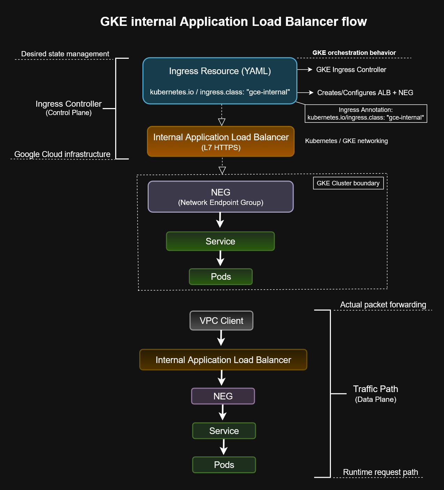
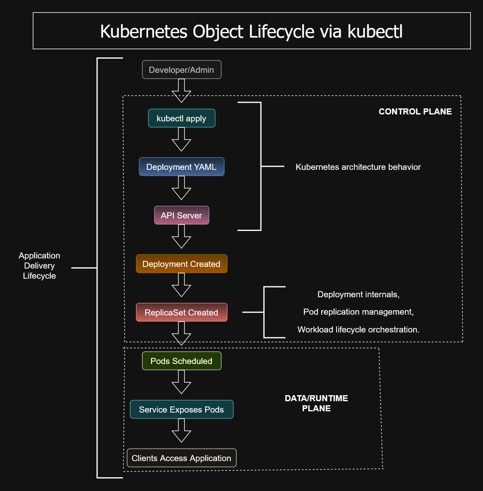
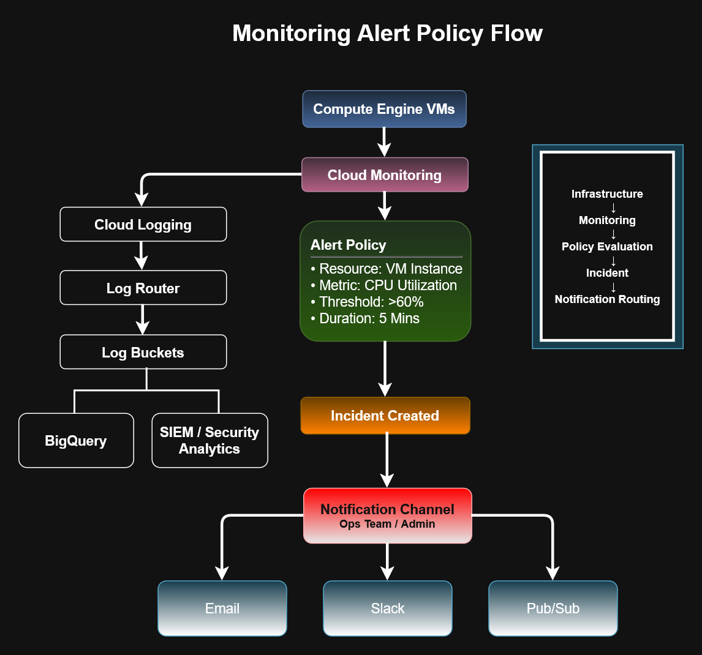
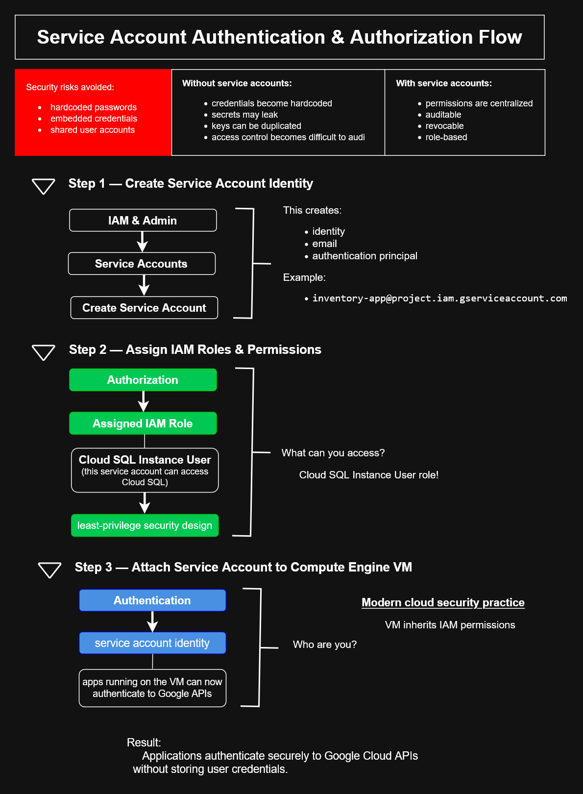
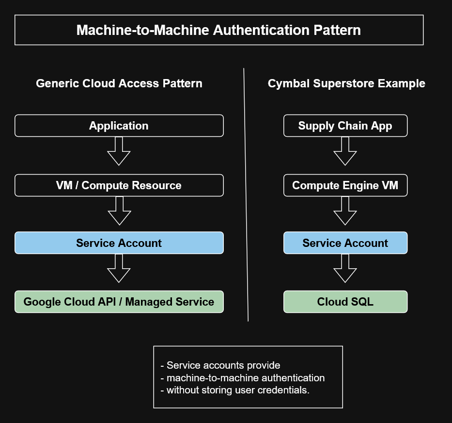

# Google Cloud Architecture Diagrams

This directory contains architecture diagrams and visual reference models
created throughout my Google Cloud engineering learning path.

The diagrams translate cloud concepts, hands-on lab experience, and
Associate Cloud Engineer study topics into reusable infrastructure models.

## Architecture Library

| Area | Description |
|---|---|
| [Compute](compute/) | Compute Engine, VM architecture, machine configuration, and lifecycle models |
| [Data Pipelines](data-pipelines/) | Data processing and pipeline architecture |
| [Data Solutions](data-solutions/) | Google Cloud data-service architecture |
| [Foundations](foundations/) | Core Google Cloud infrastructure and platform concepts |
| [GKE](gke/) | Kubernetes, GKE, workloads, services, Ingress, and load balancing |
| [IAM](iam/) | IAM, service accounts, authentication, authorization, and security architecture |
| [Monitoring](monitoring/) | Cloud Monitoring, alert policies, logging, and observability |
| [Networking](networking/) | VPC networking, routing, addressing, and load balancing |
| [Operations](operations/) | Cloud operations and infrastructure-management workflows |
| [Storage](storage/) | Cloud Storage, storage lifecycle, and data architecture |
| [Terraform](terraform/) | Infrastructure-as-Code architecture and deployment workflows |
| [References](references/) | Diagram standards and architecture references |

## Purpose

These diagrams serve as:

- Visual study references for Google Cloud concepts
- Architecture documentation for hands-on labs
- Associate Cloud Engineer preparation material
- Reusable infrastructure reference models
- Portfolio evidence of cloud architecture and technical documentation skills

## Featured Diagrams

### GKE Internal Application Load Balancer

### Kubernetes Object Lifecycle

### Monitoring Alert Policy Flow

### IAM Service Account Security Flow

### Application Cloud Authentication Flow

## Skills Demonstrated

- Cloud architecture modeling
- Compute Engine infrastructure
- Kubernetes and GKE architecture
- IAM and service-account security
- VPC networking and load balancing
- Cloud Storage architecture
- Monitoring and observability
- Infrastructure as Code
- Technical diagramming
- Infrastructure documentation

---

[← Return to Main Repository](../README.md)

## Compute
- Compute Resource Selection Architecture
- GKE vs Cloud Run
- Serverless vs Server-Based Computing

## Storage
- Storage Selection Architecture
- BigQuery vs Cloud SQL
- Storage Classes Comparison

## Networking
- Google Cloud Load Balancer Types
- Layer 4 vs Layer 7 Traffic Flow
- Regional vs Global Load Balancing

## IAM & Governance
- Resource Hierarchy
- IAM Model
- Billing Architecture
- Observability Scoping

## Diagrams Included

- OAuth Service Account Security Flow
- Folder-Level IAM Inheritance
- Workload Identity
- Custom Role Update Flow

## Topics Covered

- OAuth 2.0
- Service Accounts
- IAM Inheritance
- Least Privilege
- Backend Authorization
- Workload Identity
## ACE Recognition Patterns

| Requirement | Usually Means |
|---|---|
| Lowest operational overhead | Autopilot |
| Full customization | Standard GKE |
| Event-driven | Cloud Functions |
| Containers | Cloud Run |
| Rolling updates | Managed Instance Groups |

---

| Folder                               | Source Files              |
| ------------------------------------ | ------------------------- |
| `gke/internal-alb-flow`              | `.drawio`, `.png`, `.svg` |
| `gke/workload-identity`              | `.drawio`, `.png`, `.svg` |
| `iam/iam-resource-model`             | `.vsdx`, `.png`           |
| `iam/resource-hierarchy`             | `.vsdx`, `.png`           |
| `networking/load-balancer-framework` | `.drawio`, `.png`, `.svg` |
| `storage/storage-selection`          | `.vsdx`, `.png`           |

[← Return to Main Repository](../README.md)
