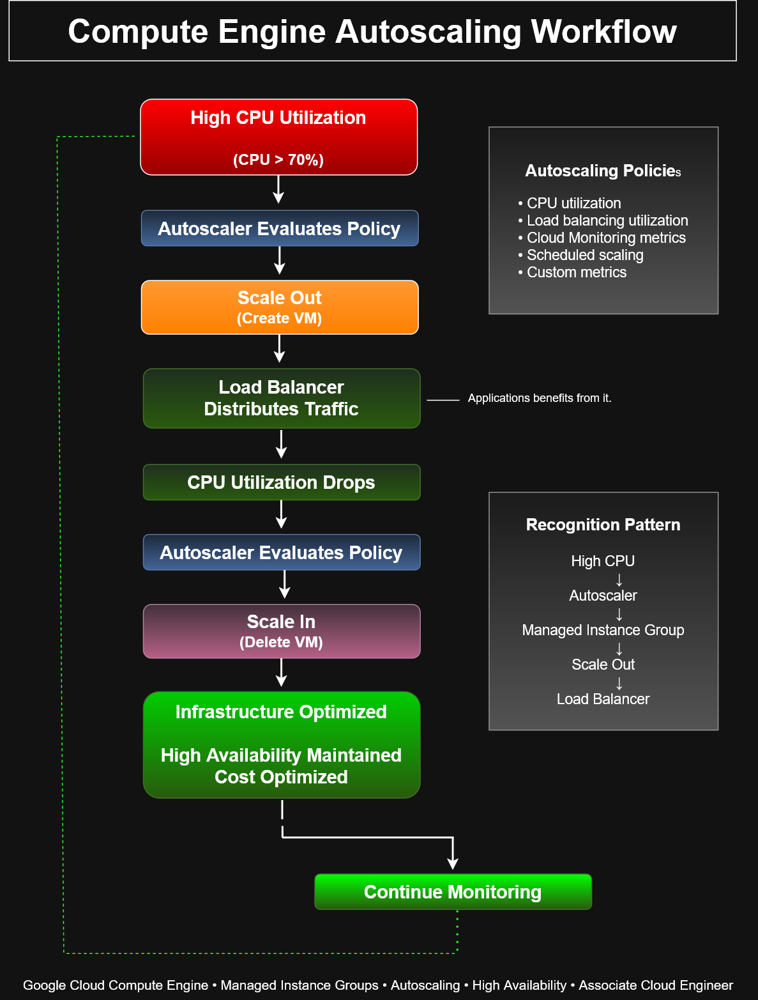

# Compute Engine Autoscaling Workflow


This architecture diagram demonstrates the lifecycle of **Google Cloud Compute Engine Autoscaling**, illustrating how Managed Instance Groups automatically scale virtual machine instances in response to changing workload demand.

The workflow highlights how autoscaling policies help maintain **high availability**, **performance**, and **cost efficiency** by dynamically adding or removing VM instances.

---

# Architecture Diagram



---

# Purpose

This diagram demonstrates the decision-making process behind Compute Engine autoscaling and reinforces common operational patterns used in enterprise cloud environments.

It supports learning objectives related to:

- Infrastructure automation
- Elastic compute resources
- Managed Instance Groups
- High availability
- Cost optimization
- Google Cloud operations

---

# Workflow Overview

```text
High CPU Utilization
        │
        ▼
Autoscaler Evaluates Policy
        │
        ▼
Scale Out (Create VM)
        │
        ▼
Traffic Distributed
Across Instances
        │
        ▼
CPU Utilization Drops
        │
        ▼
Autoscaler Evaluates Policy
        │
        ▼
Scale In (Delete VM)
```

The autoscaler continuously evaluates workload metrics and adjusts the number of running virtual machines to maintain optimal application performance.

---

# Autoscaling Policies

Google Cloud Managed Instance Groups can automatically scale using several policy types:

- CPU utilization
- Load balancing utilization
- Cloud Monitoring metrics
- Scheduled scaling
- Custom monitoring metrics

These policies allow infrastructure to respond automatically to changing demand.

---

# Scale-Out Process

When utilization exceeds the configured threshold:

1. Autoscaler evaluates the scaling policy.
2. Managed Instance Group provisions new VM instances.
3. Load balancer begins routing traffic to the new instances.
4. Application capacity increases.
5. CPU utilization decreases across the instance group.

Benefits include:

- Improved performance
- Reduced latency
- Increased availability
- Automatic capacity expansion

---

# Scale-In Process

When workload demand decreases:

1. Autoscaler reevaluates the scaling policy.
2. Excess VM instances are safely removed.
3. Remaining instances continue serving traffic.
4. Infrastructure costs are reduced.

Benefits include:

- Lower operating costs
- Efficient resource utilization
- Automatic infrastructure optimization

---

# Key Google Cloud Services

- Compute Engine
- Managed Instance Groups (MIG)
- Autoscaler
- Cloud Load Balancing
- Cloud Monitoring

Together, these services provide an elastic and self-managing compute platform.

---

# ACE Exam Recognition Patterns

For the Google Cloud Associate Cloud Engineer exam:

- High CPU utilization often triggers autoscaling.
- Managed Instance Groups provide autoscaling and self-healing capabilities.
- Autoscalers create or remove VM instances based on defined policies.
- Load balancers automatically distribute traffic to newly created instances.
- Autoscaling improves both availability and cost efficiency.

---

# Common Use Cases

- Web applications
- REST APIs
- E-commerce platforms
- Microservices
- Enterprise applications
- Seasonal workloads
- Event-driven applications

---

# Skills Demonstrated

- Google Cloud Compute Engine
- Managed Instance Groups
- Autoscaling
- Infrastructure Automation
- Elastic Compute
- High Availability
- Load Balancing
- Cloud Operations
- Infrastructure Optimization

---

# Files Included

- `compute-engine-autoscaling-workflow.drawio`
- `compute-engine-autoscaling-workflow.png`
- `compute-engine-autoscaling-workflow.svg`

---

# Related Architecture Diagrams

- Managed Instance Group Architecture
- Managed Instance Group Autoscaling Workflow
- Rolling Update Workflow
- Startup Script Workflow
- Snapshot Architecture
- Terraform Infrastructure Deployment Workflow

---

# Portfolio Note

This diagram was created as part of the **Google Cloud Associate Cloud Engineer Learning Path** to demonstrate practical understanding of Compute Engine autoscaling, infrastructure elasticity, and automated resource management. It illustrates how Google Cloud dynamically provisions and removes virtual machine instances to maintain application performance while optimizing operational costs in enterprise cloud environments.
