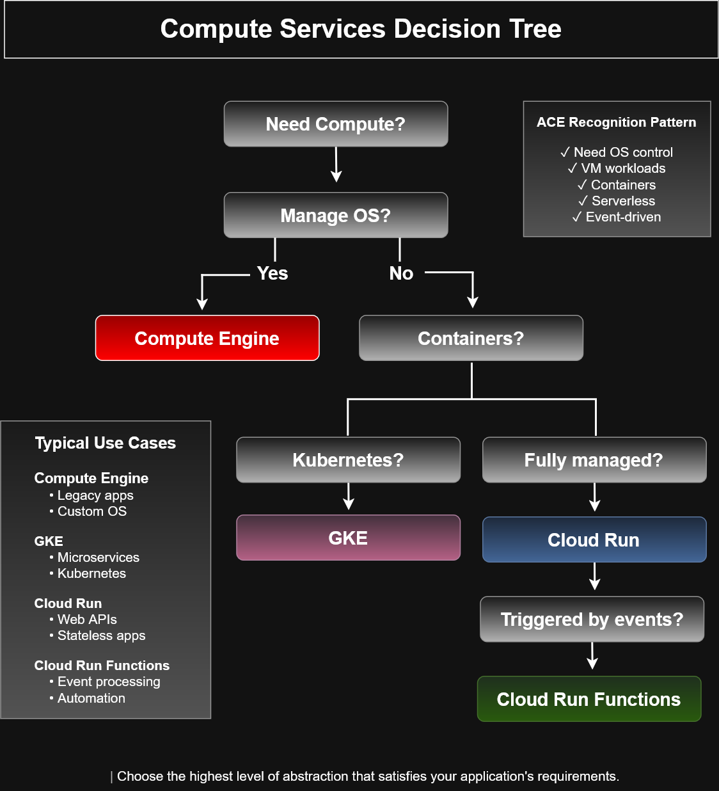

# Compute Services Decision Tree


## Overview

This decision tree provides a simplified framework for selecting the appropriate Google Cloud compute service based on workload requirements.

The diagram highlights common architectural decision points encountered during cloud solution design and Associate Cloud Engineer certification scenarios.

---

## Decision Flow

```
Need Compute?
        │
        ▼
Manage Operating System?
        │
 ┌──────┴──────┐
 │             │
Yes            No
 │             │
 ▼             ▼
Compute    Containers?
Engine          │
          ┌─────┴─────┐
          │           │
         Yes      Event-driven?
          │           │
          ▼           ▼
         GKE    Cloud Run Functions
          │
          ▼
      Cloud Run
```
Absolutely. I strongly recommend including a PNG preview in every architecture diagram README.

When recruiters or GitHub visitors browse your repository, they are much more likely to engage with a visual than open a separate image file.

Recommended README structure
# Google Cloud Service Continuum

## Overview

This diagram illustrates the progression from Infrastructure as a Service (IaaS) to Software as a Service (SaaS), demonstrating how increasing abstraction shifts operational responsibility from the customer to Google Cloud.

---

## Diagram Preview


---

## Key Concepts

- Increasing Google-managed infrastructure
- Increasing developer productivity
- Reduced operational overhead
- Infrastructure abstraction
- Compute service selection

...
For your Compute Services Decision Tree
# Compute Services Decision Tree

## Overview

This decision tree provides a framework for selecting the appropriate Google Cloud compute service based on workload requirements and operational preferences.

---

## Diagram Preview



---

## Decision Logic

Need Compute?

- Need OS control → Compute Engine
- Need Kubernetes → GKE
- Need managed containers → Cloud Run
- Need event-driven execution → Cloud Run Functions

...
---

## Service Selection Guide

### Compute Engine

Best for:

- Custom operating systems
- Legacy applications
- Lift-and-shift migrations
- Maximum infrastructure control

---

### Google Kubernetes Engine (GKE)

Best for:

- Container orchestration
- Microservices
- Kubernetes workloads
- Enterprise container platforms

---

### Cloud Run

Best for:

- Stateless web applications
- REST APIs
- Managed containers
- Automatic scaling

---

### Cloud Run Functions

Best for:

- Event-driven automation
- Scheduled tasks
- Pub/Sub triggers
- Lightweight serverless functions

---

## ACE Recognition Patterns

Typical certification clues include:

- Manage operating system → **Compute Engine**
- Kubernetes workloads → **GKE**
- Containerized applications → **Cloud Run**
- Event-driven execution → **Cloud Run Functions**

---

## Architecture Principles

Google Cloud encourages selecting the **highest level of abstraction** that satisfies application requirements.

Higher abstraction generally provides:

- Reduced infrastructure management
- Lower operational complexity
- Automatic scaling
- Improved developer productivity
- Faster deployment cycles

---

## Learning Objectives

This diagram reinforces:

- Compute service selection
- Infrastructure vs serverless computing
- Kubernetes architecture
- Event-driven design
- Cloud-native application deployment
- Google Cloud compute services

---

## Files

```
compute-services-decision-tree.drawio
compute-services-decision-tree.png
compute-services-decision-tree.svg
README.md
```
---

## Related Diagrams

- Compute Engine Autoscaling Workflow
- Managed Instance Group Scale-Out Workflow
- Instance Template Architecture
- Snapshot Restore Workflow
- Google Cloud Service Continuum
- Compute Services Decision Tree
---

## Portfolio Note

This architecture diagram was created as part of the **Google Cloud Associate Cloud Engineer Learning Path** to demonstrate cloud solution analysis, service selection strategies, and practical architectural decision-making based on workload characteristics.
