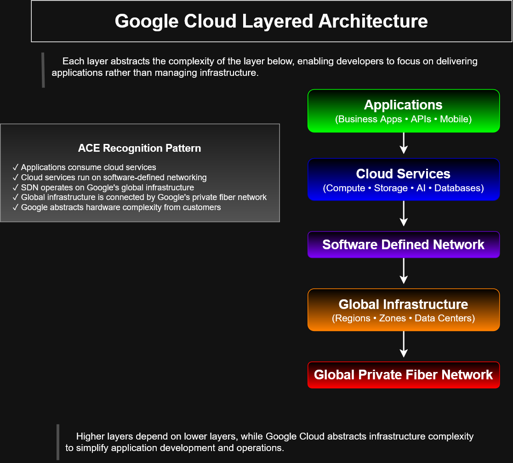

# Google Cloud Layered Architecture

## Preview

---

# Overview

This diagram illustrates the layered architecture of Google Cloud, demonstrating how higher-level services depend on lower infrastructure layers while abstracting operational complexity from developers and administrators.

As applications move upward through the stack, infrastructure management decreases, allowing teams to focus on building and deploying software rather than managing hardware and networking resources.

---

# Architecture Layers

## Applications

Examples include:

- Business applications
- Web applications
- REST APIs
- Mobile applications

Applications consume cloud services without interacting directly with the underlying infrastructure.

---

## Cloud Services

Google Cloud provides managed services that simplify application development and operations.

Examples include:

- Compute Engine
- Cloud Storage
- BigQuery
- Cloud SQL
- Vertex AI
- Cloud Run
- Google Kubernetes Engine

These services abstract hardware management while providing scalable computing resources.

---

## Software Defined Network

Google Cloud's software-defined networking (SDN) layer provides secure and programmable connectivity across all cloud resources.

Capabilities include:

- Virtual Private Cloud (VPC)
- Load Balancing
- Cloud DNS
- Firewall Rules
- Cloud Router
- Private networking

The SDN layer enables global connectivity without requiring customers to manage physical networking equipment.

---

## Global Infrastructure

Google Cloud operates a worldwide infrastructure consisting of:

- Regions
- Zones
- Data centers

This distributed architecture provides high availability, fault tolerance, and low-latency access to cloud services.

---

## Global Private Fiber Network

At the foundation of Google Cloud is Google's private global fiber backbone.

It connects:

- Data centers
- Regions
- Edge locations
- Global services

This private network enables secure, high-performance communication between Google Cloud resources worldwide.

---

# ACE Recognition Pattern

This diagram reinforces several Associate Cloud Engineer concepts:

- Applications consume managed cloud services.
- Cloud services operate on software-defined networking.
- SDN relies on Google's global infrastructure.
- Global infrastructure is connected by Google's private fiber network.
- Google abstracts physical infrastructure complexity from customers.

---

# Learning Objectives

After reviewing this diagram, learners should understand:

- The layered design of Google Cloud.
- Infrastructure abstraction principles.
- The relationship between applications and cloud services.
- The role of software-defined networking.
- How Google's global infrastructure supports managed services.
- Why managed cloud platforms reduce operational overhead.

---

# Key Takeaway

Higher layers consume services provided by lower layers, while Google Cloud abstracts infrastructure complexity to simplify application deployment, scalability, reliability, and operations.

As organizations adopt more managed services, they spend less time managing infrastructure and more time delivering business value.

---

# Related Topics

This diagram complements:

- Compute Engine Architecture
- Managed Instance Groups
- Instance Templates
- Autoscaling Workflows
- Load Balancing
- Google Cloud Service Continuum
- Compute Services Decision Tree
- Infrastructure Dependency Stack

---

# Repository Context

This architecture diagram is part of the **cloud-engineer-learning-path** repository and was created to reinforce Google Cloud design principles, infrastructure abstraction concepts, and Associate Cloud Engineer certification objectives through visual learning.
