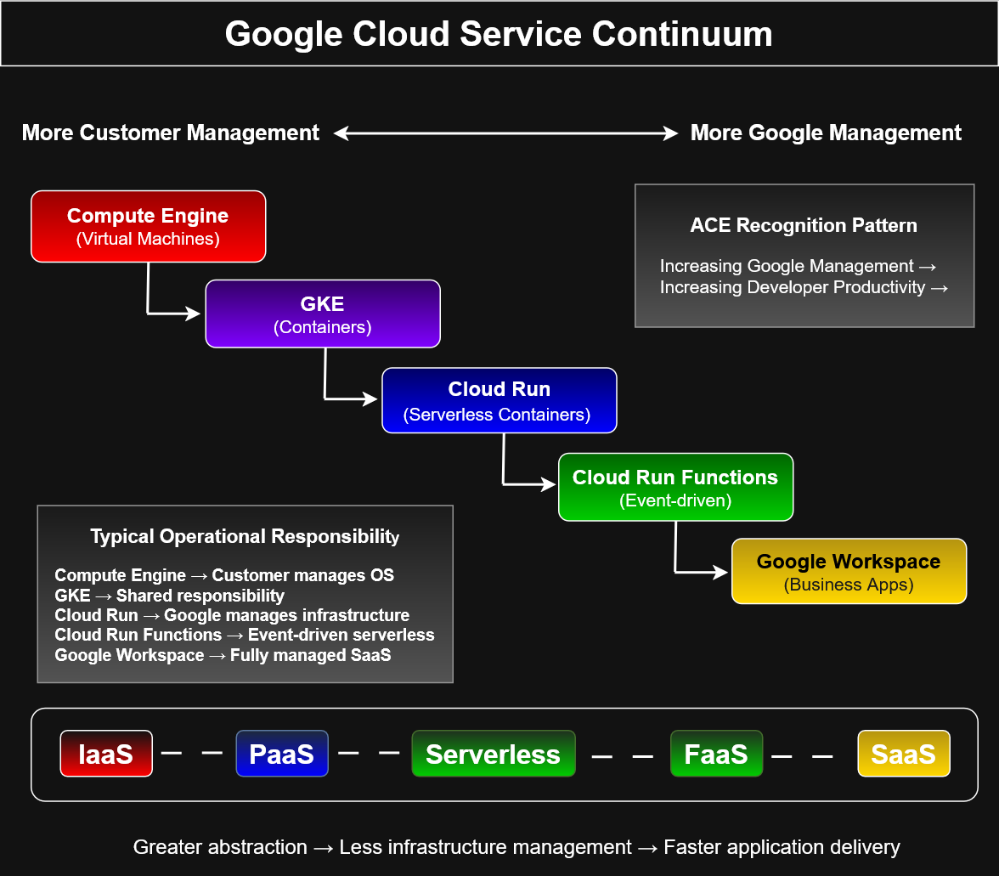

# Google Cloud Service Continuum


## Overview

This diagram illustrates the progression of Google Cloud compute services from **Infrastructure as a Service (IaaS)** to **Software as a Service (SaaS)**.

As abstraction increases, Google assumes more operational responsibility, allowing developers to focus more on application development and less on infrastructure management.

---

## Diagram Preview



---

## Key Concepts

- Increasing Google-managed infrastructure
- Increasing developer productivity
- Reduced operational overhead
- Infrastructure abstraction
- Compute service selection

...

## Service Continuum

```
Compute Engine
        ↓
Google Kubernetes Engine (GKE)
        ↓
Cloud Run
        ↓
Cloud Run Functions
        ↓
Google Workspace
```

The continuum demonstrates the relationship between:

- Infrastructure as a Service (IaaS)
- Platform as a Service (PaaS)
- Serverless Computing
- Functions as a Service (FaaS)
- Software as a Service (SaaS)

---

## Key Concepts

- Increasing Google-managed infrastructure
- Reduced operational overhead
- Increased developer productivity
- Higher abstraction levels
- Faster application delivery

---

## Service Summary

| Service | Primary Use |
|------------|-------------------------------|
| Compute Engine | Virtual machines with full OS control |
| Google Kubernetes Engine | Managed Kubernetes clusters |
| Cloud Run | Serverless container execution |
| Cloud Run Functions | Event-driven function execution |
| Google Workspace | Fully managed business applications |

---

## ACE Recognition Pattern

Typical exam indicators include:

- Need full OS access → **Compute Engine**
- Need Kubernetes orchestration → **GKE**
- Need serverless containers → **Cloud Run**
- Need event-driven code execution → **Cloud Run Functions**
- Need managed productivity software → **Google Workspace**

---

## Learning Objectives

This architecture diagram reinforces:

- Cloud service models
- Shared responsibility model
- Infrastructure abstraction
- Compute service selection
- Serverless architecture
- Google Cloud managed services

---

## Files

```
google-cloud-service-continuum.drawio
google-cloud-service-continuum.png
google-cloud-service-continuum.svg
README.md
```
---

## Related Diagrams

- Compute Engine Autoscaling Workflow
- Managed Instance Group Scale-Out Workflow
- Instance Template Architecture
- Snapshot Restore Workflow
- Google Cloud Service Continuum
- Compute Services Decision Tree
---

## Portfolio Note

This diagram was created as part of the **Google Cloud Associate Cloud Engineer Learning Path** to visualize the evolution of compute services and demonstrate an understanding of cloud abstraction models and architectural decision-making.
