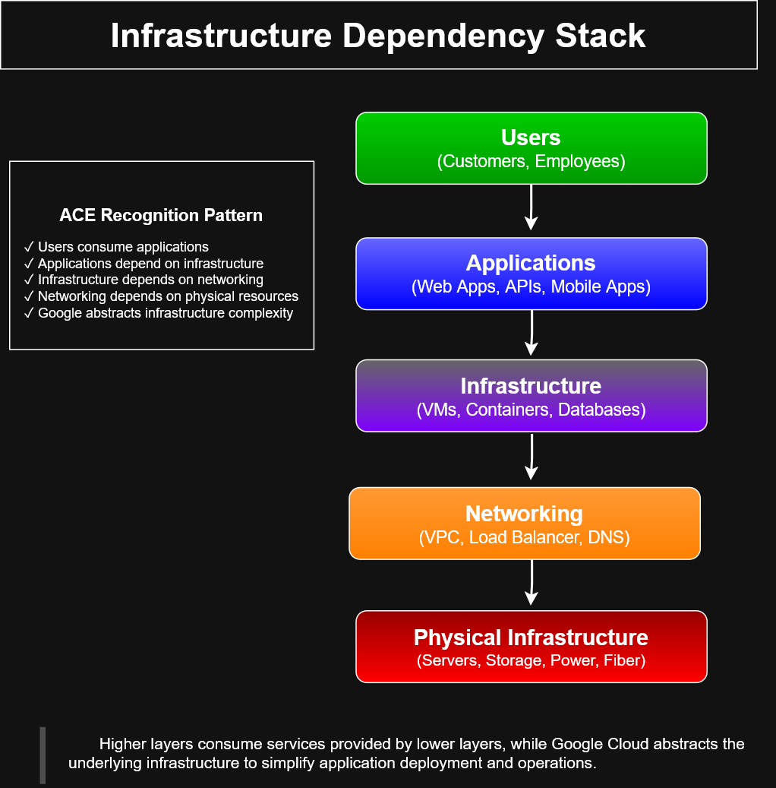

# Infrastructure Dependency Stack

## Preview

---

## Overview

This architecture diagram illustrates the dependency layers that support applications running in Google Cloud. It demonstrates how users interact with applications while the underlying infrastructure, networking, and physical resources provide the foundation for reliable cloud services.

The diagram emphasizes Google's abstraction of infrastructure complexity, allowing developers and administrators to focus on application delivery rather than hardware management.

---

## Architecture Layers

### Users

- Customers
- Employees
- Administrators

Users consume applications without interacting directly with the underlying infrastructure.

---

### Applications

Examples include:

- Web applications
- REST APIs
- Mobile applications
- Enterprise services

Applications rely on cloud infrastructure for execution.

---

### Infrastructure

Core infrastructure services include:

- Compute Engine virtual machines
- Google Kubernetes Engine (GKE)
- Cloud Run
- Databases
- Containers

These services host workloads and business applications.

---

### Networking

Networking provides secure connectivity between resources.

Examples include:

- Virtual Private Cloud (VPC)
- Cloud Load Balancing
- Cloud DNS
- Firewall Rules
- Cloud Router
- Cloud NAT

---

### Physical Infrastructure

Google manages the underlying hardware including:

- Compute servers
- Storage systems
- Fiber networks
- Power systems
- Cooling infrastructure

Customers are abstracted from physical infrastructure management.

---

## ACE Recognition Pattern

This diagram reinforces several Associate Cloud Engineer concepts:

- Users consume applications
- Applications depend on infrastructure
- Infrastructure depends on networking
- Networking depends on physical resources
- Google Cloud abstracts infrastructure complexity

---

## Learning Objectives

After reviewing this diagram, learners should understand:

- The layered nature of cloud infrastructure
- Infrastructure dependencies
- Service abstraction in Google Cloud
- The relationship between users, applications, and infrastructure
- Why managed services reduce operational complexity

---

## Key Takeaway

Higher layers consume services provided by lower layers, while Google Cloud abstracts the underlying infrastructure to simplify application deployment, scalability, reliability, and operations.

---

## Repository Context

This diagram is part of the **cloud-engineer-learning-path** repository and serves as a visual study aid for Google Cloud architecture concepts and Associate Cloud Engineer certification preparation.
