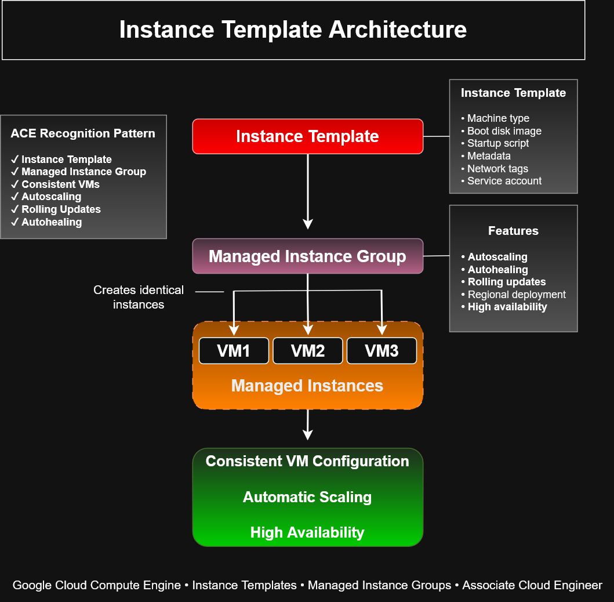

# Instance Template Architecture


# Instance Template Architecture

This architecture diagram demonstrates how **Google Cloud Instance Templates** provide standardized virtual machine configurations that can be deployed repeatedly through **Managed Instance Groups (MIGs)**.

Instance Templates are the foundation for autoscaling, rolling updates, self-healing, and high-availability architectures within Google Cloud Compute Engine.

---

# Architecture Diagram



---

# Architecture Overview

An Instance Template acts as a reusable blueprint containing all configuration settings required to launch identical virtual machines.

Managed Instance Groups reference the template to automatically create and maintain multiple VM instances, ensuring consistency and scalability across the infrastructure.

```text
Instance Template
        │
        ▼
Managed Instance Group
        │
 ┌──────┼──────┐
 ▼      ▼      ▼
VM1    VM2    VM3
```

---

# Instance Template Components

A Google Cloud Instance Template typically defines:

- Machine type
- Boot disk image
- Startup script
- Network interfaces
- Firewall tags
- Service account
- Metadata
- Labels
- Shielded VM settings

Every VM created from the template inherits these settings automatically.

---

# Managed Instance Group Features

When paired with a Managed Instance Group, Instance Templates enable:

- Autoscaling
- Self-healing
- Rolling updates
- Auto-recreation
- High availability
- Load balancing integration
- Consistent VM deployments

This architecture supports elastic cloud applications that automatically adapt to workload demands.

---

# Architecture Benefits

Using Instance Templates provides several operational advantages:

- Standardized infrastructure
- Faster deployments
- Reduced configuration drift
- Simplified maintenance
- Easier disaster recovery
- Consistent security settings
- Automated infrastructure management

---

# Common Use Cases

Instance Templates are commonly used for:

- Web server farms
- Application servers
- Microservices
- Kubernetes worker nodes
- API services
- High-availability applications
- Autoscaling production workloads

---

# ACE Recognition Pattern

For the Google Cloud Associate Cloud Engineer exam, recognize the following architecture:

```text
Instance Template
        ↓
Managed Instance Group
        ↓
Identical VM Instances
        ↓
Autoscaling / Rolling Updates / Self-Healing
```

Questions mentioning **identical virtual machines**, **automatic scaling**, or **rolling updates** almost always involve an **Instance Template with a Managed Instance Group**.

---

# Best Practices

Recommended practices include:

- Use startup scripts for automated configuration
- Keep templates immutable
- Create a new template version for updates
- Pair templates with Managed Instance Groups
- Integrate with Load Balancers
- Enable health checks for self-healing
- Store startup scripts in source control

---

# Google Cloud Services

This architecture incorporates:

- Compute Engine
- Instance Templates
- Managed Instance Groups
- Load Balancing
- Autoscaler
- Startup Scripts
- Health Checks

---

# ACE Exam Focus Areas

This diagram reinforces concepts related to:

- Compute Engine
- Instance Templates
- Managed Instance Groups
- Autoscaling
- Rolling Updates
- Startup Scripts
- Infrastructure Automation
- High Availability

---

# Skills Demonstrated

- Google Cloud Architecture
- Compute Engine Administration
- Infrastructure Automation
- Managed Instance Groups
- Autoscaling Design
- High Availability
- Cloud Operations
- Infrastructure as Code Principles

---

# Files Included

- `instance-template-architecture.drawio`
- `instance-template-architecture.png`
- `instance-template-architecture.svg`

---

# Related Architecture Diagrams

- Managed Instance Group Architecture
- Managed Instance Group Scale-Out Workflow
- Rolling Update Workflow
- Compute Engine Autoscaling Workflow
- Startup Script Workflow
- Persistent Disk Snapshot Recovery Workflow

---

# Portfolio Note

This architecture diagram was created as part of the **Google Cloud Associate Cloud Engineer Learning Path** to illustrate how Instance Templates serve as reusable infrastructure blueprints for Managed Instance Groups. It demonstrates scalable, automated deployment patterns commonly used in enterprise Google Cloud environments and reinforces key Associate Cloud Engineer certification concepts.
