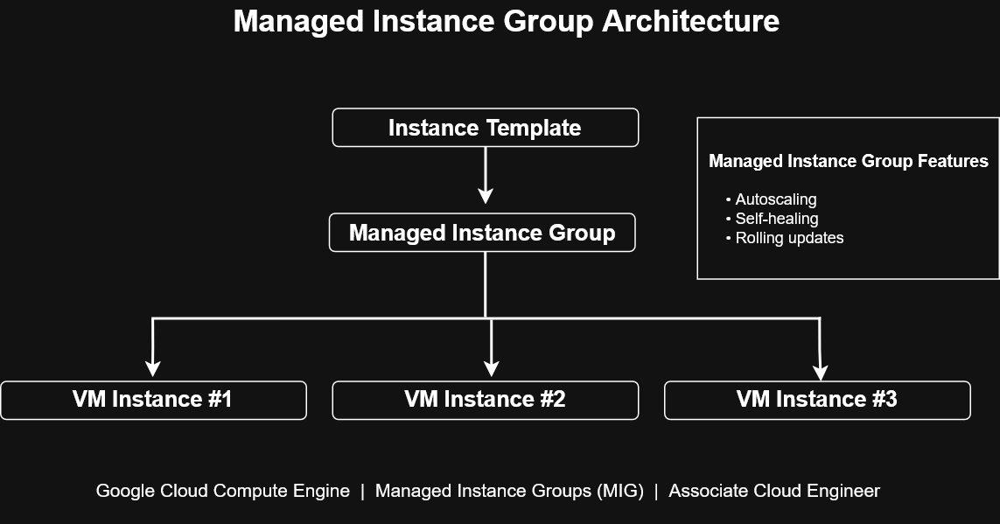

# Managed Instance Group Architecture


This diagram illustrates the architecture of a Google Cloud Managed Instance Group (MIG), demonstrating how a single instance template can automatically provision and manage multiple virtual machine instances.

---

# Architecture Diagram



---

# Architecture Overview

A Managed Instance Group uses an instance template to create identical virtual machines and manage them as a single logical resource.

This architecture provides:

- Automatic instance provisioning
- Self-healing capabilities
- Autoscaling
- Rolling updates
- Consistent VM configurations
- High availability

---

# Architecture Flow

```text
Instance Template
        │
        ▼
Managed Instance Group
        │
 ┌──────┼──────┐
 ▼      ▼      ▼
VM1    VM2    VM3
```

The instance template defines the machine configuration, while the Managed Instance Group ensures that all virtual machines remain healthy and consistent.

---

# Key Components

## Instance Template

Defines:

- Machine type
- Boot disk
- Startup script
- Metadata
- Network configuration
- Service account
- Labels and tags

All instances created by the Managed Instance Group inherit this configuration.

---

## Managed Instance Group

Responsible for:

- Creating VM instances
- Monitoring instance health
- Replacing failed instances
- Autoscaling based on load
- Performing rolling updates
- Maintaining desired capacity

---

## Virtual Machine Instances

Each VM is created from the same template, ensuring consistency across the deployment.

Benefits include:

- Standardized environments
- Easier maintenance
- Predictable deployments
- Simplified operations

---

# Operational Features

### Autoscaling

Automatically adds or removes VM instances based on utilization metrics.

Examples:

- CPU utilization
- Load balancer requests
- Custom Cloud Monitoring metrics

---

### Self-Healing

Health checks continuously monitor VM instances.

If an instance fails, the Managed Instance Group automatically recreates it from the instance template.

---

### Rolling Updates

When a new instance template is created, the Managed Instance Group can gradually replace existing VMs without significant downtime.

---

# Common Use Cases

- Web application servers
- API backends
- Microservices
- Load-balanced applications
- Scalable compute workloads
- High availability deployments

---

# ACE Exam Recognition Patterns

For the Associate Cloud Engineer exam:

- Instance Template → Managed Instance Group indicates automated VM management.
- Managed Instance Groups support autoscaling and self-healing.
- Rolling updates replace instances gradually using a new template version.
- Health checks enable automatic recovery of failed instances.

---

# Skills Demonstrated

- Compute Engine
- Managed Instance Groups
- Instance Templates
- Autoscaling
- Self-Healing Infrastructure
- Rolling Updates
- High Availability
- Infrastructure Automation

---

# Files Included

- managed-instance-group-architecture.drawio
- managed-instance-group-architecture.png
- managed-instance-group-architecture.svg

---

# Related Architecture Diagrams

- Rolling Update Workflow
- Startup Script Workflow
- Snapshot Architecture
- Terraform Infrastructure Deployment Workflow
- GKE Cluster Architecture

---

# Portfolio Note

This diagram was created as part of the **Google Cloud Associate Cloud Engineer Learning Path** to demonstrate knowledge of scalable Compute Engine deployments using Managed Instance Groups, highlighting infrastructure automation, self-healing, autoscaling, and high availability design patterns commonly used in enterprise cloud environments.
