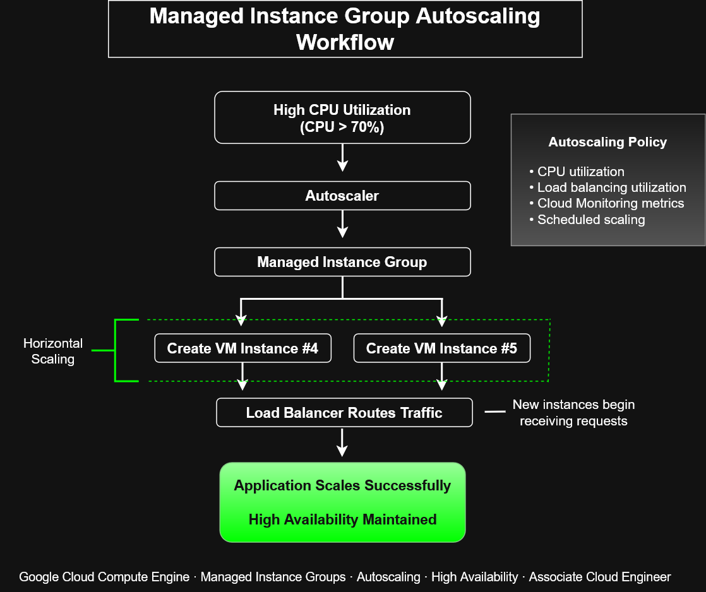

# Managed Instance Group Autoscaling Workflow


This diagram illustrates how **Google Cloud Managed Instance Groups (MIGs)** automatically provision additional virtual machine instances in response to increased workload demand while maintaining high availability and application performance.

The workflow demonstrates one of the most common infrastructure automation patterns used in Google Cloud Compute Engine.

---

# Architecture Diagram



---

# Purpose

This architecture demonstrates how a Managed Instance Group responds to increased resource utilization by automatically creating additional virtual machine instances and distributing traffic across the expanded infrastructure.

The diagram reinforces core concepts related to:

- Infrastructure automation
- Horizontal scaling
- High availability
- Load balancing
- Elastic cloud computing
- Google Cloud operations

---

# Workflow Overview

```text
High CPU Utilization
        │
        ▼
Autoscaler
        │
        ▼
Managed Instance Group
        │
 ┌──────┴──────┐
 ▼             ▼
Create VM #4  Create VM #5
        │
        ▼
Load Balancer Routes Traffic
        │
        ▼
Application Scales Successfully
High Availability Maintained
```

As workload demand increases, the Managed Instance Group provisions additional VM instances and integrates them into the application's load balancing pool.

---

# Autoscaling Policy

The autoscaler evaluates predefined policies such as:

- CPU utilization
- Load balancing utilization
- Cloud Monitoring metrics
- Scheduled scaling

These policies determine when additional virtual machines should be created or removed.

---

# Horizontal Scaling

This workflow demonstrates **horizontal scaling**, where infrastructure capacity is increased by adding additional VM instances rather than increasing the size of existing machines.

Benefits include:

- Improved fault tolerance
- Better scalability
- Reduced single points of failure
- Increased application availability

---

# Traffic Distribution

After new VM instances are created:

1. The instances complete initialization.
2. Health checks verify readiness.
3. The load balancer begins routing traffic.
4. Requests are distributed across all healthy instances.

This allows application capacity to grow without interrupting service.

---

# High Availability

By distributing workloads across multiple virtual machines, Managed Instance Groups help provide:

- Continuous application availability
- Automatic failure recovery
- Fault isolation
- Consistent user experience
- Resilient cloud infrastructure

---

# Key Google Cloud Services

- Compute Engine
- Managed Instance Groups
- Autoscaler
- Cloud Load Balancing
- Cloud Monitoring

These services work together to deliver scalable and highly available cloud applications.

---

# ACE Exam Recognition Patterns

For the Associate Cloud Engineer exam:

- High CPU utilization often triggers autoscaling.
- Managed Instance Groups automatically create additional VM instances.
- Horizontal scaling adds more virtual machines instead of increasing machine size.
- Load balancers distribute traffic to newly provisioned instances.
- Autoscaling supports both high availability and operational efficiency.

---

# Common Use Cases

- Web applications
- REST APIs
- E-commerce platforms
- Enterprise applications
- Microservices
- Customer-facing services
- Variable traffic workloads

---

# Skills Demonstrated

- Google Cloud Compute Engine
- Managed Instance Groups
- Autoscaling
- Horizontal Scaling
- Infrastructure Automation
- High Availability
- Cloud Load Balancing
- Elastic Infrastructure
- Cloud Operations

---

# Files Included

- `managed-instance-group-autoscaling-workflow.drawio`
- `managed-instance-group-autoscaling-workflow.png`
- `managed-instance-group-autoscaling-workflow.svg`

---

# Related Architecture Diagrams

- Managed Instance Group Architecture
- Compute Engine Autoscaling Workflow
- Rolling Update Workflow
- Startup Script Workflow
- Snapshot Architecture
- Terraform Infrastructure Deployment Workflow

---

# Portfolio Note

This diagram was created as part of the **Google Cloud Associate Cloud Engineer Learning Path** to demonstrate practical knowledge of Managed Instance Groups and autoscaling behavior in Google Cloud. It illustrates how enterprise applications automatically scale horizontally, distribute traffic across new instances, and maintain high availability through infrastructure automation and managed cloud services.
