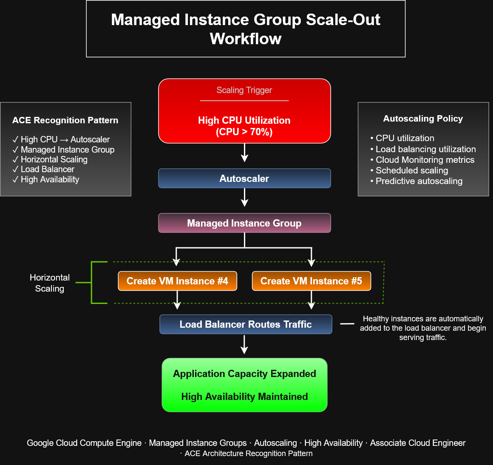

# Managed Instance Group Scale-Out Workflow


# Managed Instance Group Scale-Out Workflow

This architecture diagram demonstrates how **Google Cloud Managed Instance Groups (MIGs)** automatically scale out in response to increased application demand while maintaining high availability through load balancing.

The workflow illustrates the relationship between autoscaling policies, Managed Instance Groups, Compute Engine instances, and Cloud Load Balancing to provide elastic infrastructure with minimal operational overhead.

---

# Architecture Diagram



---

# Architecture Overview

When resource utilization exceeds a configured threshold, the Google Cloud Autoscaler evaluates the autoscaling policy and provisions additional Compute Engine virtual machine instances from the Managed Instance Group.

After passing health checks, the new instances are automatically registered with the load balancer and begin serving incoming requests, allowing the application to scale horizontally without downtime.

---

# Scale-Out Workflow

```text
High CPU Utilization
        ↓
Autoscaler
        ↓
Managed Instance Group
        ↓
Create Additional VM Instances
        ↓
Load Balancer Routes Traffic
        ↓
Application Capacity Expanded
High Availability Maintained
```

---

# Autoscaling Policy Metrics

Managed Instance Groups can automatically scale based on:

- CPU utilization
- Load balancing utilization
- Cloud Monitoring metrics
- Scheduled scaling
- Predictive autoscaling

---

# Benefits

- Automatic horizontal scaling
- High availability
- Elastic infrastructure
- Minimal operational overhead
- Consistent VM configuration through instance templates
- Automatic traffic distribution
- Improved application resiliency

---

# Google Cloud Services

This architecture incorporates the following Google Cloud services:

- Compute Engine
- Managed Instance Groups
- Autoscaler
- Instance Templates
- Cloud Load Balancing
- Cloud Monitoring

---

# Recognition Pattern

This architecture follows a common Google Cloud recognition pattern:

```text
High CPU Utilization
        ↓
Autoscaler
        ↓
Managed Instance Group
        ↓
Create Additional VM Instances
        ↓
Load Balancer
        ↓
High Availability
```

Understanding this sequence is valuable for identifying autoscaling solutions during cloud architecture design and Associate Cloud Engineer certification scenarios.

---

# Common Use Cases

Managed Instance Group scale-out architectures are commonly used for:

- Web applications
- REST APIs
- Enterprise applications
- E-commerce platforms
- Microservices
- High-traffic websites
- Production workloads requiring high availability

---

# ACE Exam Focus Areas

This diagram reinforces concepts related to:

- Compute Engine
- Managed Instance Groups
- Autoscaling
- Horizontal scaling
- Instance Templates
- Cloud Load Balancing
- High Availability
- Infrastructure Automation
- Cloud Operations

---

# Skills Demonstrated

- Google Cloud Architecture
- Compute Engine Administration
- Managed Instance Groups
- Autoscaling Configuration
- High Availability Design
- Horizontal Scaling
- Cloud Infrastructure Automation
- Operational Best Practices

---

# Files Included

- `managed-instance-group-scale-out-workflow.drawio`
- `managed-instance-group-scale-out-workflow.png`
- `managed-instance-group-scale-out-workflow.svg`

---

# Related Architecture Diagrams

- Managed Instance Group Architecture
- Rolling Update Workflow
- Compute Engine Autoscaling Workflow
- Startup Script Workflow
- Snapshot Architecture

---

# Portfolio Note

This architecture diagram was created as part of the **Google Cloud Associate Cloud Engineer Learning Path** to demonstrate practical knowledge of Managed Instance Groups, autoscaling strategies, load balancing integration, and high-availability infrastructure design through visual architecture documentation.
