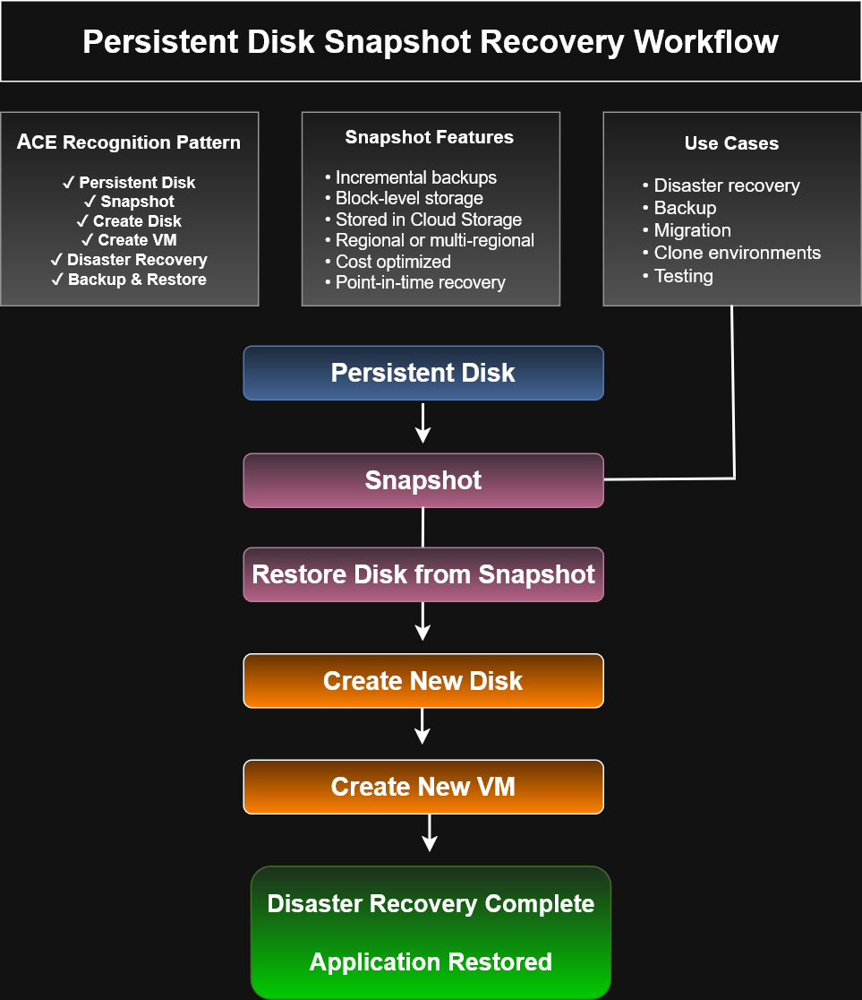

# Persistent Disk Snapshot Recovery Workflow


# Persistent Disk Snapshot Recovery Workflow

This architecture diagram illustrates the **Google Cloud Compute Engine snapshot recovery process**, demonstrating how persistent disk snapshots can be used to restore data and rapidly provision replacement virtual machines after data loss, corruption, or infrastructure failures.

The workflow highlights disaster recovery best practices and common architecture patterns used in production Google Cloud environments.

---

# Architecture Diagram



---

# Architecture Overview

Google Cloud Persistent Disk snapshots provide incremental, block-level backups that enable efficient disaster recovery and data protection.

When recovery is required, a new persistent disk is restored from an existing snapshot and attached to a newly created Compute Engine virtual machine, allowing applications and services to resume operation with minimal downtime.

---

# Recovery Workflow

```text
Persistent Disk
        ↓
Snapshot
        ↓
Restore Disk from Snapshot
        ↓
Create New Disk
        ↓
Create New VM
        ↓
Disaster Recovery Complete
Application Restored
```

---

# Snapshot Features

Google Cloud Persistent Disk snapshots provide:

- Incremental backups
- Block-level storage
- Storage in Cloud Storage
- Regional or multi-regional redundancy
- Cost-optimized backup storage
- Point-in-time recovery capabilities

These features reduce storage costs while enabling reliable recovery of production workloads.

---

# Common Use Cases

Persistent Disk snapshots are commonly used for:

- Disaster recovery
- Backup and restore operations
- Infrastructure migration
- Environment cloning
- Software testing
- Development environments
- Business continuity planning

---

# Disaster Recovery Benefits

Using snapshot-based recovery provides several operational advantages:

- Rapid infrastructure recovery
- Reduced downtime
- Cost-efficient backup storage
- Simplified environment cloning
- Reliable data protection
- Automated recovery workflows
- Improved operational resilience

---

# Google Cloud Services

This architecture incorporates the following Google Cloud services:

- Compute Engine
- Persistent Disk
- Persistent Disk Snapshots
- Cloud Storage
- Virtual Machines

---

# ACE Recognition Pattern

For the Google Cloud Associate Cloud Engineer certification, recognize the following architecture pattern:

```text
Persistent Disk
        ↓
Snapshot
        ↓
Restore Disk
        ↓
Create New VM
        ↓
Application Recovery
```

Questions involving disaster recovery, backups, cloning environments, or restoring deleted virtual machines often rely on this workflow.

---

# Best Practices

Recommended practices include:

- Schedule automatic snapshots
- Test recovery procedures regularly
- Store snapshots across regions when appropriate
- Apply lifecycle policies to control storage costs
- Monitor backup completion
- Document recovery procedures
- Validate restored workloads before production deployment

---

# ACE Exam Focus Areas

This diagram reinforces concepts related to:

- Compute Engine
- Persistent Disks
- Snapshots
- Disaster Recovery
- Backup and Restore
- Cloud Storage
- Business Continuity
- Infrastructure Operations

---

# Skills Demonstrated

- Google Cloud Architecture
- Compute Engine Administration
- Persistent Disk Management
- Snapshot Administration
- Disaster Recovery Planning
- Backup Strategies
- Cloud Infrastructure Operations
- Business Continuity Design

---

# Files Included

- `persistent-disk-snapshot-recovery-workflow.drawio`
- `persistent-disk-snapshot-recovery-workflow.png`
- `persistent-disk-snapshot-recovery-workflow.svg`

---

# Related Architecture Diagrams

- Snapshot Architecture
- Startup Script Workflow
- Instance Template Architecture
- Managed Instance Group Architecture
- Rolling Update Workflow
- Managed Instance Group Scale-Out Workflow
- Compute Engine Autoscaling Workflow

---

# Portfolio Note

This architecture diagram was created as part of the **Google Cloud Associate Cloud Engineer Learning Path** to demonstrate practical understanding of Persistent Disk snapshots, disaster recovery workflows, backup strategies, and infrastructure restoration techniques through visual architecture documentation.

The workflow reflects common enterprise recovery patterns used to protect critical workloads and restore services efficiently in Google Cloud environments.
