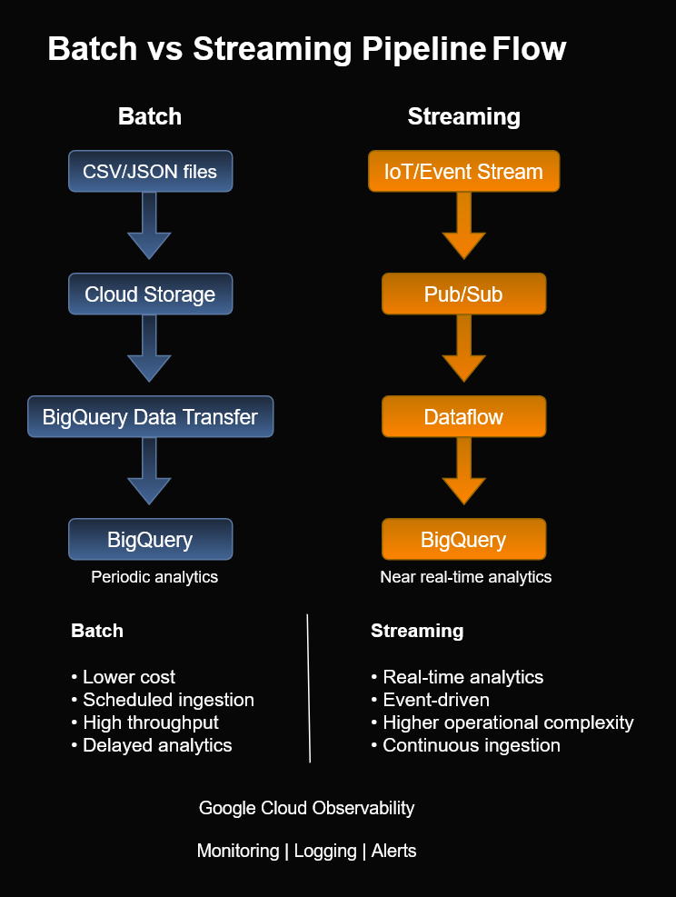

# Batch vs Streaming Pipeline Flow


This diagram compares two common Google Cloud data ingestion architectures:

- Batch ingestion pipelines
- Streaming ingestion pipelines

The goal is to demonstrate operational differences, architectural patterns, and recognition concepts commonly used in cloud engineering and analytics systems.

---

## Table of Contents

- Architecture Diagram
- Architecture Overview
- Purpose
- Batch Pipeline
- Streaming Pipeline
- Observability Layer
- Recognition Patterns
- Operational Tradeoffs
- ACE Exam Focus Areas
- Files Included
- Skills Demonstrated
  
---

## Architecture Diagram



---

## Architecture Overview

This architecture compares scheduled batch ingestion with event-driven streaming ingestion in Google Cloud.

Batch pipelines prioritize simplicity and cost efficiency, while streaming pipelines prioritize low-latency processing and real-time analytics. Both patterns are foundational architectures for cloud engineers and data engineers designing scalable analytics systems.

---

## Why This Architecture Matters

Understanding the difference between batch and streaming architectures is important for:

- Associate Cloud Engineer (ACE) certification preparation
- Data engineering workflows
- Cloud analytics systems
- Real-time event processing
- Cost optimization decisions
- Operational monitoring

---

# Batch Pipeline Flow

## Architecture

```text
CSV/JSON Files
        ↓
Cloud Storage
        ↓
BigQuery Data Transfer
        ↓
BigQuery
```
### Characteristics
- Lower operational cost
- Scheduled ingestion
- High throughput
- Delayed analytics
- Easier operational management
  
### Common Use Cases
- Daily reporting
- Periodic ETL jobs
- Historical analytics
- CSV imports
- Business intelligence dashboards
  
### Technologies Used
- Cloud Storage
- BigQuery Data Transfer Service
- BigQuery

---

# Streaming Pipeline Flow

## Architecture
``` text
IoT/Event Stream
        ↓
Pub/Sub
        ↓
Dataflow
        ↓
BigQuery
```
### Characteristics
- Real-time analytics
- Event-driven architecture
- Continuous ingestion
- Higher operational complexity
- Low-latency processing
  
### Common Use Cases
- IoT telemetry
- Sensor monitoring
- Real-time dashboards
- Clickstream analytics
- Live event processing
  
### Technologies Used
- Pub/Sub
- Dataflow
- BigQuery

---

# Observability Layer

Both ingestion models commonly use Google Cloud Observability services for:

- Monitoring
- Logging
- Alerts
- Operational troubleshooting
  
# Recognition Patterns

## Batch Recognition Pattern

If data:

- changes slowly
- arrives periodically
- can tolerate delayed analytics

then:

- batch ingestion is usually preferred

## Streaming Recognition Pattern

If workloads require:

- real-time analytics
- continuous processing
- event-driven workflows

then:

- streaming architectures are preferred

---

> **ACE Exam Tip**
>
> - Cloud Storage → BigQuery generally indicates a batch workload.
> - Pub/Sub → Dataflow → BigQuery generally indicates a streaming workload.
> - Questions involving IoT devices, clickstream events, or sensor telemetry usually require a streaming architecture.

---
# Operational Tradeoffs

| Feature     | Batch               | Streaming           |
| ----------- | ------------------- | ------------------- |
| Processing  | Scheduled           | Continuous          |
| Latency     | Minutes to Hours    | Seconds             |
| Cost        | Lower               | Higher              |
| Complexity  | Lower               | Higher              |
| Scalability | High                | Very High           |
| Best For    | Historical Analysis | Real-time Analytics |
| Example     | Daily Sales Report  | IoT Sensor Data     |

---

# ACE Exam Focus Areas

This diagram supports learning objectives related to:

- BigQuery
- Pub/Sub
- Dataflow
- Cloud Storage
- Data ingestion
- Analytics pipelines
- Observability
- Cloud operations

---

## Files Included
- batch-vs-streaming-flow.drawio
- batch-vs-streaming-flow.png
- batch-vs-streaming-flow.svg

## Related Architecture Diagrams

- IAM Authentication Models
- GKE Workload Identity
- Cloud Storage Architecture
- BigQuery Analytics Patterns
- Terraform Infrastructure Deployment Workflow
---

## Skills Demonstrated

- Google Cloud Architecture
- Data Pipelines
- Pub/Sub
- Dataflow
- BigQuery
- Cloud Storage
- Observability
- Event-Driven Systems
- Batch Processing
- Streaming Analytics

---

# Repository

Part of the cloud-engineer-learning-path repository focused on cloud operations, data ingestion, observability, and Google Cloud architecture patterns.

## Portfolio Note

This diagram was created as part of the **Google Cloud Associate Cloud Engineer Learning Path** to reinforce architectural decision-making and recognition of common Google Cloud data ingestion patterns through visual documentation.
