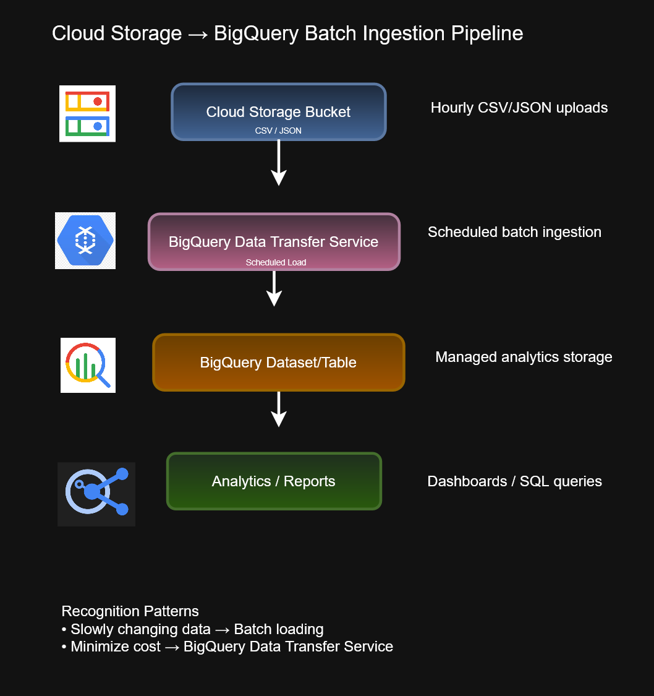

# BigQuery Batch Ingestion Pipeline


This architecture diagram demonstrates a common Google Cloud batch ingestion pattern where files stored in Cloud Storage are loaded into BigQuery using BigQuery Data Transfer Service for analytics and reporting.

The design emphasizes cost-effective, scheduled data ingestion for workloads that do not require real-time processing.

---

## Architecture Diagram



---

## Architecture Overview

The workflow follows a simple batch ingestion model:

```text
Cloud Storage
      ↓
BigQuery Data Transfer Service
      ↓
BigQuery Dataset / Table
      ↓
Analytics & Reporting
```

Files are uploaded to Cloud Storage and ingested into BigQuery on a scheduled basis, allowing analysts and business users to query data using SQL and reporting tools.

---

## Purpose

This architecture demonstrates:

- Batch data ingestion
- Scheduled data loading
- Analytics data warehousing
- Cost-efficient processing
- Managed Google Cloud services
- Operational simplicity

---

## Services Used

### Cloud Storage

Acts as the landing zone for incoming files.

Typical file formats:

- CSV
- JSON
- Avro
- Parquet

Responsibilities:

- File storage
- Data staging
- Data retention
- Low-cost storage

---

### BigQuery Data Transfer Service

Provides scheduled loading of data from Cloud Storage into BigQuery.

Benefits:

- Managed service
- Automated scheduling
- Minimal operational overhead
- Native BigQuery integration

---

### BigQuery

Provides:

- SQL analytics
- Dashboards
- Reporting
- Data warehousing
- Business intelligence workloads

---

## Recognition Pattern

A common Associate Cloud Engineer exam pattern is:

```text
Cloud Storage
        ↓
BigQuery Data Transfer Service
        ↓
BigQuery
```

This generally indicates:

- Batch ingestion
- Scheduled processing
- Lower cost analytics
- Historical reporting

---

## When to Use Batch Ingestion

Batch ingestion is preferred when:

- Data changes slowly
- Real-time processing is unnecessary
- Cost optimization is important
- Scheduled reporting is acceptable
- Large file imports occur periodically

Examples:

- Daily sales reports
- Monthly financial reports
- Inventory exports
- Data warehouse refreshes

---

## Operational Benefits

### Lower Cost

Batch processing generally costs less than continuous streaming architectures.

### Simpler Operations

No continuously running stream-processing infrastructure is required.

### Predictable Scheduling

Data can be loaded:

- Hourly
- Daily
- Weekly
- Monthly

based on business requirements.

---

## Batch vs Streaming

| Feature | Batch | Streaming |
|----------|----------|----------|
| Processing | Scheduled | Continuous |
| Cost | Lower | Higher |
| Complexity | Lower | Higher |
| Latency | Minutes to Hours | Seconds |
| Best Use Case | Reporting | Real-Time Analytics |

---

## ACE Exam Focus Areas

This diagram supports learning objectives related to:

- Cloud Storage
- BigQuery
- BigQuery Data Transfer Service
- Data ingestion
- Analytics
- Data warehousing
- Operational efficiency
- Managed services

---

## Files Included

| File | Description |
|--------|-------------|
| `bigquery-batch-ingestion.drawio` | Editable diagrams.net source |
| `bigquery-batch-ingestion.png` | Diagram preview image |
| `bigquery-batch-ingestion.svg` | Scalable vector version |

---

## Skills Demonstrated

- Google Cloud Architecture
- Data Ingestion Design
- BigQuery Analytics
- Cloud Storage Integration
- Managed Services
- Batch Processing
- Cost Optimization
- Cloud Operations

---

## Repository

Part of the **cloud-engineer-learning-path** repository documenting Google Cloud architecture patterns and Associate Cloud Engineer study materials through visual architecture diagrams.
