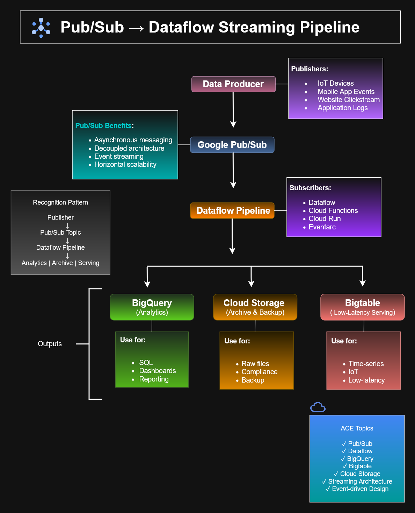

# Pub/Sub → Dataflow Streaming Pipeline

This diagram illustrates a common event-driven architecture pattern in Google Cloud, where data is ingested through Pub/Sub, processed by Dataflow, and delivered to multiple downstream services for analytics, archival storage, and low-latency applications.

The architecture demonstrates a scalable and decoupled streaming pipeline commonly used in modern cloud-native systems and is aligned with Google Cloud Associate Cloud Engineer (ACE) learning objectives.

---

## Architecture Diagram



---

## Overview

The workflow begins with one or more data producers publishing events to a Google Cloud Pub/Sub topic.

A Dataflow streaming pipeline subscribes to the topic, transforms or enriches incoming messages, and distributes processed data to specialized Google Cloud services based on workload requirements.

This architecture enables independent scaling, real-time processing, and multiple downstream consumers without tightly coupling applications.

---

## Architecture Flow

```text
Data Producer
        │
        ▼
 Google Pub/Sub
        │
        ▼
 Dataflow Pipeline
   ┌────┼─────┐
   ▼    ▼     ▼
BigQuery  Cloud Storage  Bigtable
```

---

## Components

### Data Producer

Sources that generate events for processing.

Examples include:

- IoT devices
- Mobile applications
- Website clickstream events
- Application logs
- Microservices
- Enterprise systems

---

### Google Cloud Pub/Sub

A fully managed messaging service used for asynchronous communication between independent systems.

Key capabilities include:

- Event ingestion
- Publish/subscribe messaging
- Decoupled architecture
- Horizontal scalability
- Reliable message delivery

---

### Dataflow Pipeline

Processes streaming data in real time using Apache Beam.

Typical responsibilities include:

- Data transformation
- Data enrichment
- Windowing
- Filtering
- Aggregation
- Routing

---

## Output Services

### BigQuery

Optimized for analytics and business intelligence workloads.

Common uses:

- SQL analytics
- Dashboards
- Reporting
- Data warehousing

---

### Cloud Storage

Provides durable object storage for long-term retention.

Common uses:

- Raw data archive
- Compliance retention
- Backups
- Data lake storage

---

### Bigtable

A NoSQL wide-column database optimized for high-throughput workloads.

Common uses:

- IoT telemetry
- Time-series data
- Low-latency serving
- Operational applications

---

## Recognition Pattern

This architecture follows a standard Google Cloud streaming design pattern:

```text
Publisher
      │
      ▼
Pub/Sub Topic
      │
      ▼
Dataflow Pipeline
      │
 ┌────┼─────┐
 ▼    ▼     ▼
Analytics  Archive  Serving
```

Understanding this pattern helps recognize many production streaming architectures used throughout Google Cloud.

---

## ACE Exam Topics

This diagram supports several Google Associate Cloud Engineer certification objectives, including:

- Pub/Sub messaging
- Dataflow pipelines
- Streaming data processing
- Event-driven architecture
- BigQuery analytics
- Cloud Storage
- Bigtable
- Managed data services

---

## Files Included

| File | Description |
|-----------------------------|----------------------------------------------|
| `pubsub-dataflow.drawio` | Editable diagrams.net source file |
| `pubsub-dataflow.png` | PNG preview image |
| `pubsub-dataflow.svg` | Scalable vector version |

---

## Technologies

- Google Cloud Pub/Sub
- Google Cloud Dataflow
- BigQuery
- Cloud Storage
- Bigtable
- Apache Beam

---

## Learning Objectives

This architecture demonstrates how Google Cloud services work together to build scalable event-driven systems capable of ingesting, processing, analyzing, and storing streaming data while maintaining loose coupling between producers and consumers.

It serves as a practical reference for cloud architecture design, streaming analytics, and Google Cloud Associate Cloud Engineer certification preparation.
