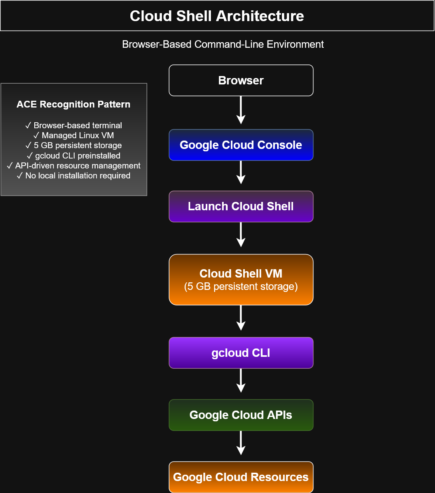

# Cloud Shell Architecture



## Overview

This architecture diagram illustrates how **Google Cloud Shell** provides a browser-based command-line environment for interacting with Google Cloud resources.

Cloud Shell is a managed Linux virtual machine that launches directly from the Google Cloud Console and includes the **gcloud CLI** and other developer tools pre-installed. It allows administrators and developers to manage Google Cloud resources without installing local software.

---

## Architecture Workflow

```
Browser
    ↓
Google Cloud Console
    ↓
Launch Cloud Shell
    ↓
Cloud Shell Virtual Machine
(5 GB Persistent Storage)
    ↓
gcloud CLI
    ↓
Google Cloud APIs
    ↓
Google Cloud Resources
```

---

## Key Concepts

* Cloud Shell is launched directly from the Google Cloud Console.
* A temporary Linux virtual machine is provisioned for the user.
* Cloud Shell includes the **Google Cloud CLI (gcloud)** pre-installed.
* The environment provides **5 GB of persistent home directory storage** across sessions.
* Commands issued through the gcloud CLI communicate with Google Cloud APIs to create and manage resources.
* No local installation or configuration is required.

---

## ACE Recognition Pattern

* ✓ Browser-based terminal
* ✓ Google Cloud Console integration
* ✓ Cloud Shell managed virtual machine
* ✓ gcloud CLI pre-installed
* ✓ Google Cloud API communication
* ✓ Command-line resource administration

---

## Learning Objectives

After reviewing this diagram, learners should be able to:

* Explain the purpose of Google Cloud Shell.
* Describe how Cloud Shell differs from the Google Cloud Console.
* Understand the relationship between Cloud Shell and the gcloud CLI.
* Identify how Cloud Shell communicates with Google Cloud services through APIs.
* Use Cloud Shell for infrastructure management and lab exercises.

---

## Files

* `cloud-shell-architecture.drawio`
* `cloud-shell-architecture.svg`
* `cloud-shell-architecture.png`
* `README.md`

---

## Related Diagrams

* Google Cloud Interaction Methods
* Google Cloud API Architecture
* Google Cloud Console Navigation Workflow

---

## Certification Alignment

This diagram supports the **Google Cloud Associate Cloud Engineer (ACE)** certification objectives related to:

* Google Cloud Console
* Cloud Shell
* Google Cloud CLI
* Resource management
* Infrastructure administration
* Cloud operations
