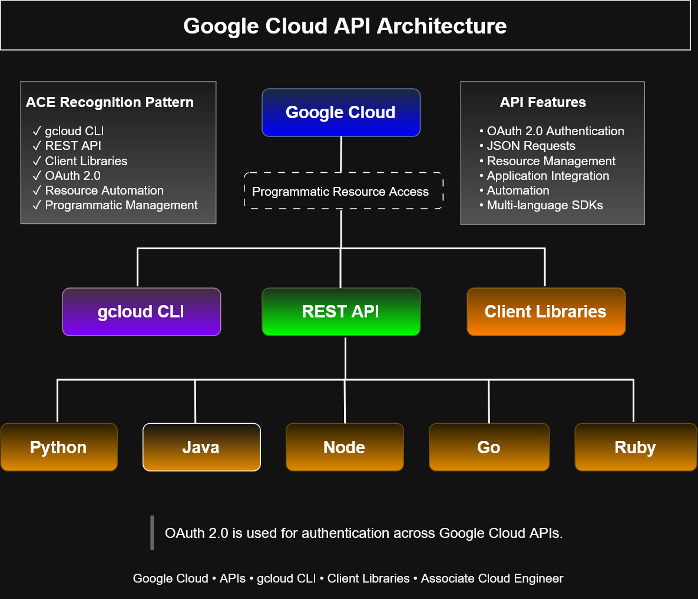

# Google Cloud API Architecture

## Overview

This diagram illustrates the three primary methods for programmatic interaction with Google Cloud services: the gcloud CLI, REST APIs, and Google Cloud Client Libraries. It also highlights the supported programming languages and the OAuth 2.0 authentication model used across Google Cloud APIs.
