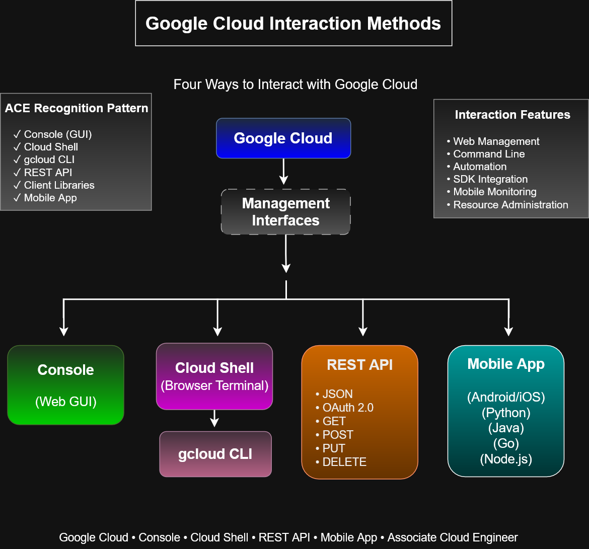

# Google Cloud Interaction Methods

## Overview
This architecture diagram illustrates the four primary methods for interacting with Google Cloud resources and services. Google Cloud provides multiple management interfaces to support administrators, developers, DevOps engineers, and automation tools.

Understanding these interaction methods is fundamental for the Google Cloud Associate Cloud Engineer (ACE) certification and for day-to-day cloud administration.

---

## Four Interaction Methods
### Google Cloud Console
- Web-based graphical user interface (GUI)
- Resource creation and management
- Monitoring and administration
- Accessible through a web browser
  
### Cloud Shell
- Browser-based Linux terminal
- Includes the gcloud CLI preinstalled
- Provides 5 GB of persistent storage
- Ideal for command-line administration and labs

### REST API
- Programmatic interface for Google Cloud services
- Uses OAuth 2.0 for authentication
- Supports standard HTTP methods (GET, POST, PUT, DELETE)
- Enables automation and custom integrations

### Cloud Mobile App
- Available for Android and iOS
- Monitor resources remotely
- View alerts and logs
- Start, stop, and manage Compute Engine instances

---

## Key Concepts
- Google Cloud offers multiple interfaces for managing cloud resources.
- The Google Cloud Console provides a graphical management experience.
- Cloud Shell enables browser-based command-line administration.
- REST APIs allow applications and automation tools to interact with Google Cloud programmatically.
- The Cloud Mobile App enables remote monitoring and management from mobile devices.
- All interfaces communicate with the same Google Cloud platform.

---

## ACE Recognition Pattern
✓ Google Cloud Console (GUI)
✓ Cloud Shell
✓ gcloud CLI
✓ REST API
✓ Cloud Mobile App
✓ Multiple management interfaces for the same cloud resources

---

## Learning Objectives
After studying this diagram, learners should be able to:

- Identify the four primary methods of interacting with Google Cloud.
- Understand when to use the Console versus Cloud Shell.
- Explain the role of REST APIs in cloud automation.
- Recognize how mobile applications support cloud administration.
- Select the appropriate interface based on operational requirements.

---

## Files

- `google-cloud-interaction-methods.drawio`
- `google-cloud-interaction-methods.svg`
- `google-cloud-interaction-methods.png`
- `README.md`
---

### Related Diagrams
- Cloud Shell Architecture
- Google Cloud API Architecture
- Google Cloud Console Navigation Workflow

---

Repository: cloud-engineer-learning-path

Category: Architecture Diagrams → Foundations

Certification Alignment: Google Cloud Associate Cloud Engineer (ACE)
