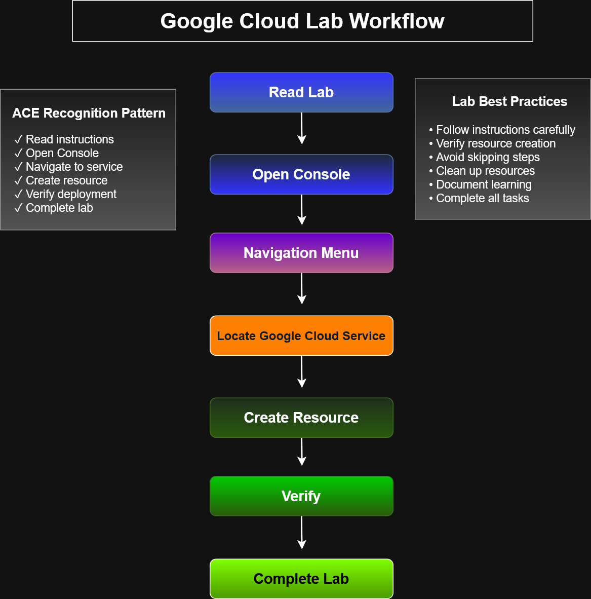

# Google Cloud Lab Workflow



## Overview

This diagram illustrates the recommended workflow for completing hands-on Google Cloud labs. It emphasizes a structured approach to reading instructions, navigating the Google Cloud Console, deploying resources, verifying results, and successfully completing lab objectives.

The workflow reflects best practices for learning Google Cloud services and preparing for the **Google Cloud Associate Cloud Engineer (ACE)** certification.

---

## Workflow

```
Read Lab
    ↓
Open Console
    ↓
Navigation Menu
    ↓
Locate Google Cloud Service
    ↓
Create Resource
    ↓
Verify
    ↓
Complete Lab
```

---

## Key Concepts

* Read all lab instructions before starting.
* Navigate to the required Google Cloud service.
* Create resources according to the lab requirements.
* Verify successful deployment and configuration.
* Complete all required tasks before ending the lab.

---

## Learning Objectives

After reviewing this workflow, learners should be able to:

* Follow a structured process for Google Cloud labs.
* Navigate the Google Cloud Console efficiently.
* Verify deployed resources before completion.
* Develop repeatable cloud engineering practices.

---

## Files

* `google-cloud-lab-workflow.drawio`
* `google-cloud-lab-workflow.svg`
* `google-cloud-lab-workflow.png`
* `README.md`

---

**Category:** Architecture Diagrams → Foundations

**Certification Alignment:** Google Cloud Associate Cloud Engineer (ACE)

