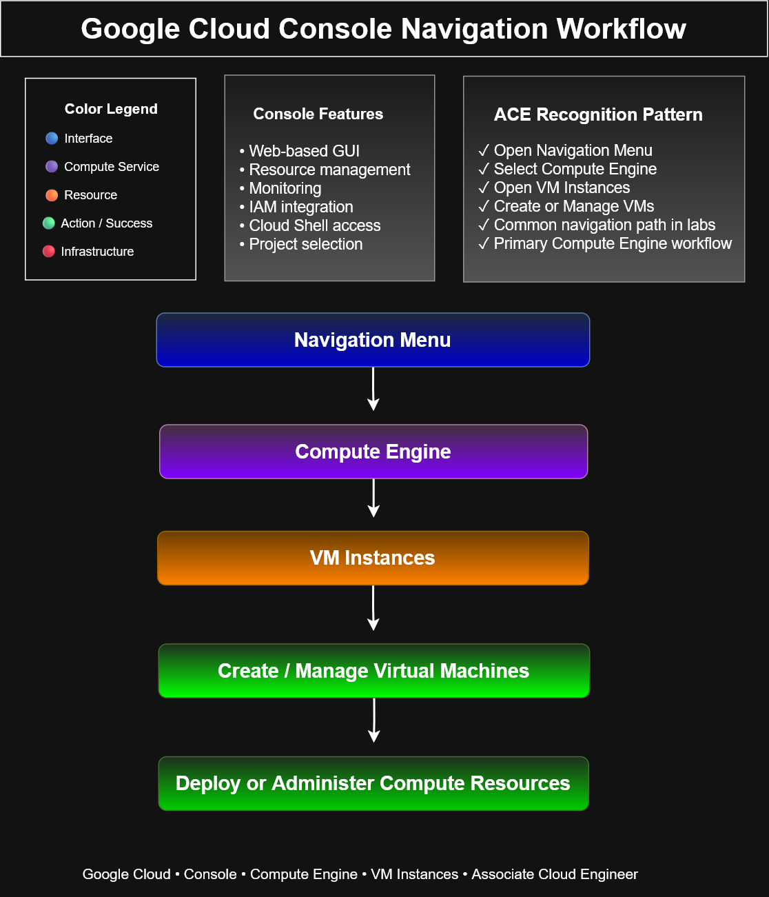

# Google Cloud Console Navigation Workflow



## Overview

This diagram illustrates the standard navigation path used within the Google Cloud Console to access and manage Compute Engine virtual machines.

Understanding this navigation workflow is fundamental for the Google Cloud Associate Cloud Engineer certification and is frequently used throughout Google Cloud labs.

---

## Navigation Flow

```
Navigation Menu
        ↓
Compute Engine
        ↓
VM Instances
        ↓
Create / Manage Virtual Machines
        ↓
Deploy and Administer Resources
```

---

## Key Concepts

- The Navigation Menu provides access to all Google Cloud services.
- Compute Engine hosts virtual machine resources.
- VM Instances displays existing virtual machines.
- Administrators can create, start, stop, modify, or delete VMs from this page.
- This workflow is commonly used in hands-on labs and production environments.

---

## ACE Recognition Pattern

- Navigation Menu
- Compute Engine
- VM Instances
- Create or Manage VMs
- Resource Administration
- Common certification workflow

---

## Learning Objectives

- Navigate the Google Cloud Console efficiently.
- Locate Compute Engine resources.
- Manage virtual machine instances.
- Build familiarity with the Google Cloud graphical interface.

---

## Files

- `google-cloud-console-navigation-workflow.drawio`
- `google-cloud-console-navigation-workflow.svg`
- `google-cloud-console-navigation-workflow.png`

---

Part of the **cloud-engineer-learning-path** portfolio documenting Google Cloud architecture and Associate Cloud Engineer concepts.
