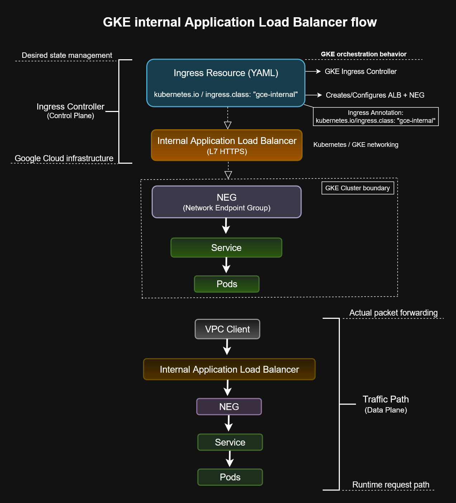

# GKE Internal Application Load Balancer Flow


---

## Overview

This architecture diagram illustrates how a Google Kubernetes Engine (GKE) Internal Application Load Balancer routes Layer 7 HTTP(S) traffic to workloads running inside a private VPC.

The GKE Ingress Controller automatically provisions the Internal Application Load Balancer, backend services, URL maps, and Network Endpoint Groups (NEGs) based on Kubernetes Ingress resources.

This pattern is commonly used for private enterprise applications and is a key networking concept for the Google Cloud Associate Cloud Engineer certification.

---

## Architecture Diagram



---

## Authentication and Traffic Flow

```text
Client
    ↓
Internal Application Load Balancer
    ↓
Network Endpoint Group (NEG)
    ↓
Kubernetes Service
    ↓
Pods
```

---

## Key Components

### Internal Application Load Balancer

- Layer 7 HTTP(S) load balancing
- Private IP address
- Accessible only within the VPC
- Supports host and path-based routing

### GKE Ingress Controller

Automatically provisions:

- Internal ALB
- Backend Services
- URL Maps
- Health Checks
- Network Endpoint Groups

### Network Endpoint Groups (NEGs)

- Represent Pod endpoints
- Enable direct routing to Pods
- Required for Internal HTTP(S) Load Balancing

### Kubernetes Service

Provides stable networking and load distribution across Pods.

### Pods

Host the backend application workloads.

---

## Recognition Pattern

```
Ingress Resource
        ↓
GKE Ingress Controller
        ↓
Internal ALB
        ↓
NEG
        ↓
Service
        ↓
Pods
```

---

## ACE Exam Tips

Remember these associations:

| Resource | Purpose |
|----------|----------|
| Ingress | Layer 7 Load Balancer |
| Service (LoadBalancer) | Layer 4 Load Balancer |
| NEG | Backend Pod endpoints |
| Internal ALB | Private VPC traffic |
| gce-internal | Internal Ingress annotation |

---

## Skills Demonstrated

- Google Kubernetes Engine
- Kubernetes Ingress
- Internal Application Load Balancer
- Network Endpoint Groups
- Layer 7 Networking
- Kubernetes Services
- Cloud Architecture
- Traffic Routing

---

## Files Included

| File | Description |
|----------|-------------------------------|
| `gke-internal-alb-flow.drawio` | Editable diagram |
| `gke-internal-alb-flow.png` | Preview image |
| `gke-internal-alb-flow.svg` | Scalable vector image |

---

## Related Diagrams

- `../service-pod-deployment`
- `../kubernetes-object-lifecycle`
- `../kubectl-management-models`
- `../workload-identity`

---

## Repository

Part of the **cloud-engineer-learning-path** repository, documenting Google Cloud networking, Kubernetes architecture, and Associate Cloud Engineer recognition patterns.
