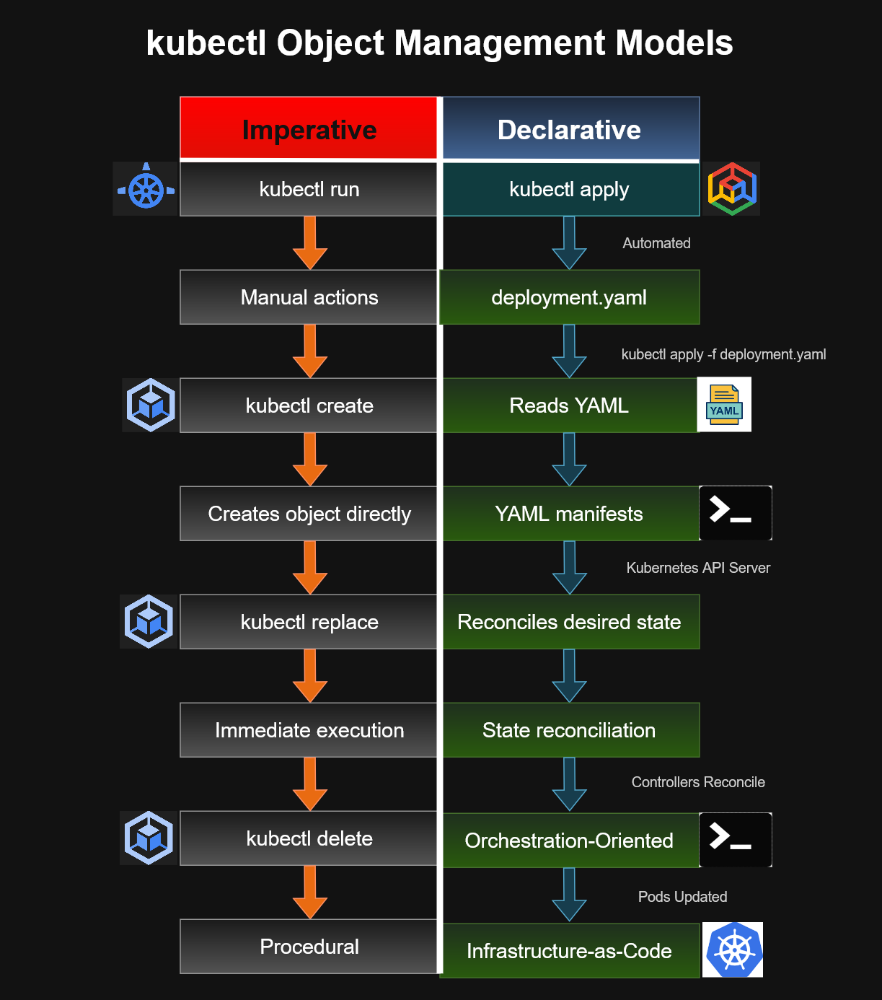

# kubectl Object Management Models


---

# Overview

This diagram compares the two primary methods of managing Kubernetes resources with **kubectl**:

- **Imperative Management**
- **Declarative Management**

Understanding the differences between these approaches is essential for Kubernetes administration, Google Kubernetes Engine (GKE) operations, and the Google Cloud Associate Cloud Engineer (ACE) certification.

---

# Architecture Diagram



---

# Imperative Management

Imperative management tells Kubernetes **what action to perform immediately**.

Example:

```bash
kubectl create deployment nginx --image=nginx
```

Characteristics:

- Command-driven
- Quick changes
- Interactive administration
- Best for testing and troubleshooting
- Harder to reproduce consistently

---

# Declarative Management

Declarative management describes the **desired state** of the infrastructure in a YAML manifest.

Example:

```bash
kubectl apply -f deployment.yaml
```

Characteristics:

- Infrastructure as Code (IaC)
- Version controlled
- Repeatable deployments
- Easier collaboration
- Automatically reconciles desired state

---

# Management Flow

```text
YAML Manifest
      ↓
kubectl apply
      ↓
Kubernetes API Server
      ↓
etcd Desired State
      ↓
Controllers
      ↓
Pods Running
```

---

# Key Differences

| Imperative | Declarative |
|------------|-------------|
| Command based | Configuration based |
| Manual changes | Desired state management |
| Immediate execution | Continuous reconciliation |
| Difficult to reproduce | Version controlled |
| Good for testing | Recommended for production |

---

# ACE Recognition Patterns

If you see:

```bash
kubectl create
kubectl run
kubectl expose
kubectl delete
```

Think:

> **Imperative object management**

---

If you see:

```bash
kubectl apply -f deployment.yaml
```

Think:

> **Declarative Infrastructure as Code**

---

# Best Practices

- Use **declarative management** for production workloads.
- Store manifests in **Git repositories**.
- Review changes through pull requests.
- Automate deployments with CI/CD pipelines.
- Minimize manual changes to running clusters.

---

# Skills Demonstrated

- Google Kubernetes Engine (GKE)
- kubectl
- Kubernetes API
- Infrastructure as Code
- Declarative Configuration
- DevOps Practices
- Configuration Management

---

# Files Included

| File | Description |
|----------|------------------------------|
| `kubectl-management-models.drawio` | Editable source diagram |
| `kubectl-management-models.png` | Preview image |
| `kubectl-management-models.svg` | Scalable vector image |

---

# Related Diagrams

- `../internal-alb-flow`
- `../service-pod-deployment`
- `../kubernetes-object-lifecycle`
- `../workload-identity`

---

# Repository

Part of the **cloud-engineer-learning-path** repository, documenting Kubernetes operations, Google Cloud architecture patterns, and Associate Cloud Engineer certification concepts.
