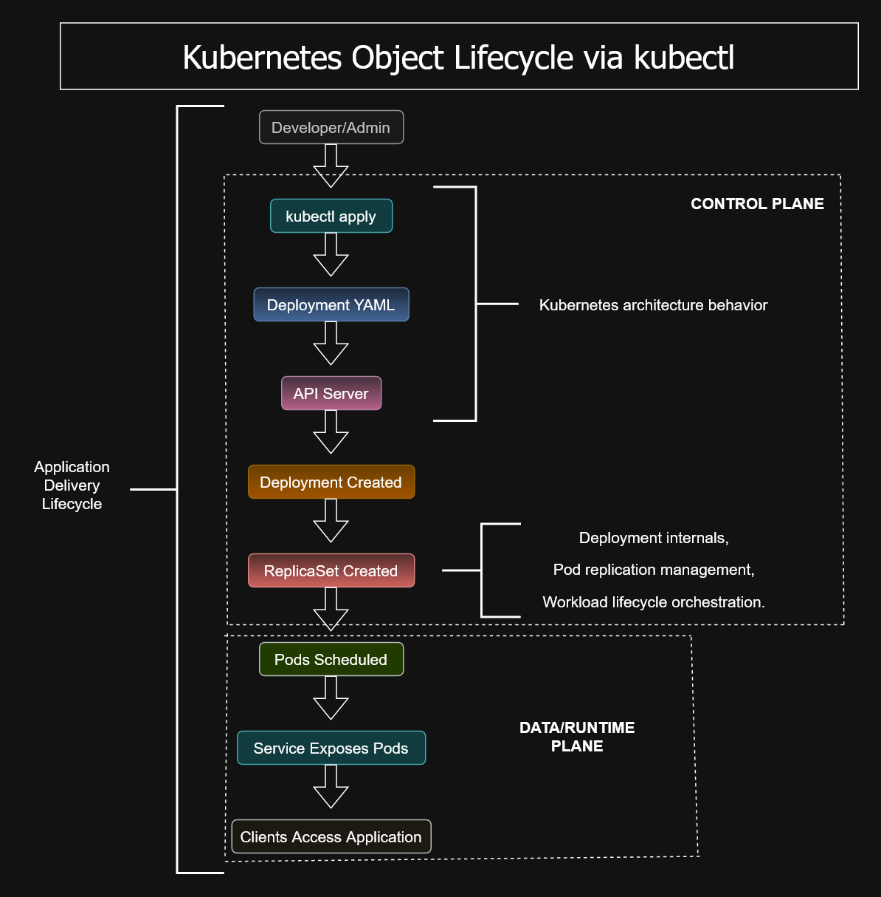

# Kubernetes Object Lifecycle via kubectl


---

# Overview

This diagram illustrates the lifecycle of Kubernetes objects as they move from a YAML manifest through the Kubernetes control plane and into a running application.

It demonstrates how **kubectl**, the Kubernetes API Server, **etcd**, controllers, and worker nodes collaborate to maintain the desired state of a cluster.

Understanding this lifecycle is fundamental for operating Google Kubernetes Engine (GKE) and is an important recognition pattern for the Google Cloud Associate Cloud Engineer (ACE) certification.

---

# Architecture Diagram



---

# Object Lifecycle

```text
deployment.yaml
        ↓
kubectl apply
        ↓
Kubernetes API Server
        ↓
etcd (Desired State)
        ↓
Deployment Controller
        ↓
ReplicaSet
        ↓
Pod
        ↓
Container Running
```

---

# Lifecycle Stages

## 1. Create Resource

A Kubernetes object is defined in a YAML manifest and submitted using:

```bash
kubectl apply -f deployment.yaml
```

The manifest specifies the desired state of the application.

---

## 2. Kubernetes API Server

The API Server validates the request and stores the object definition.

It serves as the central management interface for the cluster.

---

## 3. etcd

The desired state of the object is persisted in **etcd**, Kubernetes' distributed key-value database.

This becomes the source of truth for the cluster.

---

## 4. Controllers

Controllers continuously compare:

- Desired state
- Actual state

If differences exist, controllers create, update, or remove resources until the desired state is achieved.

---

## 5. ReplicaSet

The ReplicaSet ensures that the specified number of Pod replicas remain running.

If a Pod fails, a replacement is automatically created.

---

## 6. Pods

Pods represent the smallest deployable unit in Kubernetes and host one or more application containers.

Pods are scheduled onto worker nodes by the Kubernetes Scheduler.

---

## 7. Running Application

Once scheduled, the application begins serving traffic while Kubernetes continuously monitors its health and availability.

---

# Control Loop

Kubernetes operates as a reconciliation system.

```text
Desired State
        ↓
Controller Manager
        ↓
Actual Cluster State
        ↓
Differences Detected
        ↓
Automatic Reconciliation
```

This continuous control loop is one of Kubernetes' defining architectural principles.

---

# ACE Recognition Patterns

If you see:

```bash
kubectl apply -f deployment.yaml
```

Think:

- Declarative configuration
- Desired state management
- Infrastructure as Code

---

If you see:

- Deployment
- ReplicaSet
- Pod

Think:

> Kubernetes object hierarchy.

---

If a Pod crashes:

> The ReplicaSet automatically creates a replacement Pod.

---

# Key Concepts

- Desired State
- Declarative Configuration
- Kubernetes API Server
- etcd
- Deployment Controller
- ReplicaSet
- Pod Lifecycle
- Self-healing Infrastructure
- Automatic Reconciliation

---

# Skills Demonstrated

- Google Kubernetes Engine (GKE)
- Kubernetes Architecture
- kubectl
- Kubernetes Controllers
- Declarative Infrastructure
- Container Orchestration
- Cloud Native Operations
- DevOps Practices

---

# Files Included

| File | Description |
|----------|-------------------------------|
| `Kubernetes-Object-Lifecycle-via-kubectl.drawio` | Editable source diagram |
| `Kubernetes-Object-Lifecycle-via-kubectl.png` | Preview image |
| `Kubernetes-Object-Lifecycle-via-kubectl.svg` | Scalable vector image |

---

# Related Diagrams

- `../kubectl-management-models`
- `../service-pod-deployment`
- `../internal-alb-flow`
- `../workload-identity`

---

# Repository

Part of the **cloud-engineer-learning-path** repository, documenting Kubernetes architecture, Google Cloud operations, and Associate Cloud Engineer certification concepts through visual learning and recognition patterns.
