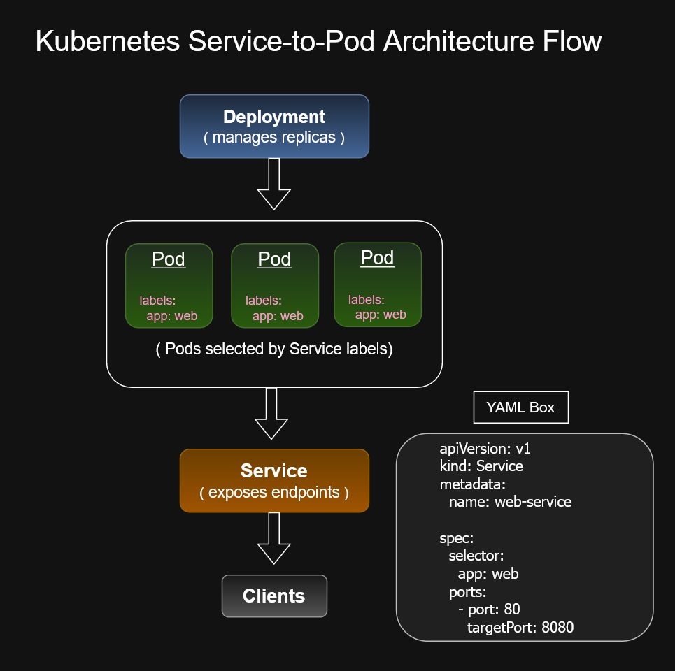

# Kubernetes Service to Pod Deployment Flow


---

# Overview

This diagram illustrates how a Kubernetes **Service** routes network traffic to one or more **Pods** running inside a Google Kubernetes Engine (GKE) cluster.

A Service provides a stable virtual IP address and DNS name while automatically load balancing requests across healthy Pods selected by labels.

Understanding this relationship is fundamental for Kubernetes networking and is a core concept for the Google Cloud Associate Cloud Engineer (ACE) certification.

---

# Architecture Diagram



---

# Traffic Flow

```text
Client
    ↓
Kubernetes Service
    ↓
Label Selector
    ↓
Pod 1
Pod 2
Pod 3
```

---

# Component Overview

## Client

A client application sends requests to a Kubernetes Service instead of directly communicating with Pods.

This provides a stable endpoint regardless of Pod lifecycle events.

---

## Kubernetes Service

The Service acts as a networking abstraction that:

- Provides a stable Cluster IP
- Performs load balancing
- Uses label selectors to identify backend Pods
- Routes traffic only to healthy endpoints

---

## Label Selector

The Service locates backend Pods using labels.

Example:

```yaml
selector:
  app: web
```

Only Pods matching the selector become Service endpoints.

---

## Pods

Pods contain one or more containers that execute the application workload.

Pods are ephemeral and may be recreated automatically, while the Service endpoint remains constant.

---

# Deployment Relationship

```text
Deployment
      ↓
ReplicaSet
      ↓
Pods
      ↓
Service
      ↓
Client
```

The Deployment manages the Pods, while the Service provides stable network access to them.

---

# Load Balancing Behavior

As additional Pods are created or removed, Kubernetes automatically updates the Service endpoints.

```text
Service
   ↓
 ┌───────┐
 │ Pod 1 │
 ├───────┤
 │ Pod 2 │
 ├───────┤
 │ Pod 3 │
 └───────┘
```

No manual reconfiguration is required.

---

# ACE Recognition Patterns

If you see:

```yaml
kind: Service
```

Think:

- Stable networking endpoint
- Internal load balancing
- DNS resolution
- Label selector

---

If you see:

```yaml
selector:
  app: frontend
```

Think:

> The Service routes traffic only to Pods with matching labels.

---

If Pods are recreated:

> The Service automatically redirects traffic to the new healthy Pods.

---

# Key Concepts

- Kubernetes Service
- Label Selectors
- ClusterIP
- Endpoint Discovery
- Pod Networking
- Service Discovery
- Internal Load Balancing
- High Availability

---

# Skills Demonstrated

- Google Kubernetes Engine (GKE)
- Kubernetes Networking
- Service Discovery
- Load Balancing
- Pod Architecture
- Cloud Native Applications
- Kubernetes Operations

---

# Files Included

| File | Description |
|----------|------------------------------|
| `k8s-service-pod-deployment-flow.drawio` | Editable source diagram |
| `k8s-service-pod-deployment-flow.png` | Preview image |
| `k8s-service-pod-deployment-flow.svg` | Scalable vector image |

---

# Related Diagrams

- `../internal-alb-flow`
- `../kubectl-management-models`
- `../kubernetes-object-lifecycle`
- `../workload-identity`

---

# Repository

Part of the **cloud-engineer-learning-path** repository, documenting Kubernetes networking, service discovery, and Google Cloud architecture patterns for Associate Cloud Engineer certification preparation and professional portfolio development.
