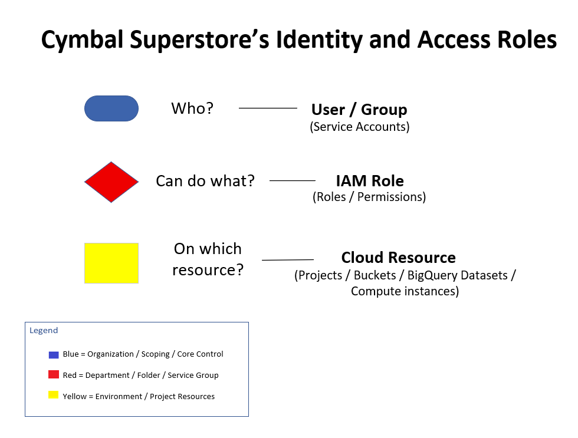

# IAM Resource Model


## Overview

This architecture diagram illustrates the three fundamental components of Google Cloud Identity and Access Management (IAM):

- **Who** is requesting access (User, Group, or Service Account)
- **What** permissions are granted (IAM Role)
- **Which** Google Cloud resource those permissions apply to

Understanding this relationship is essential for designing secure cloud environments and follows the principle of least privilege.

---

## Architecture Diagram



---

## Core IAM Model

```
Principal
     │
     ▼
 IAM Role
     │
     ▼
Cloud Resource
```

Where:

- **Principal** → User, Group, or Service Account
- **IAM Role** → Collection of permissions
- **Cloud Resource** → Project, Bucket, VM, BigQuery Dataset, etc.

---

## Key Concepts

### Principal

An identity that can be authenticated.

Examples:

- Google User
- Google Group
- Service Account

---

### IAM Role

Defines what actions are permitted.

Examples:

- Viewer
- Editor
- Owner
- Storage Object Viewer
- BigQuery Data Viewer

---

### Resource

The object being protected.

Examples:

- Project
- Cloud Storage Bucket
- Compute Engine VM
- Cloud SQL Instance
- BigQuery Dataset

---

## ACE Exam Recognition Pattern

Associate Cloud Engineer questions commonly follow this pattern:

> **Who can do what on which resource?**

If you can identify those three components, you can solve many IAM questions quickly.

---

## Files Included

| File | Description |
|-------------------------|--------------------------------|
| `iam-resource-model.vsdx` | Editable Microsoft Visio source |
| `iam-resource-model.png` | Preview image |

---

## Created With

- Microsoft Visio Professional
- Google Cloud Architecture Icons
- Custom ACE study annotations

---

## Skills Demonstrated

- Google Cloud IAM
- Identity and Access Management
- Least Privilege Security
- Role-Based Access Control (RBAC)
- Cloud Security Architecture
- Technical Documentation

---

## Related Topics

- Service Accounts
- Custom IAM Roles
- Organization Policies
- Resource Hierarchy
- Workload Identity Federation
- Cloud Security Best Practices
