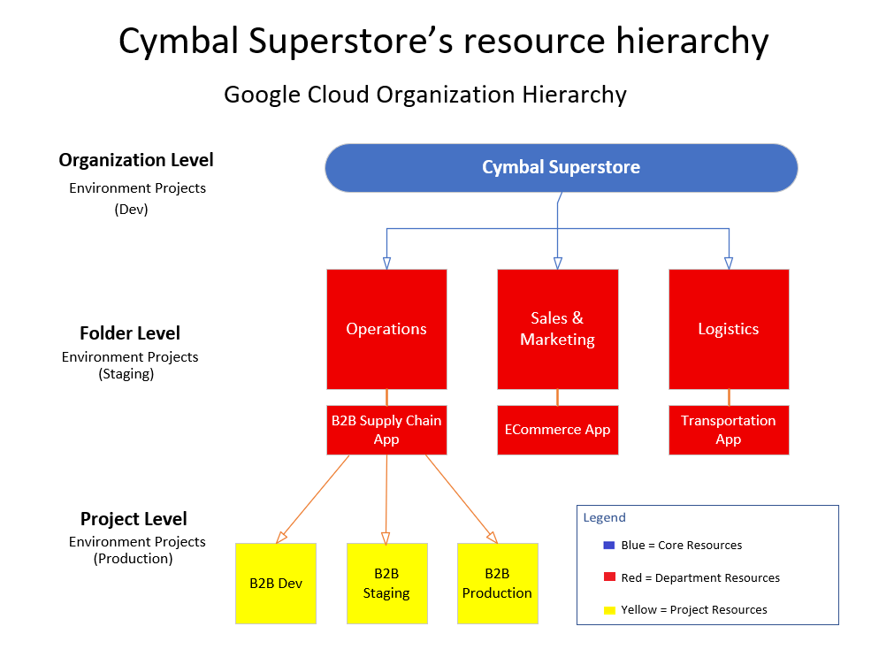

# Google Cloud Resource Hierarchy


---

# Overview

This diagram illustrates the Google Cloud Resource Hierarchy using a fictional **Cymbal Superstore** organization.

It demonstrates how Google Cloud resources are organized from the top-level Organization down to individual Projects, allowing administrators to apply IAM policies, organizational policies, and billing structures consistently across an enterprise environment.

Understanding the resource hierarchy is fundamental for designing secure and scalable Google Cloud environments.

---

# Architecture Diagram



---

# Hierarchy Structure

```
Organization
      │
      ▼
Folders
      │
      ▼
Projects
      │
      ▼
Resources
```

Policies and permissions inherit downward through each level unless explicitly overridden.

---

# Organization Level

The Organization represents the highest level of administration.

Responsibilities include:

- Enterprise governance
- Organization policies
- Centralized billing
- Identity management
- Security standards

In this example:

```
Cymbal Superstore
```

serves as the root Organization.

---

# Folder Level

Folders logically group projects by department, business unit, or environment.

Example folders include:

- Operations
- Sales & Marketing
- Logistics

Folders simplify policy management by allowing IAM roles and organizational policies to be assigned to multiple projects simultaneously.

---

# Project Level

Projects contain deployable cloud resources.

Examples shown include:

- B2B Development
- B2B Staging
- B2B Production

Projects provide isolation for:

- IAM permissions
- Billing
- APIs
- Networking
- Resource quotas

---

# IAM Policy Inheritance

Google Cloud uses inherited permissions throughout the hierarchy.

```
Organization
      │
      ▼
Folder
      │
      ▼
Project
      │
      ▼
Resource
```

Policies applied at a higher level automatically propagate to child resources unless specifically restricted.

This model reduces administrative overhead while maintaining consistent security controls.

---

# Security Benefits

The resource hierarchy enables:

- Centralized governance
- Consistent IAM policies
- Least-privilege access
- Organizational policy enforcement
- Department-level administration
- Environment separation (Dev, Staging, Production)

---

# ACE Exam Recognition Pattern

When an exam question asks:

- Where should permissions be assigned?
- How can multiple projects inherit the same policy?
- How are departments separated?
- Where should Organization Policies be applied?

The answer often involves understanding the Google Cloud Resource Hierarchy.

Remember this pattern:

```
Organization
     ↓
Folder
     ↓
Project
     ↓
Resources
```

---

# Files Included

| File | Description |
|-------------------------------|-----------------------------------------|
| `resource-hierarchy-architecture.vsdx` | Editable Microsoft Visio source |
| `resource-hierarchy-architecture.png` | Preview image |

---

# Created With

- Microsoft Visio Professional
- Google Cloud Architecture Icons
- Custom ACE study annotations

---

# Skills Demonstrated

- Google Cloud Organization Structure
- Resource Hierarchy Design
- Identity and Access Management (IAM)
- Policy Inheritance
- Enterprise Cloud Governance
- Security Architecture
- Cloud Infrastructure Design
- Technical Documentation

---

# Related Topics

- IAM Resource Model
- Organization Policies
- Custom IAM Roles
- Service Accounts
- Workload Identity
- Folder Administration
- Google Cloud Projects
- Enterprise Security Architecture

---

# Repository Context

This architecture diagram is part of the **cloud-engineer-learning-path** repository and supports:

- Associate Cloud Engineer (ACE) certification preparation
- Google Cloud IAM architecture
- Enterprise governance patterns
- Cloud security best practices
- Technical portfolio development
