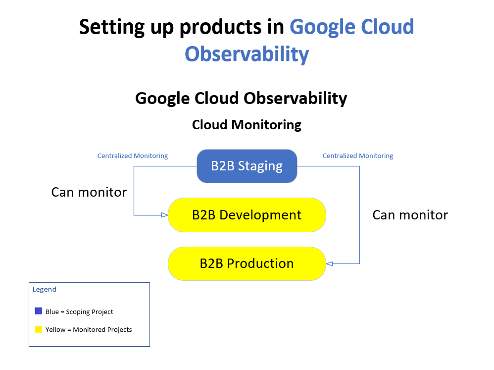

# Google Cloud Observability Scoping Model


---

# Overview

This diagram demonstrates how **Google Cloud Observability Scopes** enable centralized monitoring across multiple Google Cloud projects.

A single monitoring project can collect metrics, dashboards, alerts, and health information from multiple monitored projects, providing a unified operational view for administrators and Site Reliability Engineers (SREs).

This architecture is commonly used in enterprise environments where Development, Staging, and Production projects are managed separately but monitored centrally.

---

# Architecture Diagram



---

# Architecture Flow

```text
                 Monitoring Scope

                 B2B Staging
                      │
        ┌─────────────┴─────────────┐
        │                           │
        ▼                           ▼

B2B Development             B2B Production

      Metrics                   Metrics
      Logs                      Logs
      Alerts                    Alerts
      Dashboards                Dashboards
```

The monitoring scope provides centralized visibility while preserving project isolation.

---

# What is an Observability Scope?

An **Observability Scope** defines which projects can be monitored from a single Google Cloud Monitoring workspace.

Rather than logging into multiple projects, administrators can view infrastructure health from one centralized location.

---

# Benefits

- Centralized dashboards
- Cross-project monitoring
- Unified alerting
- Simplified operations
- Improved incident response
- Enterprise-scale visibility

---

# Typical Enterprise Design

```
Organization
      │
      ▼

Monitoring Project
      │
 ┌────┴─────┐
 │          │
 ▼          ▼

Development  Production
Project      Project

      Metrics collected
           centrally
```

This architecture reduces operational complexity while maintaining project separation.

---

# ACE Exam Recognition Pattern

If an exam question asks:

- How can one project monitor multiple projects?
- Where should dashboards be centralized?
- How can alerts span multiple environments?
- How should Dev and Production be monitored together?

The answer often involves configuring an **Observability Scope**.

---

# Key Concepts

### Monitoring Scope

A container that defines which projects can be monitored.

---

### Scoping Project

The project that hosts:

- Dashboards
- Alert Policies
- Uptime Checks
- Monitoring Views

---

### Monitored Projects

Projects that contribute:

- Metrics
- Resource health
- Performance data
- Infrastructure telemetry

---

# Enterprise Use Cases

- Multi-environment monitoring
- Shared operations teams
- Centralized SRE dashboards
- Enterprise observability
- Cross-project alerting
- Cloud operations centers

---

# Files Included

| File | Description |
|--------------------------------|-----------------------------------|
| `observability-scoping-model.vsdx` | Editable Microsoft Visio source |
| `observability-scoping-model.png` | Preview image |

---

# Created With

- Microsoft Visio Professional
- Google Cloud Architecture Icons
- Custom ACE study annotations

---

# Skills Demonstrated

- Google Cloud Observability
- Cloud Monitoring
- Monitoring Scopes
- Enterprise Operations
- Site Reliability Engineering (SRE)
- Cross-Project Monitoring
- Infrastructure Monitoring
- Cloud Architecture Documentation

---

# Related Topics

- Cloud Logging
- Alert Policies
- Dashboards
- Incident Management
- Monitoring Workspace
- Metrics Explorer
- Uptime Checks
- Operations Suite

---

# Repository Context

This architecture diagram is part of the **cloud-engineer-learning-path** repository and supports:

- Associate Cloud Engineer (ACE) certification preparation
- Google Cloud Operations Suite
- Enterprise observability architecture
- Cross-project monitoring strategies
- Technical portfolio development
