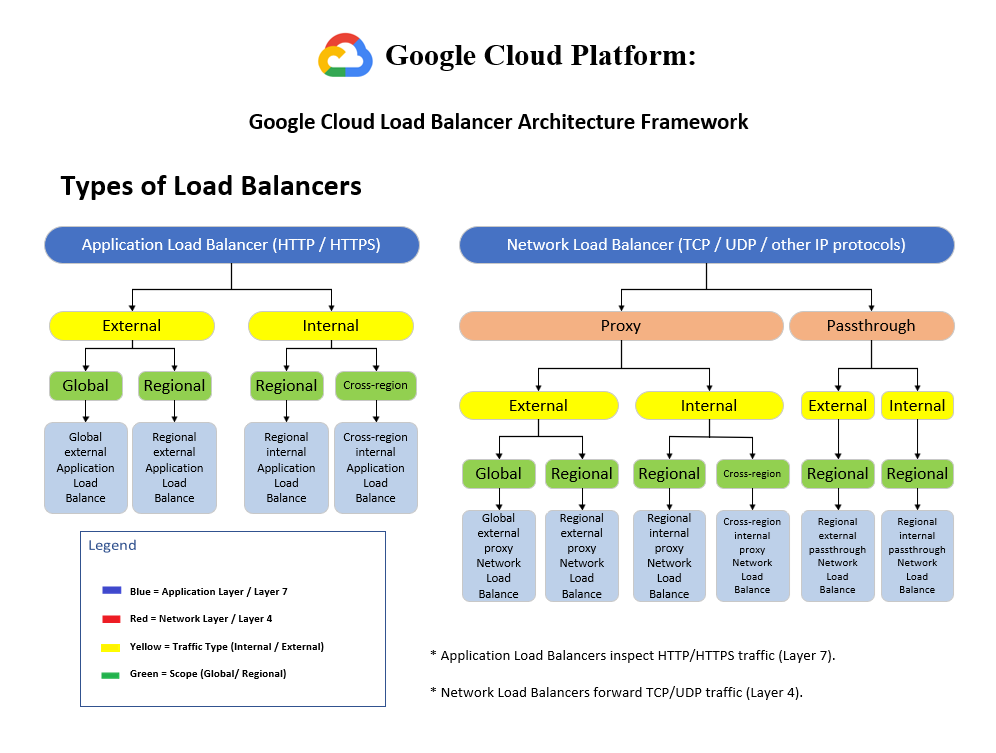

# Google Cloud Load Balancer Architecture Framework

## Overview

This architecture diagram provides a visual reference for the different types of Google Cloud Load Balancers available within Google Cloud Platform (GCP).

It organizes load balancers by:

- Application vs. Network Load Balancing
- External vs. Internal traffic
- Global vs. Regional scope
- Proxy vs. Pass-through implementations

The diagram is intended as a quick-reference guide for Google Cloud Associate Cloud Engineer (ACE) certification preparation and cloud architecture design.

---

## Architecture Diagram

---

# Purpose

Understanding the Google Cloud Load Balancer portfolio is essential for designing scalable, secure, and highly available cloud applications.

This diagram helps distinguish when to use:

- Layer 7 Application Load Balancers
- Layer 4 Network Load Balancers
- External-facing services
- Internal service communication
- Global deployments
- Regional deployments

---

# Application Load Balancers (Layer 7)

Application Load Balancers inspect HTTP and HTTPS traffic and make routing decisions based on application-layer information.

## External

- Global External Application Load Balancer
- Regional External Application Load Balancer

### Common Use Cases

- Public web applications
- REST APIs
- E-commerce platforms
- Content delivery

---

## Internal

- Regional Internal Application Load Balancer
- Cross-region Internal Application Load Balancer

### Common Use Cases

- Internal microservices
- Enterprise applications
- Private APIs
- Shared business services

---

# Network Load Balancers (Layer 4)

Network Load Balancers route TCP, UDP, and other IP traffic without inspecting application content.

They are optimized for high-performance network connectivity and low latency.

---

## Proxy Network Load Balancers

### External

- Global External Proxy Network Load Balancer
- Regional External Proxy Network Load Balancer

### Internal

- Regional Internal Proxy Network Load Balancer
- Cross-region Internal Proxy Network Load Balancer

---

## Pass-through Network Load Balancers

### External

- Regional External Passthrough Network Load Balancer

### Internal

- Regional Internal Passthrough Network Load Balancer

---

# Recognition Patterns for the ACE Exam

| Requirement | Recommended Load Balancer |
|--------------|---------------------------|
| HTTP / HTTPS traffic | Application Load Balancer |
| TCP / UDP traffic | Network Load Balancer |
| Internet-facing application | External Load Balancer |
| Private internal services | Internal Load Balancer |
| Worldwide deployment | Global Load Balancer |
| Single-region deployment | Regional Load Balancer |
| Intelligent Layer 7 routing | Proxy Load Balancer |
| Preserve original client IP | Pass-through Load Balancer |

---

# Key Concepts

- Application Load Balancers operate at **Layer 7**.
- Network Load Balancers operate at **Layer 4**.
- External Load Balancers accept traffic from the internet.
- Internal Load Balancers route traffic within a VPC.
- Global Load Balancers distribute traffic across multiple regions.
- Regional Load Balancers serve resources within a single region.
- Proxy Load Balancers terminate client connections before forwarding traffic.
- Pass-through Load Balancers preserve the original client connection.

---

# Skills Demonstrated

- Google Cloud Networking
- Load Balancer Selection
- High Availability Design
- Layer 4 vs. Layer 7 Networking
- External vs. Internal Services
- Global Architecture Design
- Cloud Infrastructure Planning

---

# Files Included

| File | Description |
|-------------------------------|----------------------------------|
| `load-balancer-architecture.vsdx` | Editable Microsoft Visio source |
| `load-balancer-architecture.png` | Preview image |

---

# Created With

- Microsoft Visio Professional
- Google Cloud Architecture Icons
- Custom Google Cloud ACE study annotations

---

# Repository Context

This diagram is part of the **cloud-engineer-learning-path** repository and supports:

- Google Cloud Associate Cloud Engineer (ACE) preparation
- Google Cloud networking concepts
- Cloud architecture documentation
- Infrastructure design best practices
- Technical portfolio development
