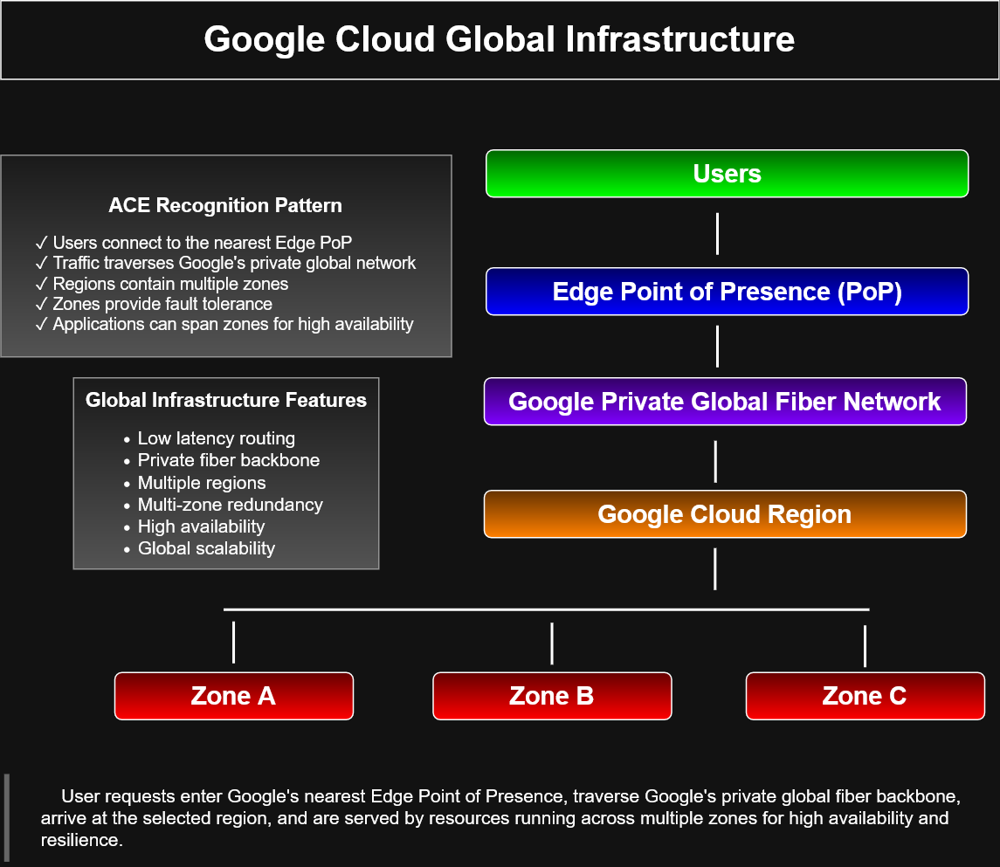

# Google Cloud Global Infrastructure


## Preview



---

# Overview

This diagram illustrates the high-level architecture of Google's global infrastructure and demonstrates how user requests travel through Google's private network before reaching cloud resources deployed within a Google Cloud region.

It highlights one of Google Cloud's key competitive advantages: a globally distributed private fiber backbone that connects regions and enables low-latency, highly available application delivery.

---

# Architecture Flow

```
Users
      │
      ▼
Edge Point of Presence (PoP)
      │
      ▼
Google Private Global Fiber Network
      │
      ▼
Google Cloud Region
      │
 ┌────┴────┐
 ▼    ▼    ▼
Zone A Zone B Zone C
```

---

# Component Description

## Users

End users access applications and services from anywhere in the world using web browsers, mobile applications, APIs, and enterprise systems.

---

## Edge Point of Presence (PoP)

Google routes incoming requests to the nearest Edge Point of Presence to minimize latency and optimize network performance.

Edge PoPs provide:

- Global traffic entry points
- Low-latency routing
- Edge caching capabilities
- Secure network access

---

## Google Private Global Fiber Network

Google owns and operates one of the world's largest private fiber backbone networks.

Key characteristics include:

- Private global backbone
- High-speed intercontinental connectivity
- Secure internal routing
- Low latency
- High bandwidth
- Redundant network paths

Traffic remains on Google's private network for as much of its journey as possible.

---

## Google Cloud Region

A region is a geographic deployment area that contains multiple independent zones.

Regions provide:

- Geographic redundancy
- Disaster recovery options
- Regulatory compliance
- Regional service deployment

---

## Availability Zones

Each Google Cloud region contains multiple isolated zones.

Zones provide:

- Independent power
- Independent cooling
- Independent networking
- Fault isolation
- High availability

Applications can be deployed across multiple zones to improve resilience and reduce downtime.

---

# Global Infrastructure Features

- Low-latency routing
- Google private fiber backbone
- Multiple global regions
- Multi-zone redundancy
- High availability
- Global scalability
- Fault isolation
- Disaster recovery support

---

# ACE Recognition Pattern

This diagram reinforces several Associate Cloud Engineer concepts:

- ✓ Users connect to the nearest Edge Point of Presence (PoP)
- ✓ Traffic traverses Google's private global fiber network
- ✓ Regions contain multiple independent zones
- ✓ Zones provide fault tolerance and resiliency
- ✓ Applications can span multiple zones for high availability
- ✓ Google abstracts physical infrastructure from customers

---

# Learning Objectives

After reviewing this diagram, learners should understand:

- How Google routes user traffic globally
- The role of Edge Points of Presence (PoPs)
- The importance of Google's private fiber backbone
- The relationship between regions and zones
- How multi-zone deployments improve availability
- Why Google Cloud provides low-latency global networking

---

# Key Takeaway

User requests enter Google's nearest Edge Point of Presence, traverse Google's private global fiber backbone, arrive at the selected Google Cloud region, and are served by resources deployed across multiple zones to provide high availability, resiliency, and low-latency application delivery.

---

# Related Architecture Diagrams

This diagram complements:

- Load Balancer Architecture
- Global External HTTP(S) Load Balancer
- Regional vs Global Load Balancer
- Cloud NAT
- Cloud Interconnect
- Cloud Router & Cloud VPN
- Shared VPC
- Google Cloud Layered Architecture
- Infrastructure Dependency Stack

---

# Repository Context

This diagram is part of the **cloud-engineer-learning-path** repository and was created to reinforce Google Cloud networking concepts, global infrastructure design, and Associate Cloud Engineer certification objectives through visual architecture documentation.

It serves as both a study reference and a portfolio artifact demonstrating understanding of Google Cloud's global networking architecture and high-availability design principles.
