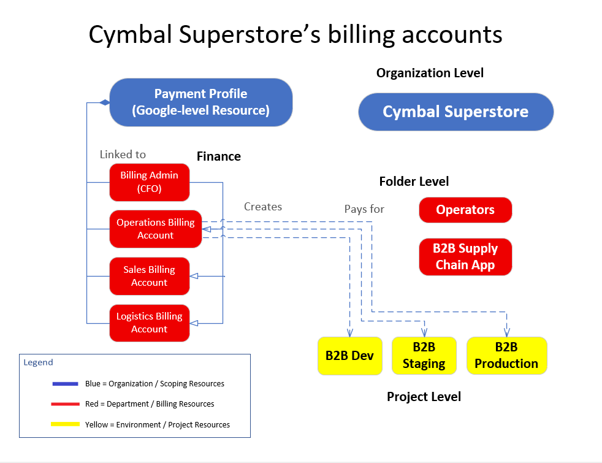

# Cymbal Superstore Billing Architecture Model


## Overview

This architecture diagram illustrates a sample Google Cloud Billing hierarchy for the fictional **Cymbal Superstore** organization.

The model demonstrates how a single **Google Payments Profile** can own multiple **Cloud Billing Accounts**, which are then linked to projects throughout an organization's resource hierarchy.

This architecture helps explain billing organization, project ownership, and financial separation across departments and environments.

---

## Architecture Diagram



---

## Purpose

This diagram helps visualize:

- Google Payments Profiles
- Cloud Billing Accounts
- Organization hierarchy
- Folder hierarchy
- Project-level billing
- Departmental cost allocation
- Enterprise FinOps design

It serves as a study aid for the **Google Cloud Associate Cloud Engineer (ACE)** certification and cloud governance planning.

---

## Architecture Components

### Payment Profile

The **Payment Profile** represents the top-level financial entity responsible for payment methods and invoices.

- Credit cards
- Bank accounts
- Tax information
- Invoice settings

One Payment Profile can manage multiple Cloud Billing Accounts.

---

### Cloud Billing Accounts

Separate billing accounts allow different departments or business units to manage spending independently.

Example billing accounts include:

- Billing Admin (CIO)
- Operations Billing
- Sales Billing
- Logistics Billing

Each billing account can be linked to one or more Google Cloud projects.

---

### Organization

The top-level organization represents the enterprise.

Example:

```
Cymbal Superstore
```

The organization contains folders and projects that inherit policies and governance settings.

---

### Folder Hierarchy

Folders provide administrative separation between departments or business units.

Example folders:

- Operations
- B2B Supply Chain App

Folders simplify IAM policy inheritance and project organization.

---

### Projects

Projects are where cloud resources are deployed and billed.

Example environments include:

- B2B Development
- B2B Staging
- B2B Production

Each project is associated with a Cloud Billing Account.

---

## Billing Flow

```text
Payment Profile
        │
        ▼
Cloud Billing Accounts
        │
        ▼
Organization
        │
        ▼
Folders
        │
        ▼
Projects
        │
        ▼
Google Cloud Resources
```

---

## Key Concepts

- Payment Profiles own Cloud Billing Accounts.
- Billing Accounts pay for Google Cloud Projects.
- Projects exist within Organizations and Folders.
- Billing ownership is independent of IAM permissions.
- Multiple projects can share a single billing account.
- Departments may maintain separate billing accounts for financial reporting.

---

## ACE Exam Recognition Patterns

| Requirement | Google Cloud Component |
|---------------------------|---------------------------|
| Payment information | Payment Profile |
| Pays for cloud usage | Cloud Billing Account |
| Top-level enterprise | Organization |
| Department grouping | Folder |
| Deploy workloads | Project |
| Cost reporting | Billing Account |

---

## Skills Demonstrated

- Google Cloud Billing
- FinOps Concepts
- Enterprise Resource Organization
- Organization Hierarchy
- Folder and Project Design
- Cloud Cost Management
- Architecture Documentation

---

## Files Included

| File | Description |
|----------------------------------|--------------------------------------|
| `billing-architecture-model.vsdx` | Editable Microsoft Visio source file |
| `billing-architecture-model.png` | Exported preview image |

---

## Created With

- Microsoft Visio Professional
- Google Cloud Architecture Icons
- Custom Google Cloud ACE study annotations

---

## Editing

This architecture diagram was created using **Microsoft Visio (.vsdx)**.

To modify the diagram, open the `.vsdx` file in Microsoft Visio or another application that supports the Visio file format. The `.png` file is provided as a rendered preview for documentation and repository browsing.

---

## Repository Context

This diagram is part of the **cloud-engineer-learning-path** repository and supports:

- Google Cloud Associate Cloud Engineer (ACE) certification preparation
- Cloud Billing and FinOps learning
- Enterprise governance concepts
- Resource hierarchy understanding
- Technical architecture portfolio development
