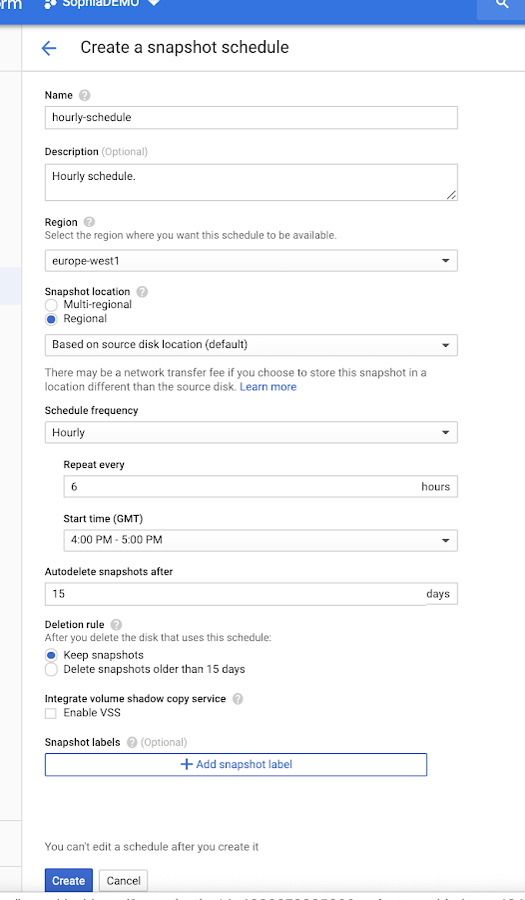
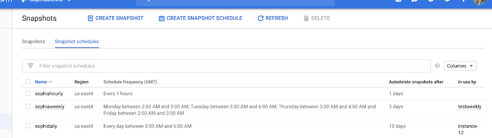
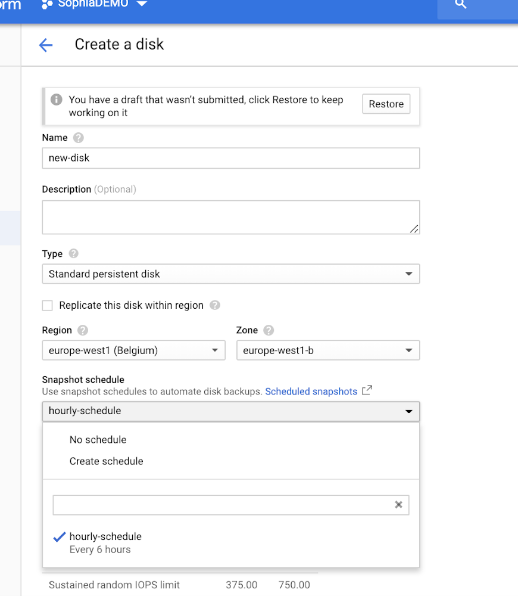

# Operations Architecture

This section contains operational workflows, cloud administration screenshots, and architecture diagrams related to Google Cloud operational management.

## Snapshot Scheduling

### Snapshot Schedule Creation

### Snapshot Schedule Inventory

### Disk Policy Attachment

## Key Operational Concepts

- Automated backup scheduling
- Snapshot lifecycle management
- Regional vs multi-regional storage
- Disaster recovery preparation
- Compute Engine operational administration
