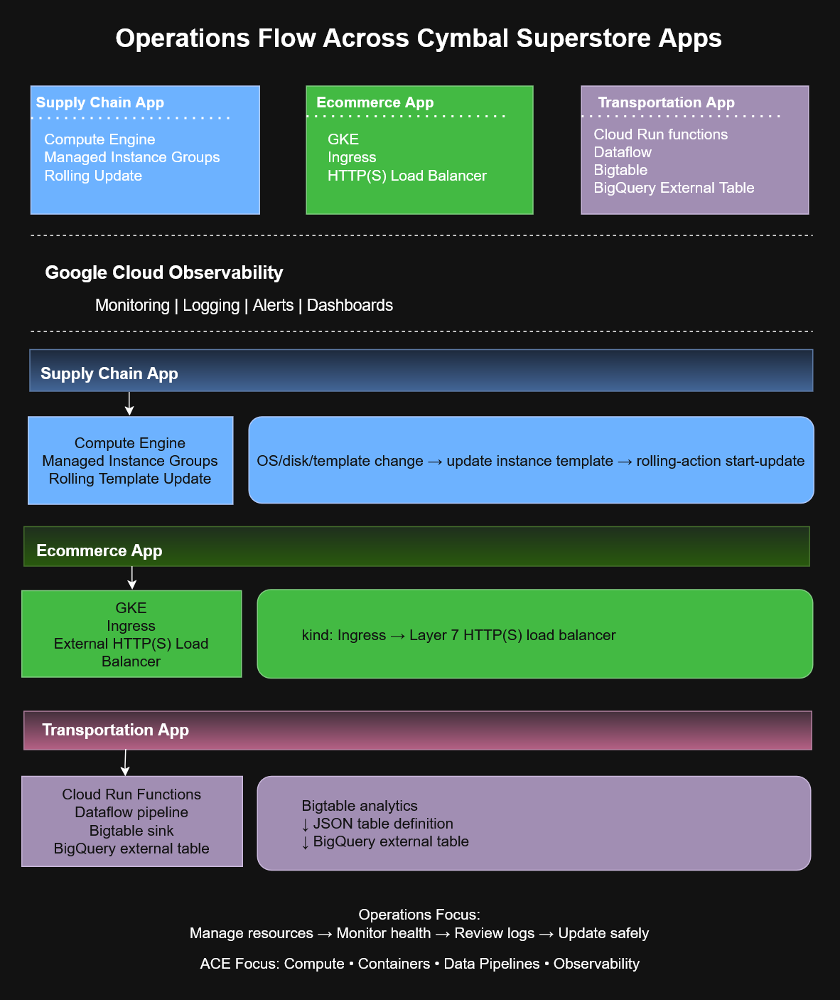

# Operations Flow Across Cymbal Superstore Applications


# Overview

This architecture diagram illustrates the operational workflows across multiple applications within the fictional **Cymbal Superstore** environment.

The diagram demonstrates how different Google Cloud services support application deployment, infrastructure updates, and observability while sharing centralized monitoring and logging capabilities.

It provides a high-level view of enterprise cloud operations commonly encountered in production environments.

---

# Architecture Diagram



---

# Purpose

This diagram demonstrates:

- Enterprise application architecture
- Cloud operations workflows
- Managed infrastructure updates
- Kubernetes ingress management
- Serverless data processing
- Centralized observability
- Multi-application operational design

It serves as a study reference for the **Google Cloud Associate Cloud Engineer (ACE)** certification and enterprise cloud operations.

---

# Supply Chain Application

The Supply Chain application is deployed on **Compute Engine Managed Instance Groups (MIGs)**.

### Operational Flow

```text
OS / Disk / Template Change
            │
            ▼
Update Instance Template
            │
            ▼
Rolling Action Start Update
            │
            ▼
Managed Instance Group
```

### Key Concepts

- Managed Instance Groups
- Rolling updates
- Instance templates
- Zero-downtime deployments
- Infrastructure management

---

# Ecommerce Application

The Ecommerce platform runs on **Google Kubernetes Engine (GKE)**.

Traffic enters through a Kubernetes Ingress resource that automatically provisions an external HTTP(S) Load Balancer.

### Traffic Flow

```text
Client
   │
   ▼
Ingress Resource
   │
   ▼
Layer 7 HTTP(S) Load Balancer
   │
   ▼
Kubernetes Services
   │
   ▼
Pods
```

### Key Concepts

- GKE
- Kubernetes Ingress
- Layer 7 Load Balancing
- External HTTP(S) Load Balancer
- Container orchestration

---

# Transportation Application

The Transportation application demonstrates a serverless analytics pipeline.

Services include:

- Cloud Run Functions
- Dataflow
- Bigtable
- BigQuery External Tables

These components process and analyze transportation and logistics data at scale.

### Key Concepts

- Serverless computing
- Event-driven processing
- Streaming analytics
- BigQuery integration
- Bigtable storage

---

# Centralized Observability

All applications integrate with a centralized Google Cloud Observability platform.

Shared operational capabilities include:

- Cloud Monitoring
- Cloud Logging
- Alert Policies
- Dashboards
- Incident Management

Centralized observability enables operations teams to monitor infrastructure and applications from a single location.

---

# Operational Components

| Application | Primary Google Cloud Services |
|----------------------|--------------------------------|
| Supply Chain | Compute Engine, Managed Instance Groups |
| Ecommerce | GKE, Ingress, HTTP(S) Load Balancer |
| Transportation | Cloud Run, Dataflow, Bigtable, BigQuery |
| Shared Platform | Cloud Monitoring, Cloud Logging, Dashboards |

---

# ACE Exam Recognition Patterns

| Requirement | Google Cloud Service |
|----------------------------|--------------------------------|
| Rolling VM updates | Managed Instance Groups |
| Container orchestration | Google Kubernetes Engine |
| HTTP(S) routing | Kubernetes Ingress |
| Layer 7 load balancing | Application Load Balancer |
| Serverless execution | Cloud Run |
| Data streaming | Dataflow |
| Centralized monitoring | Cloud Monitoring |
| Centralized logging | Cloud Logging |

---

# Skills Demonstrated

- Google Cloud Operations
- Enterprise Architecture
- Managed Instance Groups
- Google Kubernetes Engine
- Kubernetes Ingress
- Cloud Run
- Dataflow
- Bigtable
- BigQuery
- Cloud Observability
- Production Operations

---

# Files Included

| File | Description |
|---------------------------------------------|--------------------------------|
| `operations-flow-cymbal-superstore.drawio` | Editable draw.io source diagram |
| `operations-flow-cymbal-superstore.png` | Exported preview image |
| `operations-flow-cymbal-superstore.svg` | Scalable vector version |

---

# Created With

- draw.io
- Google Cloud Architecture Icons
- Custom Google Cloud ACE study annotations

---

# Editing

This architecture diagram was created using **draw.io**.

To modify the diagram, open the `.drawio` file in draw.io or diagrams.net. The `.png` and `.svg` files are provided for documentation, preview, and presentation purposes.

---

# Repository Context

This diagram is part of the **cloud-engineer-learning-path** repository and supports:

- Google Cloud Associate Cloud Engineer (ACE) certification preparation
- Cloud operations and observability concepts
- Enterprise application architecture
- Production deployment strategies
- Technical portfolio development
