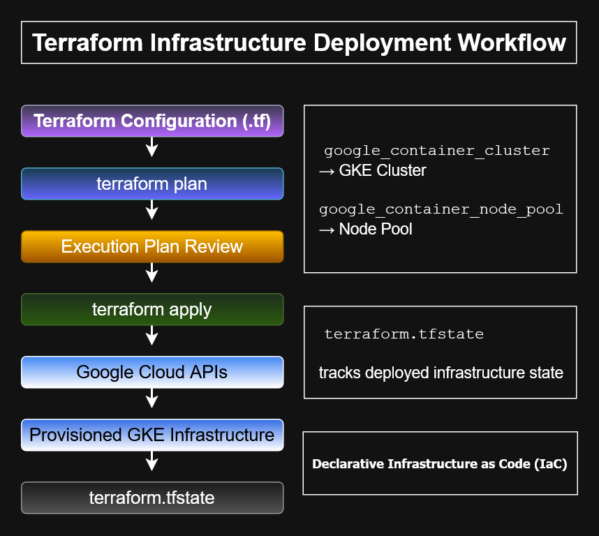

# Terraform Infrastructure Deployment Workflow


## Overview

This diagram illustrates the Terraform deployment workflow used to provision Google Cloud infrastructure.

It shows how a Terraform configuration file moves through planning, review, apply, Google Cloud API execution, deployed infrastructure, and Terraform state tracking.

---

## Architecture Diagram



---

## Deployment Flow

```text
Terraform Configuration (.tf)
        ↓
terraform plan
        ↓
Execution Plan Review
        ↓
terraform apply
        ↓
Google Cloud APIs
        ↓
Provisioned GKE Infrastructure
        ↓
terraform.tfstate
```

---

## Key Concepts

### Terraform Configuration

The `.tf` files describe the desired infrastructure state.

Examples:

```text
google_container_cluster  → GKE Cluster
google_container_node_pool → Node Pool
```

---

### terraform plan

Creates an execution plan showing what Terraform will:

- create
- update
- destroy
- leave unchanged

---

### Execution Plan Review

Reviewing the plan helps prevent accidental infrastructure changes before applying them.

---

### terraform apply

Applies the approved execution plan by calling the appropriate Google Cloud APIs.

---

### Google Cloud APIs

Terraform communicates with Google Cloud APIs to provision or update infrastructure resources.

---

### terraform.tfstate

The state file tracks deployed infrastructure and maps Terraform configuration to real cloud resources.

---

## ACE Recognition Pattern

If a question mentions:

```text
Declarative infrastructure
Terraform configuration
Execution plan
State file
Provisioning GKE resources
```

Think:

```text
terraform plan → review → terraform apply → terraform.tfstate
```

---

## Files Included

| File | Description |
|---|---|
| `terraform-infrastructure-deployment-workflow.drawio` | Editable draw.io source |
| `terraform-infrastructure-deployment-workflow.png` | Preview image |
| `terraform-infrastructure-deployment-workflow.svg` | Scalable vector version |

---

## Created With

- draw.io
- Google Cloud Architecture Icons
- Custom ACE study annotations

---

## Skills Demonstrated

- Terraform
- Infrastructure as Code
- Google Cloud APIs
- GKE provisioning
- Execution plan review
- State file management
- Cloud infrastructure documentation
- DevOps workflow design

---

## Repository Context

Part of the **cloud-engineer-learning-path** repository for Google Cloud ACE preparation and cloud architecture portfolio development.
