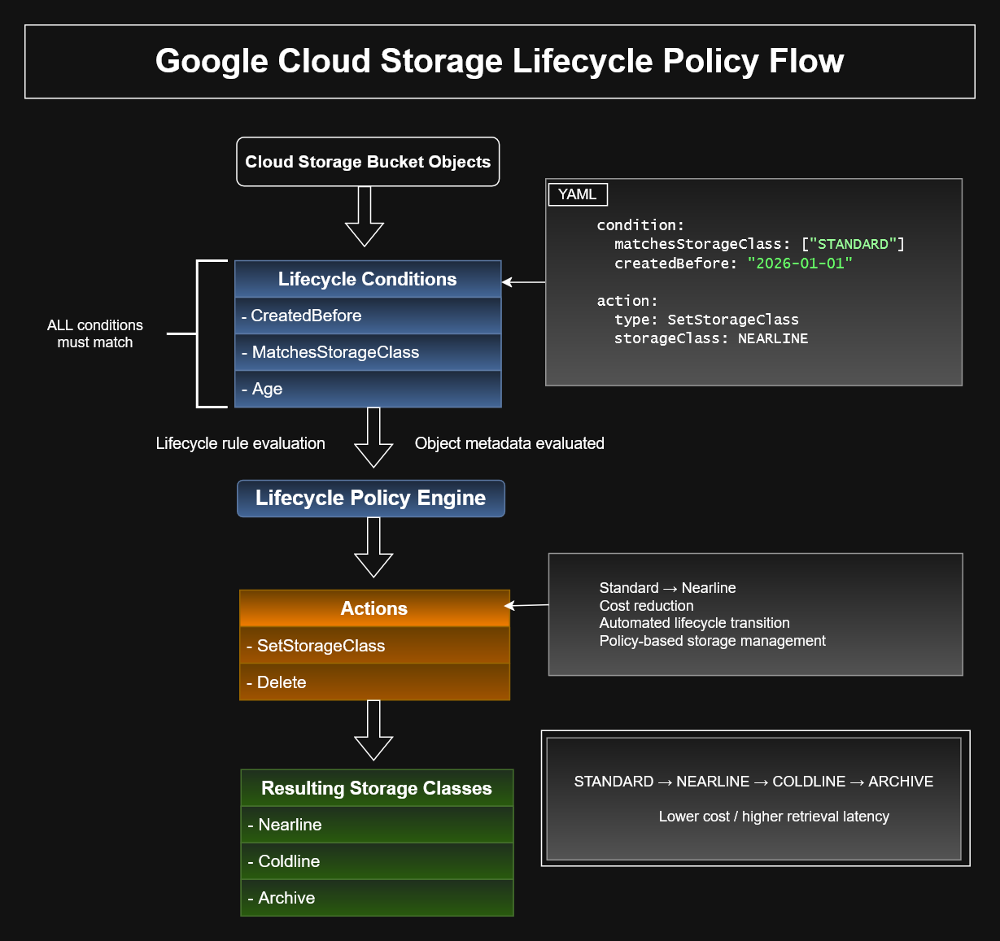
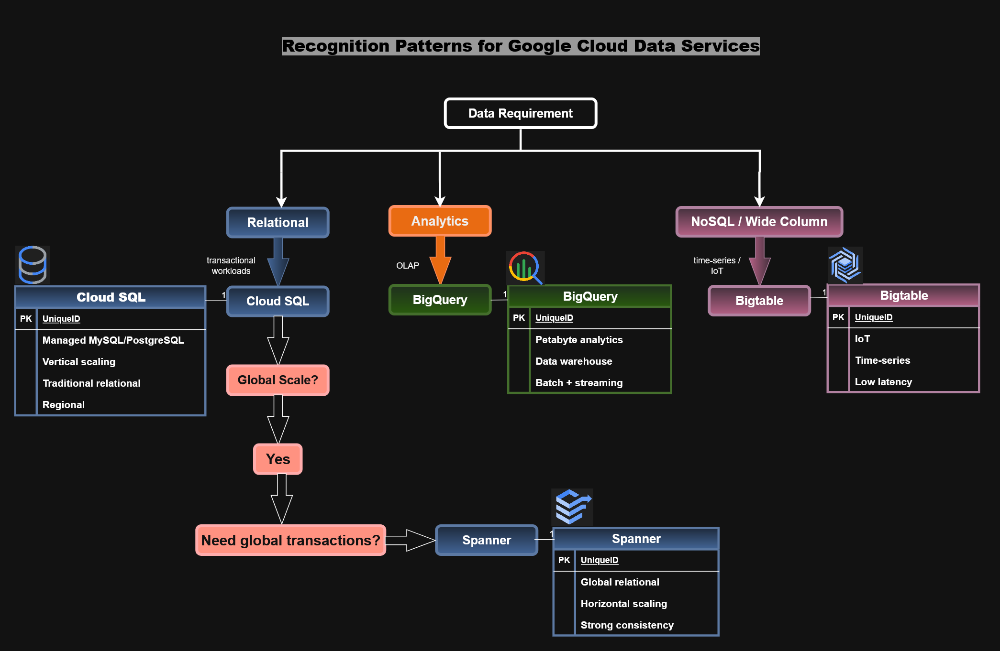

## Storage & Lifecycle Architecture

This section contains Google Cloud storage architecture diagrams,
lifecycle automation flows, and data solution decision models used
for Associate Cloud Engineer (ACE) preparation.

---

## Google Cloud Storage Lifecycle Policy Flow

Demonstrates how Cloud Storage lifecycle rules evaluate object metadata
and automatically transition storage classes using policy-based automation.

Topics covered:

- Lifecycle conditions
- Storage class transitions
- Cost optimization
- Object metadata evaluation
- Automated storage governance

### Diagram Files

- gcs-lifecycle-policy-flow.drawio
- gcs-lifecycle-policy-flow.png
- gcs-lifecycle-policy-flow.svg

---

## Google Cloud Data Solutions Decision Tree

Demonstrates decision-making patterns for selecting Google Cloud
data storage and analytics services.

Topics covered:

- Cloud SQL
- BigQuery
- Firestore
- Spanner
- Data architecture selection
- Operational tradeoffs

### Diagram Files

- data-solutions-decision-tree.drawio
- data-solutions-decision-tree.png
- data-solutions-decision-tree.svg

---

## Key ACE Concepts

- Cloud Storage lifecycle management
- Object versioning
- Storage class optimization
- Data platform selection
- Cost-aware architecture
- Managed storage services
