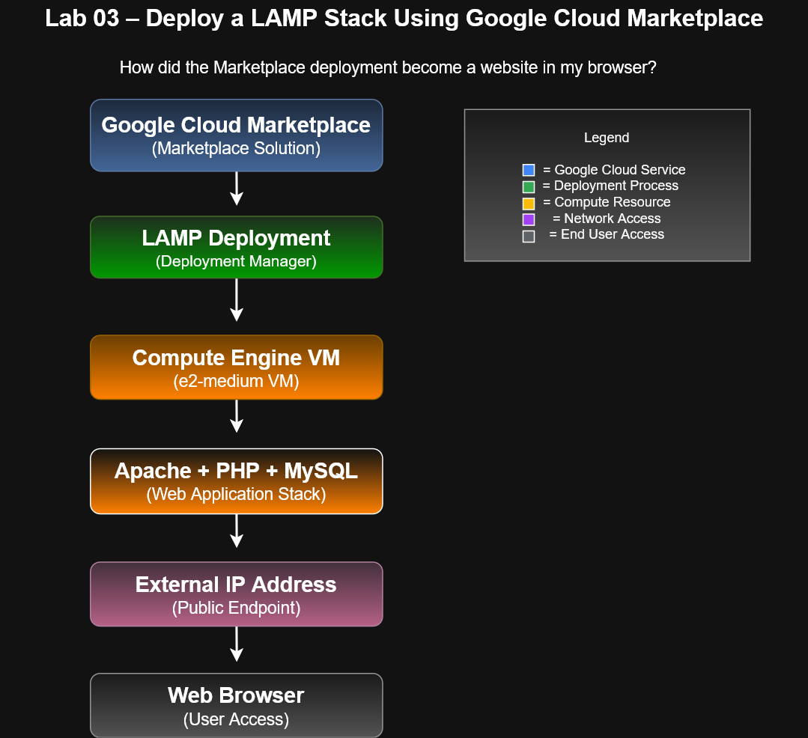
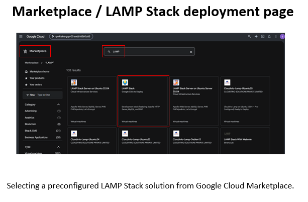
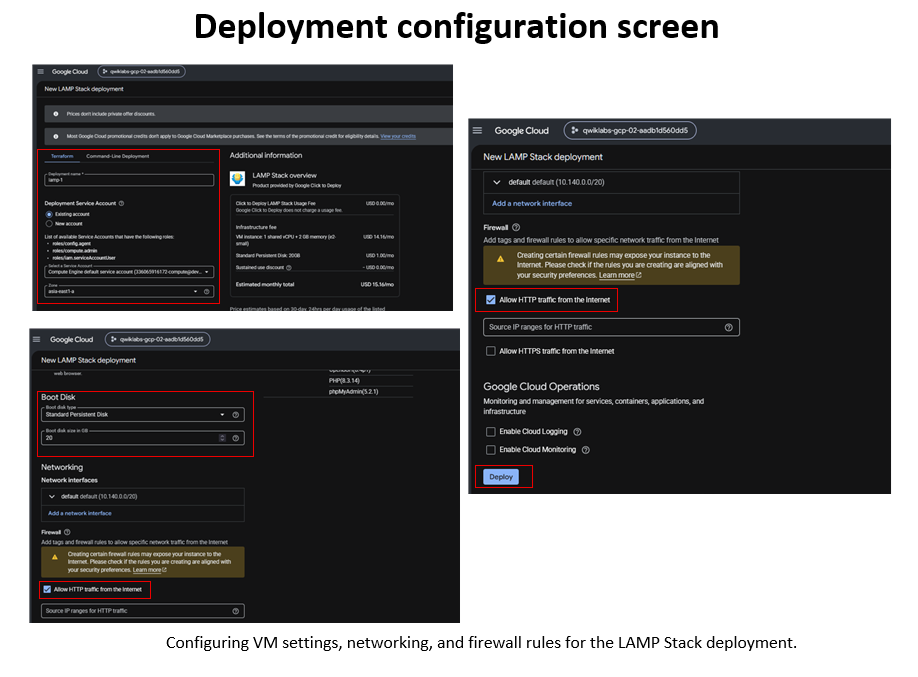
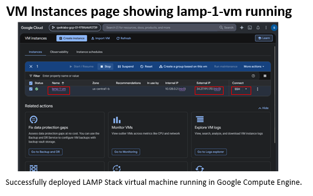
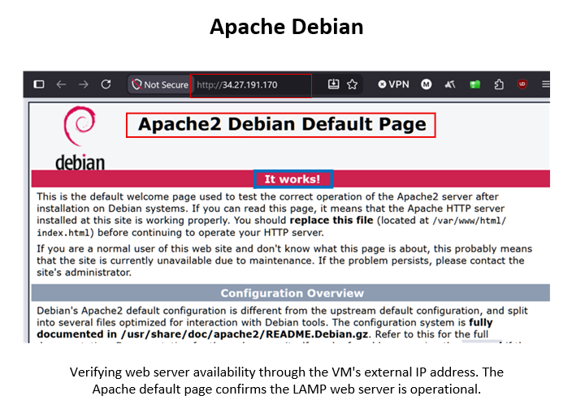
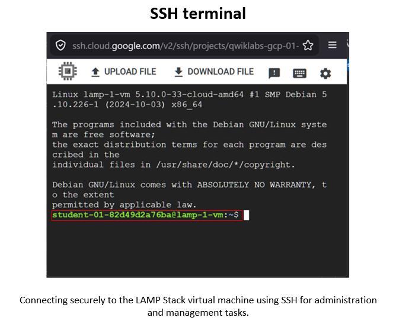
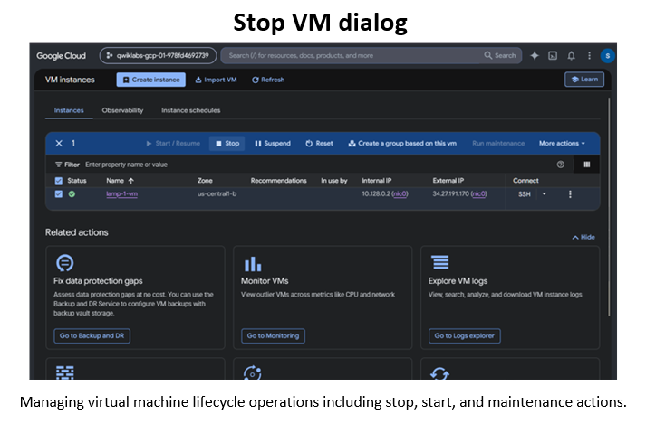

# Lab 03 – Deploy a LAMP Stack Using Google Cloud Marketplace

## Overview

In this lab, I deployed a complete LAMP (Linux, Apache, MySQL, PHP) environment using Google Cloud Marketplace. The deployment automatically provisioned a Compute Engine virtual machine, installed the required software stack, configured networking, and exposed the application through a public IP address.

This lab demonstrates how Google Cloud Marketplace can simplify infrastructure deployment by automating resource creation and software installation.

---

## Objectives

* Deploy a LAMP Stack from Google Cloud Marketplace
* Configure deployment settings
* Create and verify a Compute Engine virtual machine
* Access the deployed web server through a public IP address
* Connect to the virtual machine using SSH
* Manage the virtual machine lifecycle

---

## Architecture Overview

*Figure 1. Google Cloud Marketplace automatically provisions a LAMP stack on a Compute Engine virtual machine, exposing the application through a public IP address that can be accessed through a web browser.*

---

## Lab Workflow

### Step 1 – Select the LAMP Stack Solution

A preconfigured LAMP Stack deployment was selected from Google Cloud Marketplace.

*Figure 2. Selecting the LAMP Stack deployment from Google Cloud Marketplace.*

---

### Step 2 – Configure Deployment Settings

Deployment parameters including machine type, networking, and firewall settings were configured.

*Figure 3. Configuring deployment settings prior to launching the solution.*

---

### Step 3 – Deploy and Verify the Virtual Machine

The deployment process created a Compute Engine virtual machine and installed the required software stack.

*Figure 4. Compute Engine instance successfully deployed and running.*

---

### Step 4 – Verify Web Server Availability

The Apache web server was accessed through the VM's public IP address.

*Figure 5. Apache default page confirming successful LAMP Stack deployment.*

---

### Step 5 – Connect Using SSH

An SSH session was established to administer the virtual machine directly.

*Figure 6. Secure Shell (SSH) connection to the Compute Engine instance.*

---

### Step 6 – Manage the Virtual Machine

The virtual machine lifecycle can be managed through the Google Cloud Console.

*Figure 7. Managing virtual machine operations through the Google Cloud Console.*

---

## Services Used

* Google Cloud Marketplace
* Google Compute Engine
* Apache HTTP Server
* MySQL
* PHP
* Virtual Private Cloud (VPC)
* SSH

---

## Skills Demonstrated

* Cloud Marketplace Deployments
* Infrastructure Provisioning
* Compute Engine Administration
* Public IP Access
* Linux Server Management
* SSH Connectivity
* Cloud Resource Management

---

## Key Takeaways

This lab demonstrated how Google Cloud Marketplace can rapidly deploy a production-ready software stack with minimal manual configuration. By automating infrastructure provisioning and software installation, organizations can accelerate deployment times while maintaining consistent environments.

