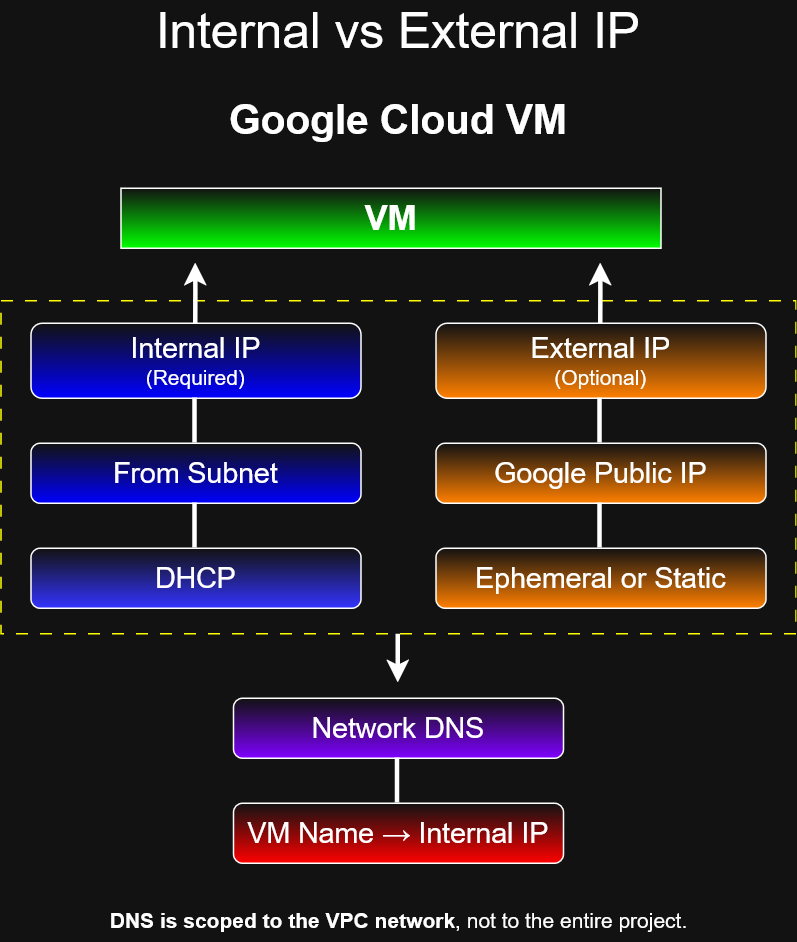

# IP Addresses

## Objective

Understand how Google Cloud assigns internal and external IP addresses to Compute Engine VM instances.

---

## Diagram



---

## Internal IP Addresses

Every Compute Engine VM network interface receives a primary internal IP address.

Internal IP addresses are used for private communication inside a VPC network.

### Characteristics

- Required for VM network communication
- Allocated from the subnet IP range
- Automatically assigned if no specific address is selected
- Can be ephemeral or static
- Not publicly routable from the internet
- Used for private communication between resources in the VPC network

Google Cloud automatically assigns an internal IP address from the subnet range when one is not specified.

If a fixed internal address is required, you can reserve a static internal IP address or promote an ephemeral internal IP address to static.

---

## External IP Addresses

External IP addresses are optional.

Use an external IP address when a VM needs direct public internet access or must be reachable from the internet.

External IP addresses are publicly routable.

### Ephemeral External IP

- Assigned automatically when requested
- Comes from Google's public IP address pool
- Does not permanently belong to the VM
- May be released when the resource is stopped, deleted, or reconfigured

### Static External IP

- Reserved by your project
- Remains assigned to the project until released
- Useful when a service needs a fixed public address
- Can increase cost when reserved but unused

---

## No External IP + Cloud NAT

A VM does not always need its own external IP address for outbound internet access.

Cloud NAT can allow VMs without external IPv4 addresses to reach IPv4 destinations on the internet.

Cloud NAT supports outbound connections and return traffic, but it does not allow unsolicited inbound connections from the internet.

### Cloud NAT Use Case

Use Cloud NAT when VMs need to:

- Download operating system updates
- Pull packages or dependencies
- Call external APIs
- Reach the internet without exposing each VM with its own external IP address

---

## Bring Your Own IP (BYOIP)

Bring Your Own IP allows an organization to bring its own public IP address ranges to Google Cloud.

After the IP address range is imported, Google Cloud manages the imported addresses similarly to Google-provided external IP addresses.

### Requirements

- Own a public IP address range
- Provision the range into Google Cloud
- Use the imported addresses with supported Google Cloud resources

For IPv4 BYOIP, Google Cloud public advertised prefixes support `/16` through `/24` ranges.

---

## Internal DNS

Google Cloud automatically creates internal DNS records for Compute Engine instances.

Default internal DNS mapping:

```text
VM name -> Internal IP address
