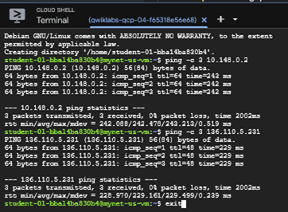

# Demo 04 – Internal and External IP Addresses

## Objective

Observe how Google Cloud assigns internal and external IP addresses to a VM instance and how those addresses behave when the VM is stopped and started.

---

## VM Creation

During VM creation, Google Cloud allows configuration of:

- VPC Network
- Subnet
- Internal IP Address
- External IP Address

Internal IP Options

- Ephemeral (DHCP assigned)
- Custom internal IP
- Reserved static internal IP

External IP Options

- None
- Ephemeral
- Static Reserved

---

## Demo Steps

### Create VM

Create a new Compute Engine VM.

Default configuration:

- Internal IP → Ephemeral (DHCP)
- External IP → Ephemeral

After creation:

```
Internal IP : 10.128.x.x
External IP : Google Public IP
```

---

### Stop the VM

When the VM is stopped:

- Internal IP remains assigned
- Ephemeral External IP is released

Result

```
Internal IP : Still Assigned
External IP : Removed
```

---

### Start the VM

When the VM starts again:

- Internal IP remains unchanged
- New External IP is assigned

Result

```
Internal IP : Same Address

External IP :
Old -> 34.xxx.xxx.xxx

New -> 35.xxx.xxx.xxx
```

---

## Key Concepts

Internal IP

✔ Required

✔ Allocated from subnet

✔ Usually remains with the VM

✔ Used for communication inside the VPC

---

External IP

✔ Optional

✔ Required only for Internet access

✔ Ephemeral changes after Stop/Start

✔ Static remains the same

---
# Demo – Internal and External IP Addresses

## Objective

Deploy Compute Engine VM instances and observe their assigned internal and external IP addresses.

---

## VM Instances

The lab deploys two Compute Engine virtual machines in different Google Cloud regions.


### Observations

- Both VM instances are in the **Running** state.
- Each VM has its own internal IPv4 address.
- Each VM has an ephemeral external IP address.
- SSH access is available through the Google Cloud Console.
- The VMs are deployed in different regions to demonstrate cross-region networking.
---

## Connectivity Test

After deploying the VM instances, connectivity was verified using ICMP (`ping`).



### Results

- SSH connection to **mynet-us-vm** succeeded.
- Internal IP connectivity was verified.
- External IP connectivity was verified.
- All tests completed with **0% packet loss**.

### Commands Used

```bash
ping -c 3 <internal-ip>
ping -c 3 <external-ip>
```

This confirms that the configured firewall rules, routing, and network connectivity are functioning correctly.

---
## ACE Exam Notes

✔ Every VM receives an internal IP.

✔ External IP addresses are optional.

✔ Ephemeral external IPs change after a VM stops and starts.

✔ Static external IPs remain the same.

✔ Internal IPs come from the subnet.

✔ DNS resolves VM names to internal IP addresses.

---

## Demo Result

The demo proves:

- Internal IP remains stable.
- Ephemeral external IP changes.
- Static external IP would remain unchanged.
- Internet access requires an external IP or another networking solution (such as Cloud NAT).

---

## Takeaway

> Every Google Cloud VM requires an internal IP address for private communication within the VPC.
>
> External IP addresses are optional. Ephemeral external IPs are released when a VM stops and replaced when it starts again, while static external IPs remain attached until released.
