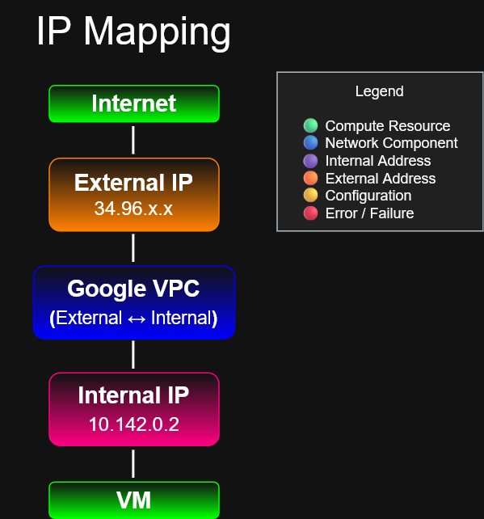

# IP Address Mapping and DNS Resolution

## Objective

Understand how Google Cloud maps external IP addresses to internal VM addresses and how DNS resolution works for Compute Engine instances.

---

## Diagram



---

## External IP Mapping

A Google Cloud VM operating system is only aware of the VM's internal IP address.

The external IP address is mapped to the VM's internal IP address by Google Cloud networking.

This mapping allows traffic from the internet to reach the VM while the operating system continues to use its private internal address.

```text
Internet
   │
External IP 34.96.x.x
   │
Google VPC
External ↔ Internal mapping
   │
Internal IP 10.142.0.2
   │
VM
```
Inside the VM, commands such as ifconfig or ip addr show the internal IP address.

Example:
```bash
ifconfig

10.142.0.2
```
The external public IP address does not appear as a network interface address inside the VM operating system.

---

## Internal DNS
Every Compute Engine instance automatically receives an internal DNS name.

Internal DNS maps a VM name to the VM's internal IP address.

Example:
```text
vm-1
  ↓
10.128.0.5
```
Internal DNS allows VM instances in the same VPC network to communicate with each other by using names instead of only IP addresses.
---

## Internal DNS Types
Google Cloud supports two types of internal DNS names:

- Zonal DNS
- Global DNS
  
### Zonal DNS

Zonal DNS includes the instance name, zone, project ID, and internal domain.

Format:
```bash
instance-name.zone.c.project-id.internal
```
Example:
```bash
web-server.us-central1-a.c.demo-project.internal
```
Google recommends zonal DNS because it improves reliability by isolating DNS registration failures to individual zones.

### Global DNS

Global DNS uses the instance name, project ID, and internal domain.

Format:
```bash
instance-name.c.project-id.internal
```
Example:
```bash
web-server.c.demo-project.internal
```
---

## Metadata Server

Every Compute Engine VM can access the metadata server.

IPv4 address:
```bash
169.254.169.254
```
Recommended DNS name:
```bash
metadata.google.internal
```
The metadata server provides:

- Instance metadata
- Project metadata
- Service account token access
- Internal DNS name resolution support

For DNS, Google Cloud VM instances commonly use the metadata server as their default internal name server.

---

## External DNS

Public DNS records are not automatically created for Compute Engine external IP addresses.

If a public domain name should point to a VM, administrators must create DNS records manually.

Public DNS records can be managed using:

- Cloud DNS
- Third-party DNS providers

Example:
```text
www.example.com
   ↓
34.96.x.x
```
---

## Key Concepts
### External IP Mapping
- External IP addresses are public addresses.
- Internal IP addresses are private VPC addresses.
- The VM operating system sees the internal IP address.
- Google Cloud networking maps the external IP to the internal VM address.
- External IP mapping allows public traffic to reach the VM.
### Internal DNS
- Automatically created for Compute Engine VMs
- Maps VM names to internal IP addresses
- Works inside the VPC network
- Helps VMs communicate by name
### Metadata Server
- Available at `169.254.169.254`
- Also available by using `metadata.google.internal`
- Provides instance and project metadata
- Supports internal DNS resolution behavior for VMs
### External DNS
- Not automatically created for VM external IP addresses
- Must be configured separately
- Can use Cloud DNS or a third-party DNS provider
---

## ACE Exam Notes

- A VM operating system is only aware of its internal IP address.
- The external IP address is mapped to the VM's internal IP address by Google Cloud networking.
- Internal DNS automatically maps VM names to internal IP addresses.
- Internal DNS is scoped to the VPC network.
- Zonal DNS is recommended over global DNS.
- Zonal DNS format:
```bash
instance-name.zone.c.project-id.internal
```
- Global DNS format:
```bash
instance-name.c.project-id.internal
```
- The metadata server is available at:
```bash
169.254.169.254
```
- The metadata server DNS name is:
```bash
metadata.google.internal
```
- Public DNS records are not automatically created for external IP addresses.
- Use Cloud DNS or another DNS provider to map a public domain name to an external IP address.
---

## Takeaway

> Google Cloud maps external IP addresses to internal VM addresses through the VPC network.
>
>The VM operating system sees its internal IP address, not the external public IP address.
>
>Compute Engine automatically creates internal DNS names that resolve VM names to internal IP addresses.
>
>The metadata server provides VM metadata and supports internal DNS behavior.
>
>Public DNS records must be created separately using Cloud DNS or another DNS provider.
