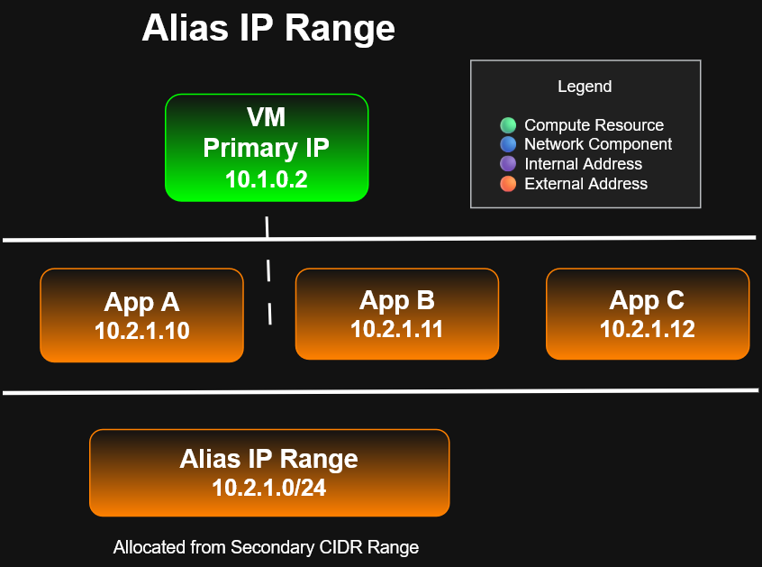

# Cloud DNS and Alias IP Ranges

## Objective

Understand the difference between Cloud DNS and Alias IP ranges in Google Cloud networking.

Cloud DNS provides managed DNS name resolution.

Alias IP ranges allow a VM network interface to use additional internal IP ranges for workloads such as containers, applications, and GKE Pods.

---

## Diagram



---

## Cloud DNS

Cloud DNS is Google Cloud's managed DNS service.

DNS translates human-readable names into IP addresses.

Example

```
www.example.com

↓

34.120.50.18
```

---

## Benefits

- Managed service
- Global Anycast network
- Low latency
- 100% uptime SLA
- Millions of DNS records
- UI
- CLI
- API

---

## Alias IP Ranges

Alias IPs allow one VM to use multiple internal IP addresses.

Instead of creating multiple network interfaces, multiple applications or containers can each receive their own IP.

Example

```
VM

Primary IP
10.1.0.2

↓

Alias Range

10.2.1.0/24
```

Applications

```
Container A

10.2.1.10

Container B

10.2.1.11

Container C

10.2.1.12
```

---

## Benefits

- Kubernetes
- Containers
- Multiple applications
- Simpler networking
- No additional NICs required

---

# ACE Exam Notes

✔ Cloud DNS is managed by Google

✔ Uses Google's global Anycast network

✔ Alias IPs come from subnet CIDR ranges

✔ Alias IPs avoid creating additional NICs

✔ Frequently used with GKE

---

## Takeaway

Cloud DNS provides scalable global name resolution, while Alias IP Ranges allow multiple services running on the same VM to communicate using separate internal IP addresses.
