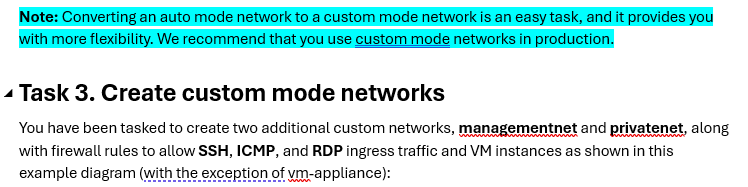
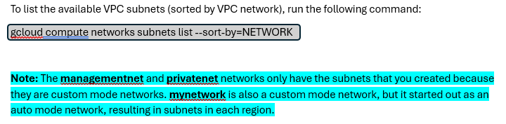
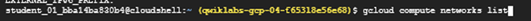
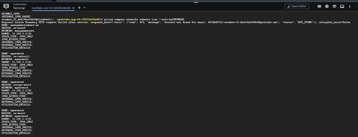

# 10. Custom Mode Networks

## Objective

Convert an auto mode VPC network into a custom mode VPC network and create additional custom VPC networks for production-style network segmentation.

---

## Task Overview

### Task 3 Overview



The lab converts **mynetwork** from Auto Mode to Custom Mode and introduces two new custom VPC networks:

- managementnet
- privatenet

These networks use manually created subnets instead of automatically generated regional subnets.



---

### Verify the Networks

The following Cloud Shell command lists every subnet grouped by VPC network.

```bash
gcloud compute networks subnets list --sort-by=NETWORK
```
### Key Concepts




## Key Concepts

- Auto mode networks automatically create subnets in every Google Cloud region.
- Custom mode networks require the administrator to create each subnet manually.
- Existing auto mode networks can be converted to custom mode.
- Converting to custom mode does not delete existing subnets.
- Custom mode provides greater control for production environments.

## Network Architecture

See the complete Visio network diagram:

- diagrams/google-cloud-vpc-networking-lab.png
- diagrams/google-cloud-vpc-networking-lab.vsdx
