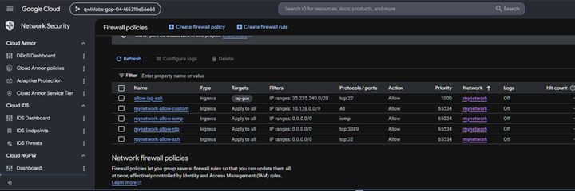

# 11. Firewall Configuration

## Objective

Configure custom firewall rules for the managementnet network to allow:

- SSH (TCP 22)
- RDP (TCP 3389)
- ICMP

---

## Firewall Rules in Google Cloud

Google Cloud VPC firewall rules control ingress and egress traffic.

Each firewall rule specifies:

- Network
- Direction
- Priority
- Target
- Source IP Range
- Protocols and Ports

---

## Management Network Firewall

The management network firewall rule was configured using:

- Name:
  managementnet-allow-icmp-ssh-rdp

- Network:
  managementnet

- Source:
  0.0.0.0/0

- Protocols
  - ICMP
  - TCP 22 (SSH)
  - TCP 3389 (RDP)

---

## Lab Configuration

This configuration allows administrators to remotely manage virtual machines in the management network.

---

## Why this matters

Without firewall rules:

- SSH connections fail
- Ping fails
- Remote Desktop connections fail

Firewall rules determine what traffic is permitted to reach Compute Engine instances.

