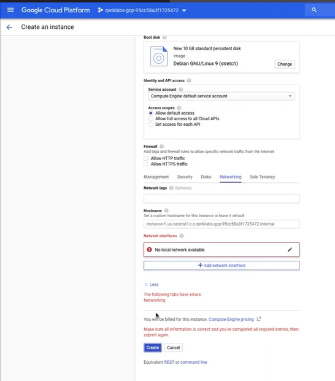
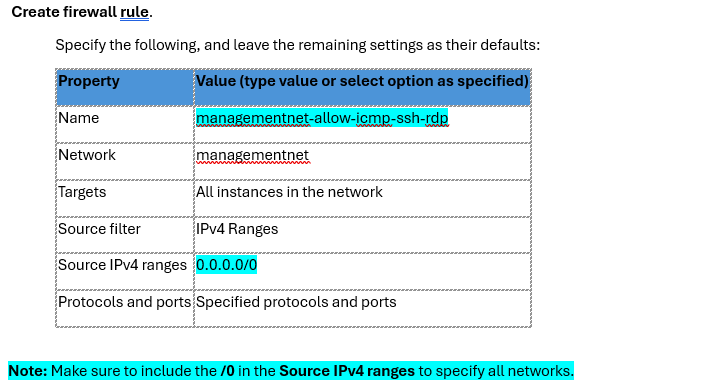
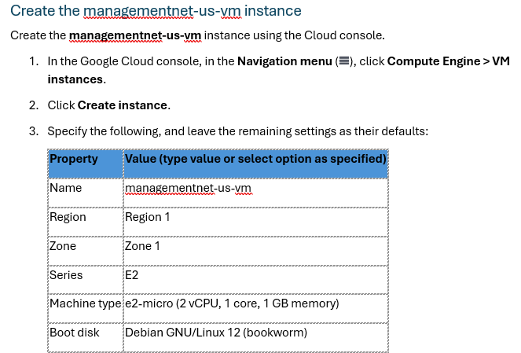
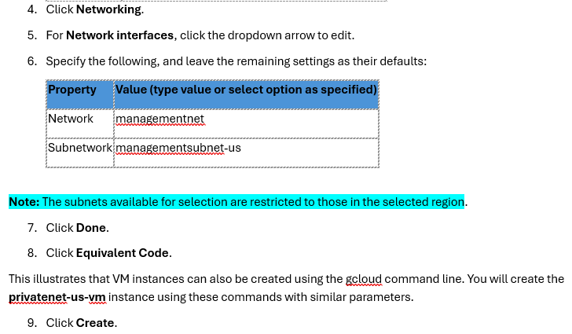
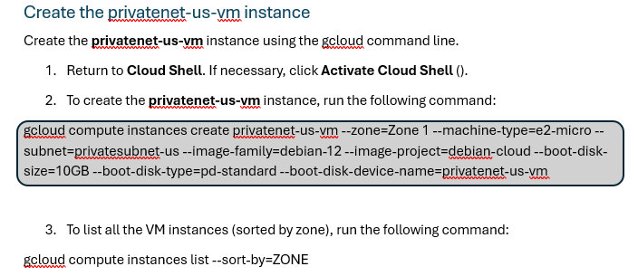
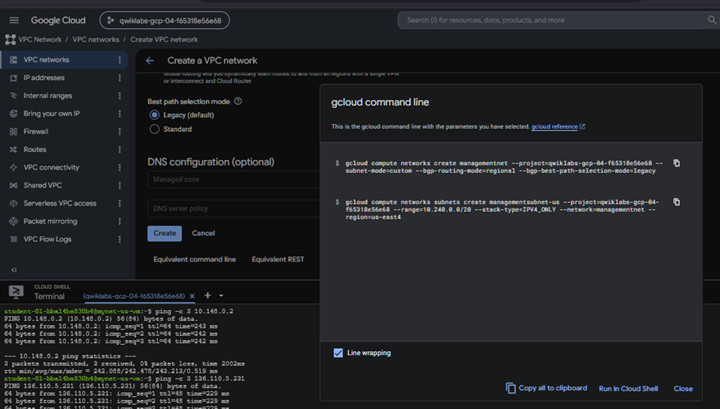
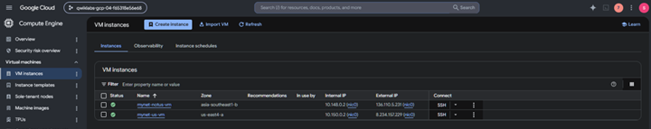

# 12. Virtual Machine Deployment

## Why VM Creation Failed

- No local network available
- Deleting the default VPC removes available networks
- Every Compute Engine VM requires a VPC



---

## Create managementnet-us-vm




Configuration

- Name
- Region
- Zone
- Machine Type
- Debian 12



Networking

- managementnet
- managementsubnet-us



---

## Create privatenet-us-vm

Cloud Shell command

```bash
gcloud compute instances create privatenet-us-vm ...
```



## Equivalent gcloud Command


The Console automatically generates the CLI command.
---

## Verify VM Deployment


> **ACE Exam Tip**
>
> The Google Cloud Console can generate the equivalent `gcloud` command for many actions. This is a useful way to learn the CLI while working in the graphical interface.
