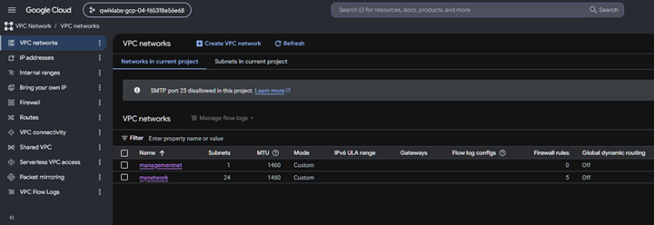

# Lab 05 - Create and Configure VPC Networks

## Infrastructure as Code Preparation

Google Cloud automatically generates equivalent gcloud CLI commands for resources created through the Cloud Console.

These commands can be reused in automation scripts, CI/CD pipelines, or Infrastructure as Code workflows.

## Skills Learned

- Google Cloud VPC
- Auto Mode Networks
- Custom Mode Networks
- Subnets
- Firewall Rules
- IAP SSH
- Compute Engine
- Internal vs External IP
- ICMP Connectivity
- Cloud Shell
- gcloud CLI

## Key Commands

gcloud compute ssh
ping
gcloud services enable

## Concepts Learned

- Every VM belongs to a VPC
- Auto Mode creates subnets automatically
- Custom Mode gives complete subnet control
- Firewall rules control ingress traffic
- Internal IP communication stays inside the VPC
- External IP communication travels over the Internet

## Status

✅ Completed
