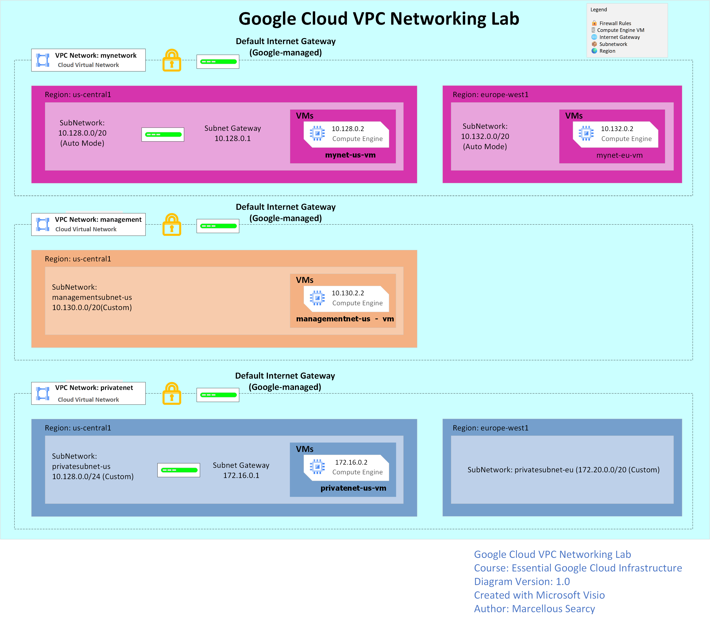

# Lab 05 - Create and Configure VPC Networks

>
>This lab demonstrates the creation and configuration of Google Cloud Virtual Private Cloud (VPC) networks. It covers Auto Mode and Custom Mode VPCs, subnet creation, firewall rules, >Compute Engine deployment, internal and external connectivity testing, and Cloud Shell verification.
>

## Infrastructure as Code Preparation

Google Cloud automatically generates equivalent gcloud CLI commands for resources created through the Cloud Console.

These commands can be reused in automation scripts, CI/CD pipelines, or Infrastructure as Code workflows.

## Skills Learned

- Auto Mode VPC Networks
- Custom Mode VPC Networks
- Regional Subnets
- Firewall Rules
- ICMP
- SSH
- RDP
- Compute Engine
- Cloud Shell
- Internal IP Connectivity
- External IP Connectivity
- gcloud CLI

## Key Commands

gcloud compute ssh
ping
gcloud services enable

## Concepts Learned

- Every VM belongs to a VPC
- Auto Mode creates subnets automatically
- Custom Mode gives complete subnet control
- Firewall rules control ingress traffic
- Internal IP communication stays inside the VPC
- External IP communication travels over the Internet
---

## ACE Exam Objectives

This lab covers:

- Create VPC Networks
- Configure Subnets
- Deploy VM Instances
- Configure Firewall Rules
- Verify Network Connectivity
- Use Cloud Shell
- Understand Auto vs Custom Mode VPCs
---

## Status

✅ Completed
