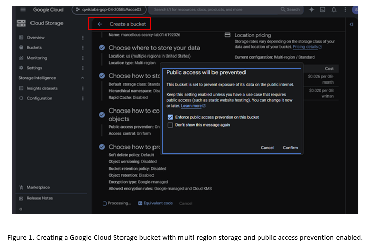
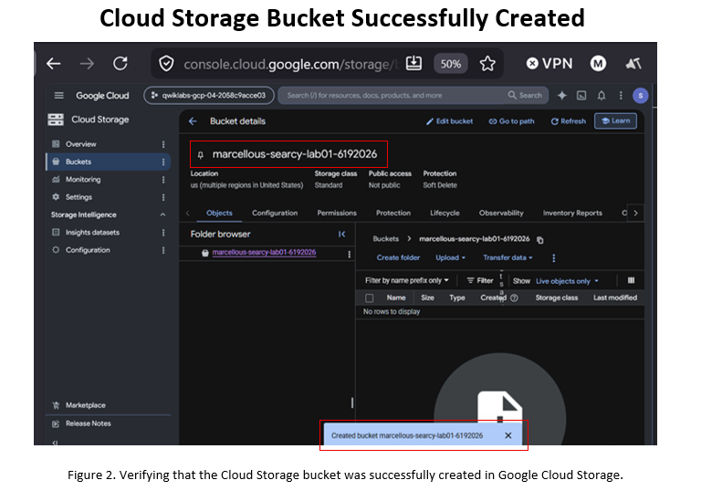
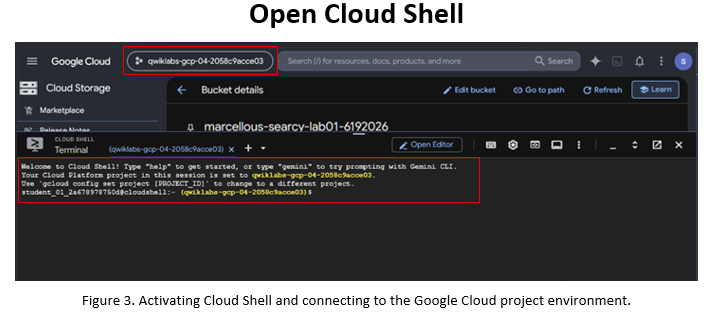
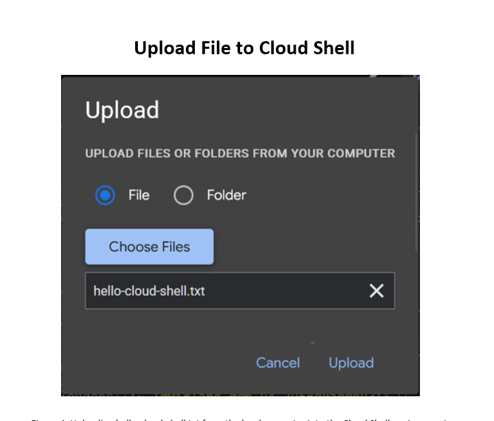
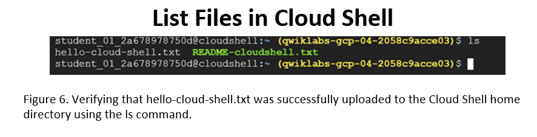
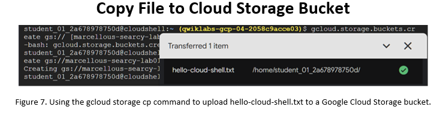
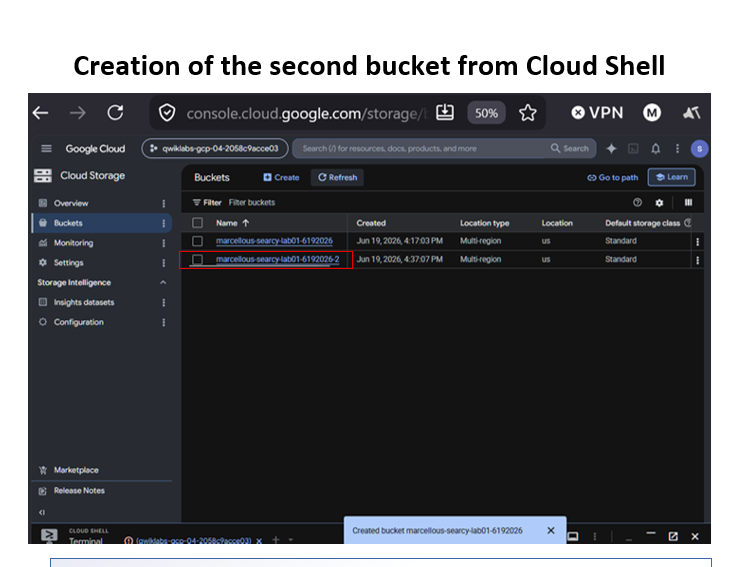

# Google Cloud Lab 01 – Cloud Storage and Cloud Shell
## Overview

This lab demonstrates the use of Google Cloud Storage and Cloud Shell within Google Cloud Platform (GCP). The objective was to create Cloud Storage buckets using both the Google Cloud Console and Cloud Shell, upload a file to Cloud Shell, and copy that file into a Cloud Storage bucket.

## Skills Demonstrated
- Creating Google Cloud Storage buckets
- Navigating the Google Cloud Console
- Using Cloud Shell
- Uploading files to Cloud Shell
- Listing files using Linux commands
- Copying files to Cloud Storage with gcloud storage cp
- Verifying bucket creation and object uploads
- Understanding browser-based cloud administration tools

---
## Technologies Used
- Google Cloud Platform (GCP)
- Google Cloud Storage
- Cloud Shell
- Cloud Console
- Linux Command Line
- Google Cloud SDK (gcloud)

---  
## Lab Workflow
### Step 1 – Create a Cloud Storage Bucket

A new Google Cloud Storage bucket was created using the Google Cloud Console. The bucket was configured with a multi-region location and Standard storage class.



*Figure 1. Creating a Google Cloud Storage bucket using the Google Cloud Console.*

---

### Step 2 – Verify Bucket Creation

The Bucket Details page was used to verify that the bucket was successfully created.



*Figure 2. Verifying successful Cloud Storage bucket creation.*

---

### Step 3 – Open Cloud Shell

Cloud Shell was launched from the Google Cloud Console to perform command-line operations.



*Figure 3. Activating Cloud Shell and connecting to the active Google Cloud project.*

---

### Step 4 – Upload a File to Cloud Shell

A local text file named `hello-cloud-shell.txt` was uploaded into the Cloud Shell environment.



*Figure 4. Uploading a local file into Cloud Shell.*

---

### Step 5 – Verify Uploaded Files

The uploaded file was verified using the Linux `ls` command.

```bash
ls
```

Expected output:

```text
hello-cloud-shell.txt
README-cloudshell.txt
```



*Figure 5. Listing files in Cloud Shell and verifying the uploaded file.*

---

### Step 6 – Copy File to Cloud Storage

The uploaded file was copied from Cloud Shell to the Cloud Storage bucket.

```bash
gcloud storage cp hello-cloud-shell.txt gs://marcellous-searcy-lab01-6192026
```



*Figure 6. Copying a file from Cloud Shell to Google Cloud Storage.*

---

### Step 7 – Create a Second Bucket Using Cloud Shell

A second Cloud Storage bucket was created using the Google Cloud CLI.

```bash
gcloud storage buckets create gs://marcellous-searcy-lab01-6192026-2
```



*Figure 7. Creating a Cloud Storage bucket from Cloud Shell.*

---

### Step 8 – Verify Multiple Buckets

The Cloud Storage Browser was used to verify that both buckets were successfully created.

```bash
gcloud storage buckets list
```


*Figure 8. Viewing Cloud Storage buckets created through both the Google Cloud Console and Cloud Shell.*

---

## Key Commands
Create Bucket
```bash
gcloud storage buckets create gs://BUCKET_NAME
```

List Files
```bash
ls
```

Upload File to Cloud Storage
```bash
gcloud storage cp hello-cloud-shell.txt gs://BUCKET_NAME
```

List Available Compute Regions
```bash
gcloud compute regions list
```

Display Environment Variable
```bash
echo $INFRACLASS_REGION
```

## Learning Outcomes

By completing this lab I learned how to:

- Use both graphical and command-line interfaces in Google Cloud.
- Create and manage Cloud Storage resources.
- Upload and transfer files between Cloud Shell and Cloud Storage.
- Execute Google Cloud SDK commands.
- Verify cloud resources using both the Console and Cloud Shell.
- Understand how Cloud Shell can automate administrative tasks.

## Repository Structure
```text
google-cloud-labs/
│
├── screenshots/
│   ├── 01-create-bucket.png
│   ├── 02-bucket-created.png
│   ├── 03-cloud-shell-terminal.png
│   ├── 04-upload-file-to-cloud-shell.png
│   ├── 05-copy-file-to-bucket.png
│   ├── 06-list-files.png
│   ├── 07-copy-file-to-bucket.png
│   └── 08-second-bucket-from-cloud-shell.png
│
├── Lab01-CloudShell.md
├── Lab02-Storage.md
├── commands.md
└── notes.md
```
## Author

**Marcellous Searcy**

Bachelor of Computer Information Systems / Software Engineering  
Google Cloud Associate Cloud Engineer Candidate  
Cloud Infrastructure • Networking • Automation • DevOps
GitHub Repository: `cloud-engineer-learning-path`
