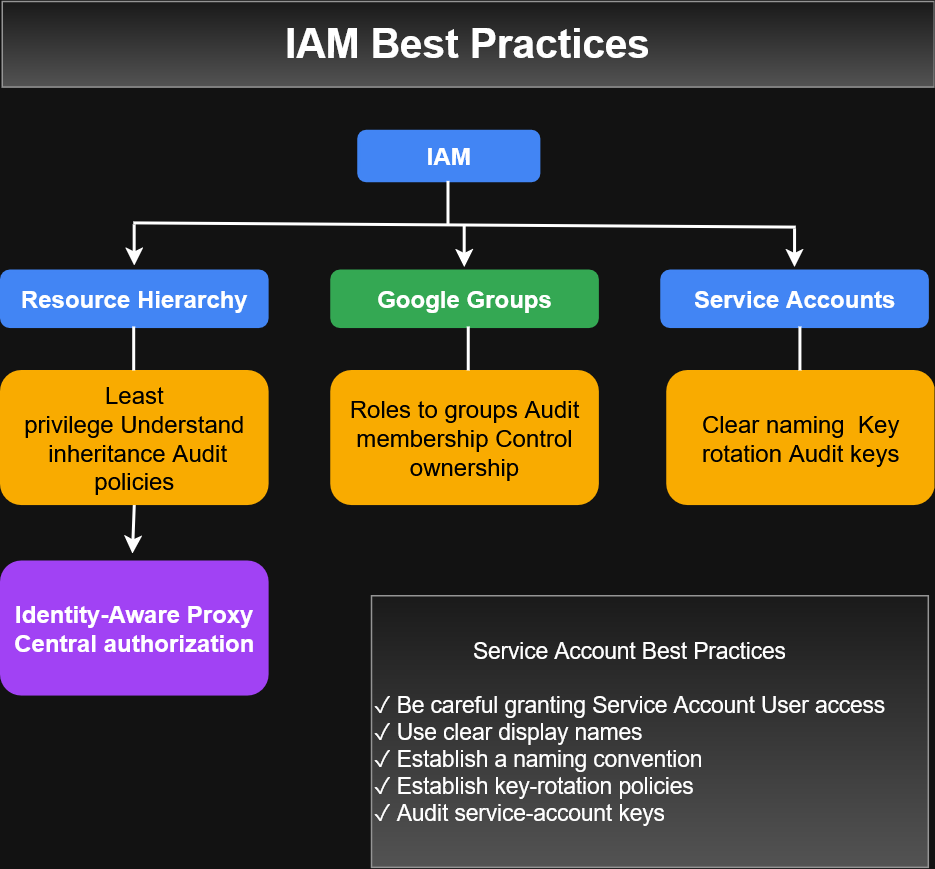
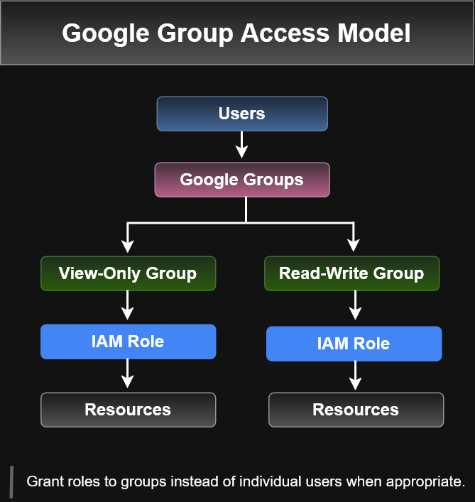

# Google Cloud IAM Best Practices

This section summarizes the IAM operational practices presented in the Google Cloud training material.

---

## Best-Practices Overview



The training emphasizes four major areas:

1. Understand and leverage the Google Cloud resource hierarchy.
2. Grant roles to groups instead of individual users where appropriate.
3. Manage service accounts carefully.
4. Use Identity-Aware Proxy for centralized application access control.

---

## Resource Hierarchy and Least Privilege

Google Cloud IAM policies follow the resource hierarchy, so administrators should understand both resource placement and policy inheritance.

The course recommends:

- Use projects to group resources that share the same trust boundary.
- Review policies granted on each resource.
- Understand inherited permissions.
- Apply the principle of least privilege when assigning roles.
- Audit IAM policy changes using Cloud Audit Logs.
- Audit membership of groups referenced by IAM policies.

### Trust Boundary

Projects should be used to group resources that share the same trust boundary.

### Policy Inheritance

IAM access granted higher in the resource hierarchy can affect descendant resources.

Because of this inheritance model, broad permissions should be assigned carefully.

---

## Grant Roles to Groups Instead of Individuals



The course recommends assigning IAM roles to Google Groups rather than repeatedly assigning roles directly to individual users.

This allows administrators to manage access by changing group membership.

### Benefits

- Update group membership instead of changing IAM policy repeatedly.
- Audit the membership of groups used in IAM policies.
- Control ownership of groups used for IAM authorization.
- Use multiple groups to provide different levels of access.

Example:

```text
Network Admin Group
        │
        ├── View-Only Group
        │       ↓
        │   Read-only access
        │
        └── Read-Write Group
                ↓
            Read/write access
```
A user's effective access can therefore be controlled through membership in one or more groups.

--- 

## Service Account Best Practices

Service accounts require careful permission and credential management.

The course recommends:

- Be careful when granting the Service Account User role.
- Give service accounts display names that clearly identify their purpose.
- Establish a consistent service-account naming convention.
- Establish key-rotation policies and procedures.
- Audit service-account keys.

The training references the following method for auditing keys:

```bash
serviceAccount.keys.list
```
Granting permission to use a service account should be treated carefully because the principal may gain access to resources available to that service account.

For additional service-account architecture and credential information, see:

service-accounts.md

---

## Identity-Aware Proxy

Identity-Aware Proxy (IAP) provides a centralized authorization layer for protected applications and resources.

The course describes the access flow as:
```text
User
  ↓
Authentication
  ↓
Identity-Aware Proxy
  ↓
IAM Authorization
  ↓
Protected Application / Resource
```
Applications and resources protected by IAP can be accessed only by users or groups with the appropriate IAM authorization.

The course presents IAP as a way to implement application-level access control for HTTPS applications rather than relying only on network-level firewall controls.

---

## Key Takeaways
- Understand the Google Cloud resource hierarchy before assigning IAM access.
- Use projects to establish appropriate trust boundaries.
- Review policy inheritance carefully.
- Apply least privilege.
- Audit IAM policies and group membership.
- Prefer group-based role assignment over individual assignments where appropriate.
- Manage service-account permissions, naming, keys, and rotation carefully.
- Use IAP when centralized identity-based application access control is appropriate.

---

Related IAM Documentation
- 
- 
- 
- 
- 
