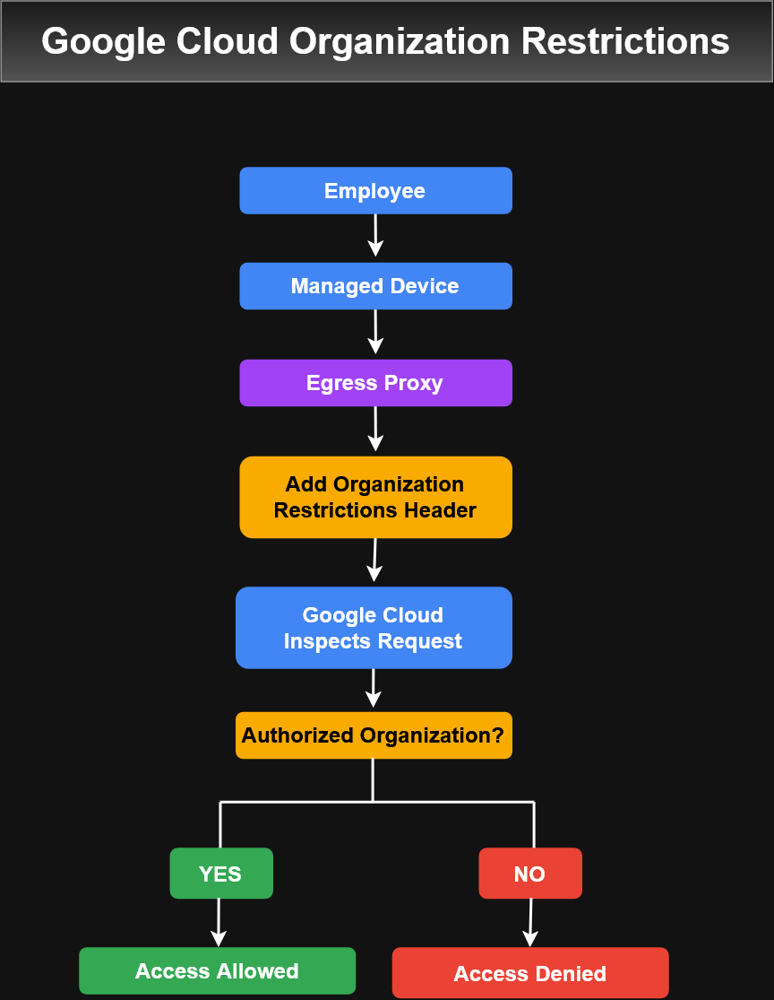

# Google Cloud IAM Fundamentals

## IAM Model
## Organizations
## Roles
## Members
## Service Accounts

---

## Organization Restrictions

Organization Restrictions help control which Google Cloud organizations users on managed devices can access.

The feature can help reduce the risk of data exfiltration through phishing or insider attacks by restricting access to authorized Google Cloud organizations.



### Access Flow

```text
Employee
   ↓
Managed Device
   ↓
Customer-Managed Egress Proxy
   ↓
Organization Restrictions Header Added
   ↓
Google Cloud Inspects Request
   ↓
Authorized Organization?
   ├── Yes → Access allowed
   └── No  → Access denied
```
### How It Works
1. An employee accesses Google Cloud from a managed device.
2. A customer-managed egress proxy processes the request.
3. The proxy adds an Organization Restrictions header.
4. Google Cloud inspects the request and the restriction header.
5. Access is allowed only when the requested Google Cloud organization is authorized.

### Administrative Responsibilities

The course describes cooperation between:

- Google Cloud administrators, who administer Google Cloud resources.
- Egress proxy administrators, who configure the proxy that adds Organization Restrictions headers.

### Example Uses

Organization Restrictions can be configured so employees can:

- Access resources only in their organization's Google Cloud organization.
- Access permitted resources such as Cloud Storage while remaining restricted to authorized organizations.
- Access an approved vendor's Google Cloud organization in addition to their own.

### Key Takeaways
- Organization Restrictions control access to Google Cloud organizations from managed devices.
- An egress proxy adds organization restriction information to outgoing requests.
- Google Cloud evaluates the restriction header before allowing access.
- Authorized organizations are allowed.
- Unauthorized organizations are blocked.
- Additional trusted organizations, such as vendor organizations, can be authorized.

---

## Best Practices
## Hands-on Lab
