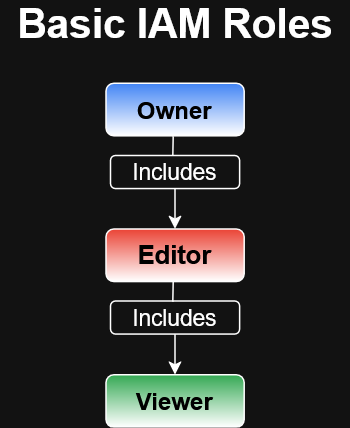
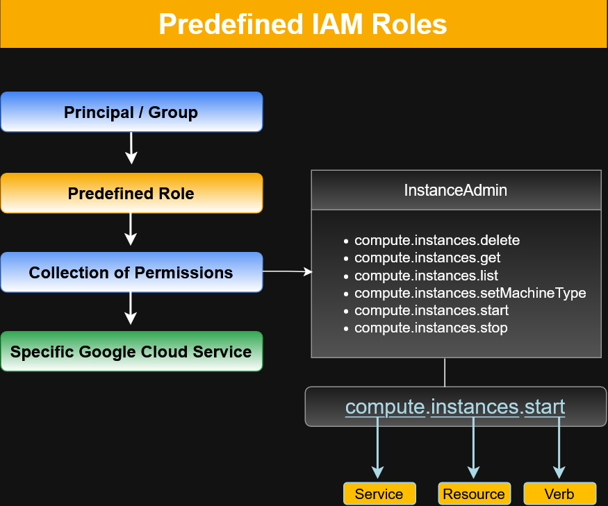

# Google Cloud IAM Roles and Permissions

Google Cloud Identity and Access Management (IAM) controls **what actions a principal can perform on a resource**.

A role is a collection of permissions. Google Cloud IAM uses three major role types:

1. **Basic roles**
2. **Predefined roles**
3. **Custom roles**

The choice of role determines how broadly or precisely access is granted.

---

## Three Types of IAM Roles

| Role Type | Scope / Purpose | Access Granularity |
|---|---|---|
| Basic | Broad project-level access | Coarse-grained |
| Predefined | Google-managed roles for particular services or job functions | Fine-grained |
| Custom | User-defined collection of selected permissions | Precise |

---

## Basic IAM Roles

Basic roles provide broad, fixed levels of access across resources in a Google Cloud project.

The principal basic roles are:

- **Owner** — administrative access
- **Editor** — modify and manage resources
- **Viewer** — read-only access

These roles are hierarchical:

- Owner includes Editor permissions.
- Editor includes Viewer permissions.



### Basic Role Relationship

```text
Owner
  ↓ includes
Editor
  ↓ includes
Viewer
```

Because basic roles grant broad access, more specific roles should be considered when a user only requires access to a particular service or set of operations.

>
> ### Billing Administration
>
> The course also discusses a Billing Administrator role for managing billing-related responsibilities without granting permission to modify the project's cloud resources.
> 

---

## Predefined IAM Roles

Predefined roles are created and maintained by Google.

Unlike broad basic roles, predefined roles provide collections of permissions associated with particular Google Cloud services or operational responsibilities.

A predefined role can be understood as:


```text
Principal / Group
       ↓
Predefined Role
       ↓
Collection of Permissions
       ↓
Specific Google Cloud Service
```
For example, a Compute Engine administrative role can include permissions such as:
```text
compute.instances.delete
compute.instances.get
compute.instances.list
compute.instances.setMachineType
compute.instances.start
compute.instances.stop
```
Grouping permissions into roles makes access easier to administer than granting individual permissions separately.

### IAM Permission Structure

Google Cloud IAM permissions commonly follow a pattern similar to:

service.resource.verb

#### Example:

compute.instances.start

This can be interpreted as:

| Component | Value       | Meaning                   |
| --------- | ----------- | ------------------------- |
| Service   | `compute`   | Compute Engine            |
| Resource  | `instances` | Virtual machine instances |
| Verb      | `start`     | Start the resource        |


This permission allows the authorized principal to start a Compute Engine instance.

### Compute Engine Predefined Role Examples

The course introduces several Compute Engine IAM roles.

| Role          | Purpose                                                                                |
| ------------- | -------------------------------------------------------------------------------------- |
| Compute Admin | Broad control of Compute Engine resources                                              |
| Network Admin | Manage Compute Engine networking resources within the permissions provided by the role |
| Storage Admin | Manage disks, images, and snapshots                                                    |

Predefined roles allow administrators to grant service-specific access without granting the broader permissions associated with a project-wide basic role.
---

## Custom IAM Roles

Custom roles allow an organization to define its own collection of permissions.

They are useful when existing predefined roles grant either:

- too many permissions, or
- too few permissions

for a particular job function.

#### Example: Instance Operator


An organization may need a user who can operate virtual machines without being able to reconfigure them.

A custom `Instance Operator` role could contain:
```text
Allowed:
├── compute.instances.get
├── compute.instances.list
├── compute.instances.start
└── compute.instances.stop

Not granted:
└── Reconfiguration permissions
```
This provides the permissions required for the operational task without granting broader administrative authority.

---

## Principle of Least Privilege

The `principle of least privilege` means granting a principal only the permissions required to perform their assigned responsibilities.

A practical IAM decision process is:
```text
Identify job responsibility
        ↓
Determine required actions
        ↓
Select the narrowest suitable role
        ↓
Grant access at the appropriate resource level
        ↓
Avoid unnecessary permissions
```
Custom and predefined roles can support least-privilege access more precisely than broad basic roles.

---

## Basic vs. Predefined vs. Custom

| Feature                     | Basic   | Predefined            | Custom                                |
| --------------------------- | ------- | --------------------- | ------------------------------------- |
| Maintained by Google        | Yes     | Yes                   | No                                    |
| Broad project access        | Yes     | Usually more targeted | Defined by administrator              |
| Service-specific            | No      | Yes                   | Can be                                |
| Custom permission selection | No      | No                    | Yes                                   |
| Useful for least privilege  | Limited | Strong                | Strongest when appropriately designed |

---

## Key Takeaways
- IAM roles define the "can do what" portion of access control.
- Roles are collections of permissions.
- Basic roles provide broad, coarse-grained access.
- Predefined roles provide more targeted access to Google Cloud services.
- Custom roles allow precise permission sets for specific operational requirements.
- IAM permissions commonly follow the service.resource.verb structure.
- Least privilege means granting only the permissions necessary to perform a job.
- Predefined or custom roles should be used when broad project-level access is unnecessary.

---

## Related IAM Documentation


