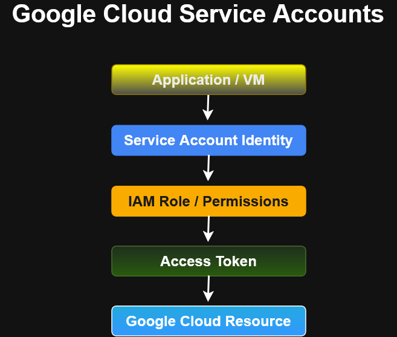
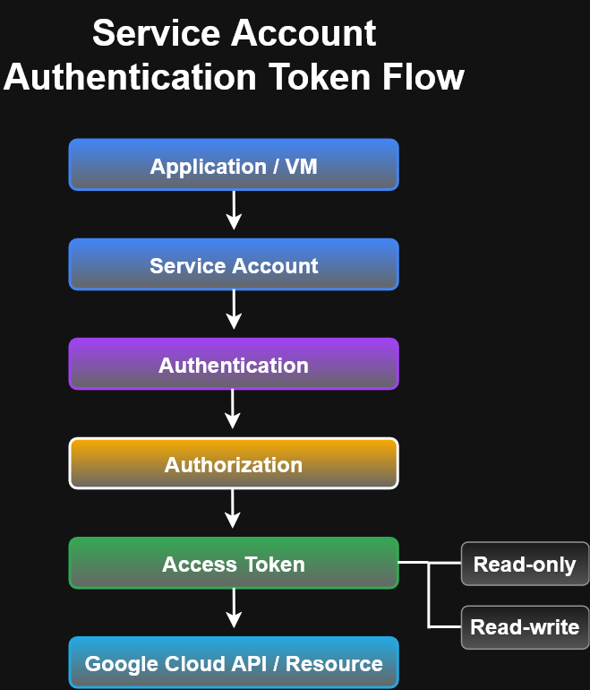
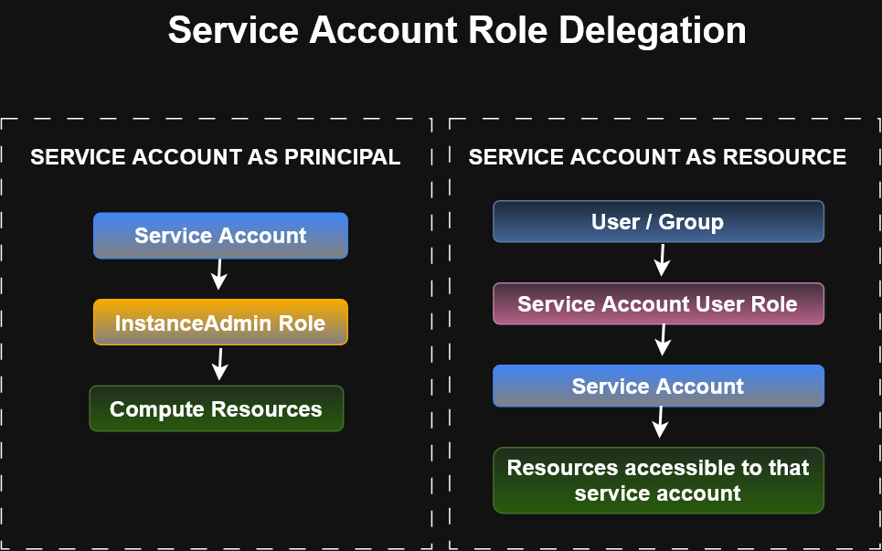
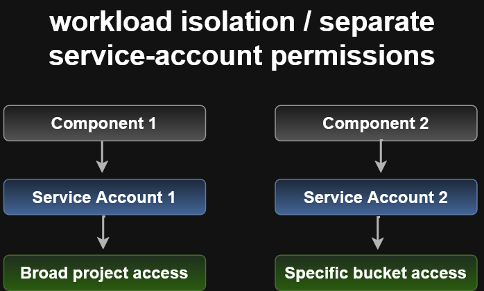
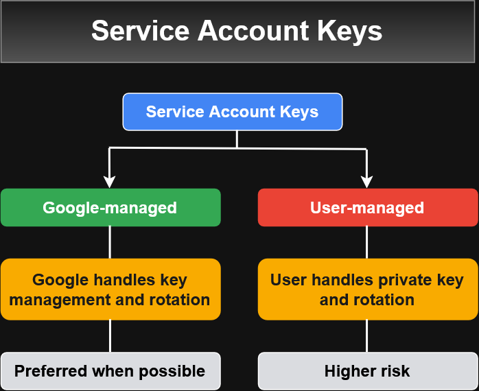

# Google Cloud Service Accounts

Service accounts provide an identity for applications, virtual machines, and other workloads that need to interact with Google Cloud services.

Unlike a normal Google Account, which represents a person, a service account represents an **application or workload**.

---

## Service Account Access Model

A workload can use a service account identity to authenticate, obtain authorization based on IAM permissions, receive an access token, and access a Google Cloud resource.



### Core Flow

1. An application or VM runs using a service account identity.
2. IAM roles determine the permissions available to the service account.
3. The workload obtains an access token.
4. The token is used to access permitted Google Cloud APIs and resources.

---

## Service Account Types


The course describes three categories of service accounts:

- **User-created service accounts**
  - Created and managed for specific applications or workloads.
  - Provide flexibility for assigning targeted IAM permissions.

- **Built-in service accounts**
  - Includes default service accounts created for certain Google Cloud services.
  - The Compute Engine default service account is one example.

- **Google APIs service account**
  - Used by Google to perform internal processes on behalf of a project.

Service accounts are identified using email-style addresses.

Example format:

```text
PROJECT_NUMBER-compute@developer.gserviceaccount.com
```

---

## Default Compute Engine Service Account

A Compute Engine default service account can be created automatically for a project.

The course explains that this account:

- Uses an automatically generated name and email address.
- Can be associated with Compute Engine VM instances.
- Can obtain credentials and access tokens automatically.
- Can be replaced with another service account when configuring a VM.
  
>
> Course note: The training material describes the default Compute Engine service account as receiving broad project permissions in its example. In 
> practice, service-account permissions should be reviewed and restricted according to least privilege.
>

---

## Authentication, Authorization, and Access Tokens

Authentication determines the identity making a request.

Authorization determines what that authenticated identity is permitted to do.



The general relationship is:

```text
Application / VM
      ↓
Service Account
      ↓
Authentication
      ↓
Authorization
      ↓
Access Token
      ↓
Google Cloud API / Resource
```
Access tokens can then be used by workloads to call Google Cloud APIs.

---

Access Scopes and IAM Roles

The course introduces access scopes such as:
```text
- read_only
- read_write
```
Access scopes are a legacy method for limiting API access from a VM.

For user-created service accounts, the course recommends using IAM roles to specify permissions.

>
> Key distinction: IAM roles define what the service account is authorized to do, while access scopes can further restrict API access available from > a VM.
>

---

## Service Account Permissions

A service account can itself be granted IAM roles on Google Cloud resources.

For example:
```text
Service Account
      ↓
InstanceAdmin Role
      ↓
Compute Resources
```
This makes the service account a principal that has permissions on another resource.

A user or group can also be granted permission to use a service account.



### Service Account as a Principal
```text
Service Account
      ↓
IAM Role
      ↓
Google Cloud Resource
```
The service account uses the permissions granted by the role.

### Service Account as a Resource
```text
User / Group
      ↓
Service Account User Role
      ↓
Service Account
```
The user or group is authorized to act through the service account according to the permissions granted.

This distinction is important because a service account can be both:

- An identity that receives permissions
- A resource that other principals receive permission to use

---

## Workload Isolation with Service Accounts



Different application components can use separate service accounts.

Example:
```text
Component 1
      ↓
Service Account 1
      ↓
Broad project access

Component 2
      ↓
Service Account 2
      ↓
Specific bucket access
```
This design allows workloads to receive only the permissions required for their individual tasks.

It also supports the principle of least privilege.

A service account's IAM permissions can be changed independently of the VM or application using the account.

## Service Account Keys

Service accounts can use cryptographic keys for authentication.

The course distinguishes between:

1. Google-managed keys
2. User-managed keys



### Google-Managed Keys

Google manages the key material and rotation.

Characteristics described in the course include:

- Google manages the public and private portions of the key.
- Key rotation is handled automatically.
- Private key material is not directly exposed to the user.

### User-Managed Keys

With user-managed keys:

- Google stores the public portion of the key.
- The user is responsible for protecting the private key.
- The user is responsible for key rotation and lifecycle management.
- Keys can be managed through Google Cloud tools and APIs.
  
> **Security warning:** Protect user-managed private keys carefully. If a private key is lost or exposed, it can create a serious security risk.


## Service Account Security Guidance

Service accounts should be treated as security-sensitive identities.

Recommended principles from this IAM material include:

- Grant only the permissions required by the workload.
- Use separate service accounts for workloads with different responsibilities.
- Avoid broad project-level permissions when narrower roles are sufficient.
- Prefer IAM roles over legacy access scopes for user-created service accounts.
- Protect user-managed service account keys.
- Rotate credentials when required.
- Prefer managed or short-lived credentials when possible.
- Review which users and groups have permission to use service accounts.

---

## Key Takeaways
- Service accounts represent applications and workloads, not individual users.
- Applications can use service accounts for service-to-service authentication.
- IAM roles determine what resources a service account can access.
- Service accounts can act as IAM principals.
- Service accounts can also be IAM resources that users or groups are allowed to use.
- Separate service accounts help isolate workloads and enforce least privilege.
- Access scopes are a legacy authorization mechanism for VMs.
- IAM roles should be used to define permissions for user-created service accounts.
- Google-managed keys reduce key-management responsibility.
- User-managed private keys require careful protection and lifecycle management.

## Related IAM Documentation
## Related IAM Documentation

- [IAM Fundamentals](iam-fundamentals.md)
- [Organizations and Folders](organization-and-folders.md)
- [Roles and Permissions](roles-and-permissions.md)
- [Members and IAM Policies](members-and-iam-policies.md)
- [IAM Best Practices](iam-best-practices.md)
