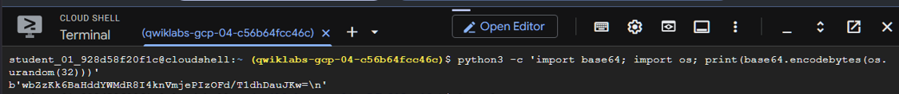
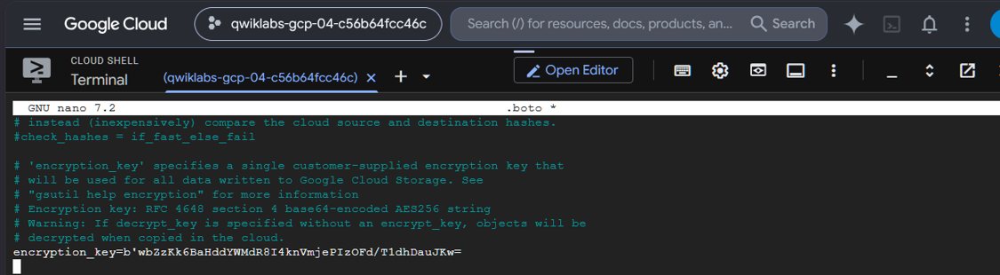
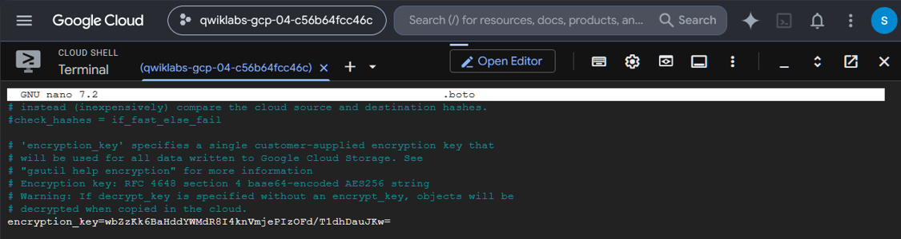
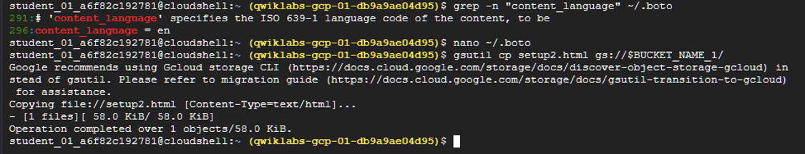

# Troubleshooting Lessons

## Invalid Content-Language

The generated `.boto` configuration caused:

`400 Invalid content language`

The `content_language` setting was disabled before retrying the upload.

## CSEK Key Handling

CSEK keys must remain exact Base64-encoded AES-256 values.
The encryption and decryption keys in `.boto` must correspond to
the key used when the object was written.

### CSEK Key Generation

The generated key initially appears as a Python byte-string:



### Incorrect `.boto` Entry

The key was initially copied with the Python byte-string formatting:



### Corrected `.boto` Entry

After removing the `b'`, trailing `'`, and `\n`, only the Base64 key remained:



---

## Configuration Recovery

### Troubleshooting Procedure
### Recreate or Locate the `.boto` Configuration File

If `.boto` is empty or missing, generate a new configuration file with:

```bash
gsutil config -n
```

Then open it with:
```bash
nano ~/.boto
```
If the expected configuration still does not appear, inspect the active `gsutil` configuration and installation details with:
```bash
gsutil version -l
```
This can help identify which configuration path `gsutil` is using.

>`gsutil version -l` does not directly “locate `.boto`” in every case,
> but it can show configuration-path information and help diagnose which config is active.

---
### `.boto` Content-Language Fix

The generated `.boto` file included:

```ini
content_language = en
```


This screenshot documents a successful recovery from the .boto content_language problem. It shows that after editing ~/.boto, the command:
```bash
gsutil cp setup2.html gs://$BUCKET_NAME_1/
```
completed successfully:

Operation completed over 1 objects/58.0 KiB.

During the lab, this setting caused a Cloud Storage upload error related to invalid content language.

After editing `~/.boto` and disabling the setting, the upload succeeded:

`gsutil cp setup2.html gs://$BUCKET_NAME_1/`

### Lesson Learned

When a Cloud Storage operation fails because of unexpected metadata, inspect the active .boto configuration for automatically applied headers or settings before assuming the bucket or object is the problem.

---
## Key Lesson

When an operation fails:

Verify the bucket environment variable.
Verify the object exists.
Verify the active encryption/decryption key.
Inspect `.boto`.
Retry the exact lab command.
